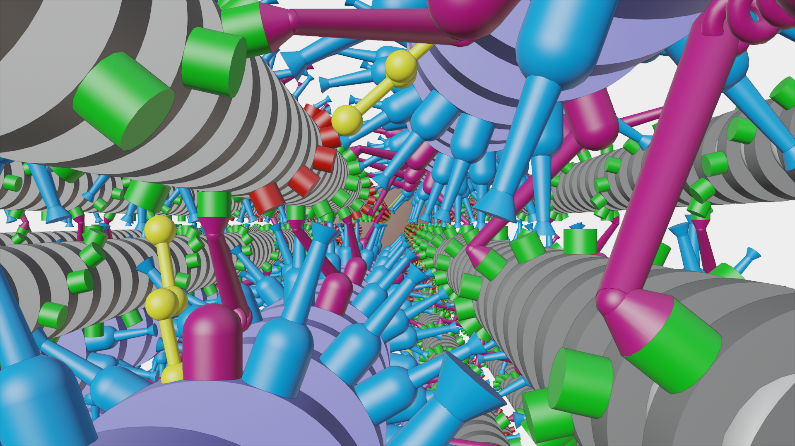

# FiberSim

This is the home page for the FiberSim software package, a spatially-explicit half-sarcomere model. You can use the code to simulate the mechanical properties of half-sarcomeres using sophisticated cross-bridge and myosin binding protein C rate equations.

To get a better idea of what this looks like, we've included a snapshot of the model in action.

To get started using FiberSim:
  + Try the [demos](pages/demos/demos.md).