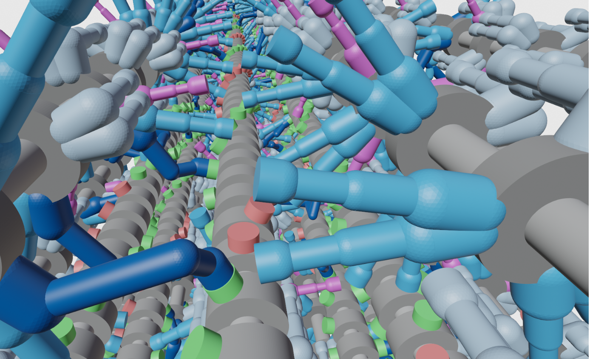

# FiberSim

FiberSim is software for spatially-explicit modeling of half-sarcomes. The code tracks the position and status of each myosin head, each binding site on actin, and each molecule of myosin binding protein-C.

You need a Windows PC to run a simulation but you can analyze output from the model on any computer that has an Anaconda-based installation of Python.

##  Organization
The main components of the software are:

+ FiberCpp - the core model that implements the calculations underlying the simulations. 
This software is written in C++ but is currently only compiled for Windows PCs.
+ FiberPy - accessory code that makes it easier to run different types of simulations and analyze output. 
This component is written in Python.

## Getting started
Quick tutorial videos are provided here to help you install FiberSim. Then you can check the demos to see how to:

Run simulations
Create videos and snap-shots of the model
