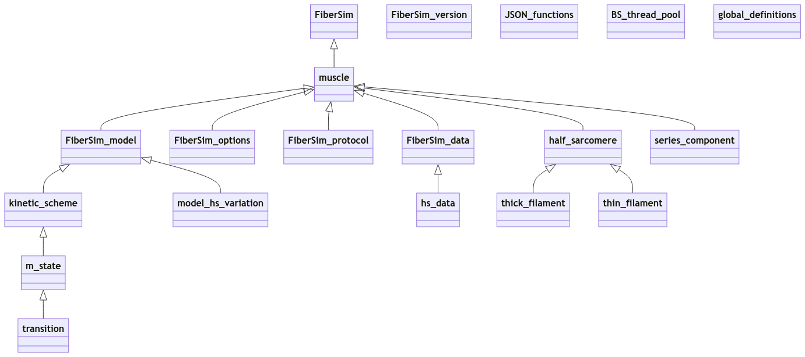

# FiberCpp

FiberCpp is the 'core model' of the FiberSim suite. The [code](code/code.html)
+ implements the underlying the simulation
+ is written in C++ for speed
+ is a low-level console application stored as `FiberCpp.exe` in `<repo>/FiberSim/bin`

FiberCpp is designed to run simulations as quickly and efficiently as possible. It does not have a sophisticated user-interface.

Most people will find it easier to run FiberCpp simulations via [FiberPy](../FiberPy/FiberPy.html). See the [demos](../demos/demos.html) for many examples.

Only those adding new features to the software (or trying to [fix bugs](http://github.com/campbell-muscle-lab/FiberSim/issues)) will need to work directly with FiberCpp. 

## Class diagram

<!--
classDiagram

    FiberSim <|-- muscle

    muscle <|-- FiberSim_model
    muscle <|-- FiberSim_options
    muscle <|-- FiberSim_protocol
    muscle <|-- FiberSim_data
    muscle <|-- half_sarcomere
    muscle <|-- series_component

    FiberSim_model <|-- kinetic_scheme
    FiberSim_model <|-- model_hs_variation
    
    FiberSim_data <|-- hs_data

    half_sarcomere <|-- thick_filament
    half_sarcomere <|-- thin_filament

    kinetic_scheme <|-- m_state
    
    m_state <|-- transition

    class FiberSim_version
    class JSON_functions
    class BS_thread_pool
    class global_definitions
>
