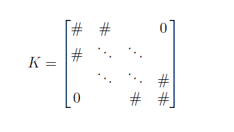
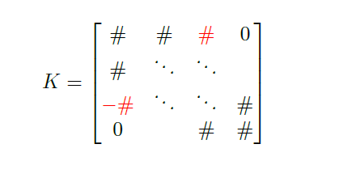
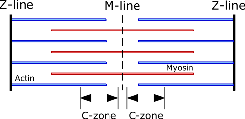

# Lattice equations

In FiberSim, the thick and thin filaments within each half-sarcomere are mimicked as a series of nodes joined by compliant springs. The nodes on the thin filament represent actin monomers. The nodes on the thick filaments represent myosin crowns.

The force in the half-sarcomere is calculated from the extension of the springs nearest the Z-line. The force in each filaments is obtained from Hooke's law (force = stiffness * extension). The force in the half-sarcomere is obtained by summing the forces in each thin filament.

It follows that determining the position of each node is a pivotal operation in FiberSim. This is achieved by assuming that forces are balanced at each node at each time-step.

This page explains the equations that goven force-balance. The procedures used to calculate the node positions are described at [KX=F](../KX=F/KX=F.html).

## Actin filaments

Thin filaments are composed of nodes joined by linear springs of stiffness $$k_{a}$$ with a resting length $$a_{rl}$$. If the position of the $$i^{th}$$ node along an x-axis is noted $$a_i$$, then the force-balance equations for the thin filament can be written as:

$$ 2 \, k_a \, a_1 - k_a \, a_2 = 0$$

$$ -  k_a \, a_{i-1} + 2 \, k_a \, a_i - k_a \, a_{i+1} = 0 \,\,\, \text{for} \, 1 \lt i \lt n$$

$$ -k_a \, a_{n-1} + k_a \, a_n = k_a \, a_{rl}$$

## Myosin filaments

Thick filaments are composed of nodes joined by linear springs of stiffness $$k_{m}$$ with a resting length $$m_{rl}$$. A rigid link of length $$\lambda$$ connects the thick filament to the M-line. If the position of the $$i^{th}$$ node along an x-axis is noted $$m_i$$, and the half-sarcomere length is noted $$l_{hs}$$, then the force-balance equations for the thick filament can be written as:

$$ 2 \, k_m \, m_1 - k_m \, m_2 = k_m \, (l_{hs}- \lambda)$$

$$ -  k_m \, m_{i-1} + 2 \, k_m \, m_i - k_m \, m_{i+1} = 0 \,\,\, \text{for} \, 1 \lt i \lt n$$

$$k_m \, m_{n-1} - k_m \, m_n = -k_m \, m_{rl}$$

The system of equations for the thin and thick filament can be written in matrix form:

$$K x = F$$ 

where $$K$$ is a matrix containing the springs stiffness, $$x$$ is a vector containing the positions of the actin and myosin nodes ($$a_i$$ and $$m_i$$, respectively) and $$F$$ is a vector containing the constant terms (independent of nodes positions). $$K$$ is a tridiagonal matrix:

  

and numerical methods exist to solve $$Kx=F$$ for $$x$$.

## Cross-bridge links 

Myosin heads located at the thick filament nodes can attach to neighboring binding sites at the thin filament nodes, thus affecting the filament lattice framework. 

  

A cross-bridge located at the $$j^{th}$$ thick filament node which attaches to the $$i^{th}$$ node of the thin filament generates a force $$f_{cb}$$ given by:

$$f_{cb} = k_{cb} \, (m_j - a_i + x_{ps})$$

where  $$k_{cb}$$ is the cross-bridge spring stiffness and $$x_{ps}$$ is the crossbridge extension when deploying the power stroke.

This additional force on the filaments should be added to the force-balance equations :

$$-  k_a \, a_{i-1} + 2 \, k_a \, a_i - k_a \, a_{i+1} \, \color{red}{+ \, k_{cb} \, a_i - k_{cb} \, m_j} = \color{blue}{k_{cb} \, x_{ps}}$$

$$-  k_m \, m_{j-1} + 2 \, k_m \, m_j - k_m \, m_{j+1} \, \color{red}{- \, k_{cb} \, a_i + k_{cb} \, m_j} = \color{blue}{-k_{cb} \, x_{ps}}$$

The terms in red will add non-tridiagonal, opposite elements to the $$K$$ matrix: 

  

while the blue terms will contribute to the $$F$$ vector. 

Cross-bridge linking toughens the numerical solving of $$K x = F$$, which notably requires an iterative procedure to find a solution $$x$$ that satisfies a certain precision. 

## Titin 

Titin is responsible for the passive force developing within the half-sarcomere when it is stretched, and for the recoil force when it is shortened. In the model, it is assumed that titin is a linear spring of stiffness $$k_t$$ and rest length $$t_{rl}$$. This spring is attached at both ends, on a particular thick and thin filament node respectively. Similar to crossbridge links, titin contributes $$f_{t}$$ to the force-balance equation.

The default behavior is:

$$f_{t} = k_{t} \, (m_l - a_k)$$

If `t_passive_mode` is defined as `exponential`, the equation is modified to:

$$f_{t} = k_{t} \, (m_l - a_k) + sign(m_l - a_k) \ t_{sigma} \ (e^{\frac{abs(m_l - a_k)}{t_L}} - 1)$$

## Myosin Binding Protein C

Myosin Binding Protein C (MyBP-C) is a striated muscle contracting protein. It is associated with the thick filaments and located near the center of the sarcomere, in the C-zones. 

  

  

This protein interacts both with myosin and actin and is a modulator of cardiac contractility. In the model, MyBPC can attach to an actin binding site and act as a "non-force-generating cross-bridge link" (meaning it cannot undergo a power stroke). Such C-links contribute to the force-balance equations:

 $$f_{pc} = k_{pc} \, (m_j - a_i)$$
 
 where  $$k_{pc}$$ is the C-link stiffness.

