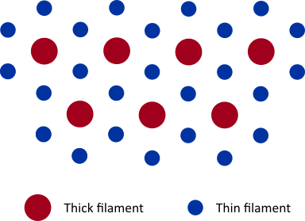
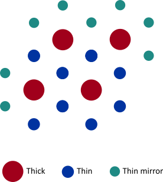

# Sarcomere Lattice

FiberSim describes the contraction of a half-sarcomere composed of thin and thick filaments. The muscle cross-section presents a hexagonal lattice as shown below. Each thick filament is surrounded by six thin filaments, while each thin filament has three neighboring thick filaments. 

 

  

 

The number of thick filaments, $$m_n$$, is specified in the model JSON file, and must be a square number. The number of thin filaments is then defined as $$ 2 . m_n$$. Some thin filaments are mirrored on the edge of the lattice to ensure that each thick and thin filament has a correct number of neighbors. An example of a generated lattice for $$m_n = 4$$ is shown below. 

 

  

