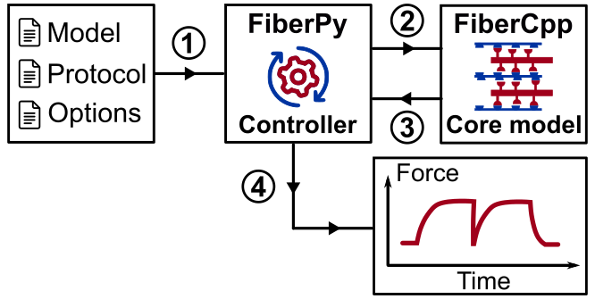

# Organization

FiberPy is computer code that interfaces with FiberCpp and makes it easier to use FiberSim for research.

FiberPy provides options for many different tasks including fitting models to experimental data and generating videos of model renderings. Typically, these strategies build on the basic task of running a simulation.

As shown below, to run a simulation using FiberPy, the user passes three files to FiberPy. The code transfers these files to FiberCpp, coordinates the simulation, saves the results to a new file, and (optionally) plots the results.

See the [demos](../../demos/demos.html) for examples.

[Structures](../../structures/structures.html) provides information about the different files that FiberSim uses.
