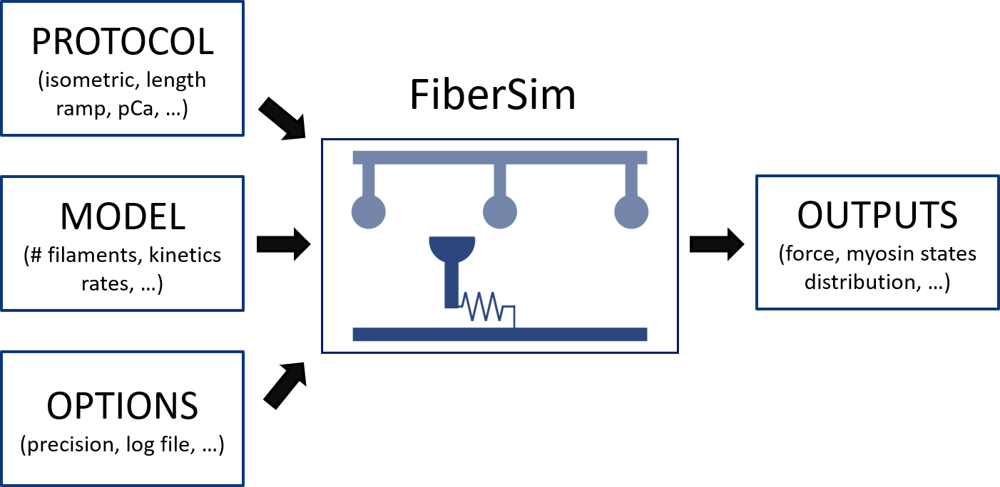

# Structure

FiberCpp needs three input files to run a simulation:

* The protocol file is a `.txt` file with four columns: the time-step, the pCa value (pCa = +- log_{10}[Ca^{2+}]+), the imposed length change (held at 0 for isometric), and the mode of contraction (length-controlling or force-controlling mode). Each new line of the protocol file represents an additional time-step. [Here](example_file/protocol.txt) is an example of a protocol file.
* The model file is a `JSON` file that describes the half-sarcomere lattice structure and the filament kinetics. JSON is a file format for storing and transporting data that is simple and human-readable. Each parameter value comes with a “key” (click [here](https://campbell-muscle-lab.github.io/howtos_json/) for more information on the `JSON` format). [Here](example_file/model.json) is an example of a model file.
* The option file is a `JSON` that specifies the computational options, such as the tolerance limit for the force-balance calculations , and whether tocreate log files that track the status of the filaments throughout the simulations. [Here](example_file/options.json) is an example of an option file.

<p align="center">

</p>

FiberCpp then writes the simulation results in a `.txt` file. 

FiberPy transmits the input files to FiberCpp and extracts the results for analysis. The instructions for a simulation are provided to FiberPy in a batch file as the one shown below:


````
{
    "FiberSim_batch": {
        "FiberSim_exe":
        {
            "relative_to": "this_file",
            "exe_file": "../../../bin/FiberSim.exe"
        },
        "job":[
            {
                "relative_to": "this_file",
                "model_file": "sim_input/model_single_run.json",
                "options_file": "sim_input/options_single_run.json",
                "protocol_file": "sim_input/pCa45_protocol.txt",
                "results_file": "sim_output/results.txt",
                "output_handler_file": "sim_input/output_handler.json"
            }
        ]
    }
}
````

* `FiberSim_exe` contains the path to the FiberSim executable 

* `job` is a list of protocols to run. Here only one job (or simulation) will be run

* `results_file` is the user-defined folder where the simulation results will be stored

* `output_handler_file` is the path to a `JSON` file containing the instructions for [making figures](../../demos/make_figures/make_figures.html)