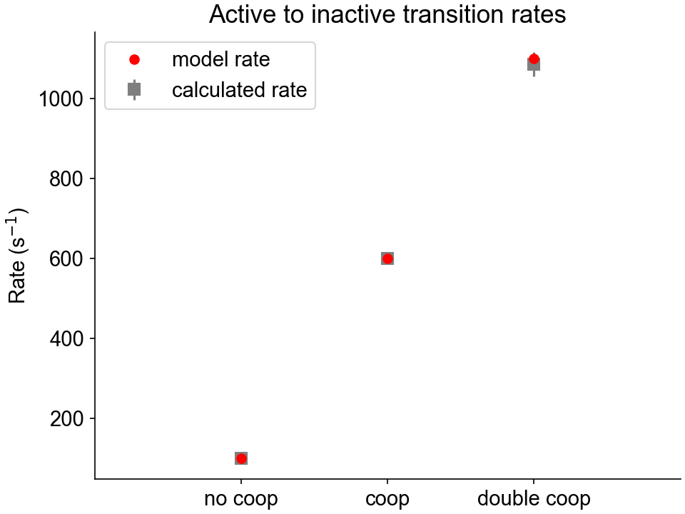

# Actin

Actin regulatory units are composed of binding sites that can transition from an inactive state to an active state, and vice-versa, as schematized below:

<p align="center">

</p>

At each time step, all the binding sites from a regulatory unit can transition together according to the rate constants `a_k_on` and `a_k_off` defined in the [model file](../../structures/model/model.html). The probabilty of a regulatory unit activating is calculated using $a_{k_{on}} [Ca^{2+}]$, and the probability of a regulatory unit deactivating is calculated using $a_{k_{off}}$. These probabilities are also modulated by `a_k_coop`, which is a parameter quantifiying the inter-regulatory unit cooperativity:

+ If no direct neighboring unit is activated, the activation rate is given by: 

++ a_{k_{on}} [Ca^{2+}] ++  

+ If one direct neighboring unit is already activated, the activation rate is given by:

++ a_{k_{on}} [Ca^{2+}] (1 + a_{k_{coop}})++  

+ If the two direct neighboring units are already activated, the activation rate is given by:

++ a_{k_{on}} [Ca^{2+}] (1 + 2 \, a_{k_{coop}})++   

The same reasoning goes for the inactivating rate constant $a_{k_{off}}$.


## What this test does

The actin kinetics test:

+ Runs a simulations in which a half-sarcomere is held isometric and activated in a solution with a pCa of 6.0. 

+ Saves a status file at each time step, which contains the state of every regulatory unit. 

+ Assesses all the regulatory units state transitions occuring between two consecutive time-steps, and calculates the apparent rate constants.

+ Compares the calculated rate constants with those provided in the model file. 

The batch file containing the instructions for this test is:

```
{
  "FiberSim_batch": {
    "FiberCpp_exe": {
      "relative_to": "this_file",
      "exe_file": "../../bin/FiberCpp.exe"
    },
    "job": [
      {
        "relative_to": "this_file",
        "model_file": "sim_input/model.json",
        "options_file": "sim_input/options.json",
        "protocol_file": "sim_input/pCa6_protocol.txt",
        "results_file": "sim_output/results.txt",
        "output_handler_file": "sim_input/output_handler.json"
      }
    ],
    "batch_validation": [
      {
        "validation_type": "a_kinetics",
        "relative_to": "this_file",
        "model_file": "sim_input/model.json",
        "options_file": "sim_input/options.json",
        "protocol_file": "sim_input/pCa6_protocol.txt",
        "output_data_folder": "sim_output/analysis"
      }
    ]
  }
}
```

As explained above, this batch file consists in a single job. The block called `batch_validation` provides the type of validation that must be run and the necessary files information.


## Instructions

Before proceeding, make sure that you have followed the [installation instructions](../../installation/installation.html) and that you already tried to run the [getting started demos](../../demos/getting_started/getting_started.html).

### Getting ready

+ Open an Anaconda Prompt

+ Activate the FiberSim Anaconda Environment by executing:
```
conda activate fibersim
```
+ Change directory to `<FiberSim_dir>/code/FiberPy/FiberPy`, where `<FiberSim_dir>` is the directory where you installed FiberSim. 

### Run the test

+ Type:
```
python Fiberpy.py run_batch "../../../testing_suite/thin_kinetics/batch_a_kinetics.json"
```

+ You should see text appearing in the terminal window, showing that the simulations are running. When it finishes (this can take ~15 minutes), you should see something similar to the image below.


### Viewing the results

The results and summary figure from the simulation are written to files in `<FiberSim_dir>/testing_suite/thin_kinetics/sim_output`


The `hs` folder contains the status files that were dumped at each time-step calculation.

The `analysis` folder contains two figure files showing the calculated activating and deactivating rate constants for the three cooperative scenarios, as well as the model values.



