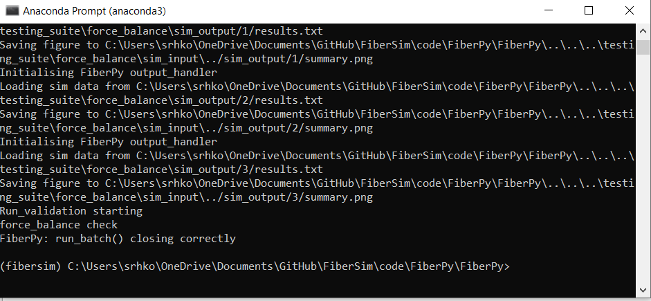
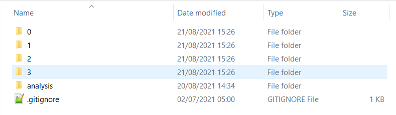
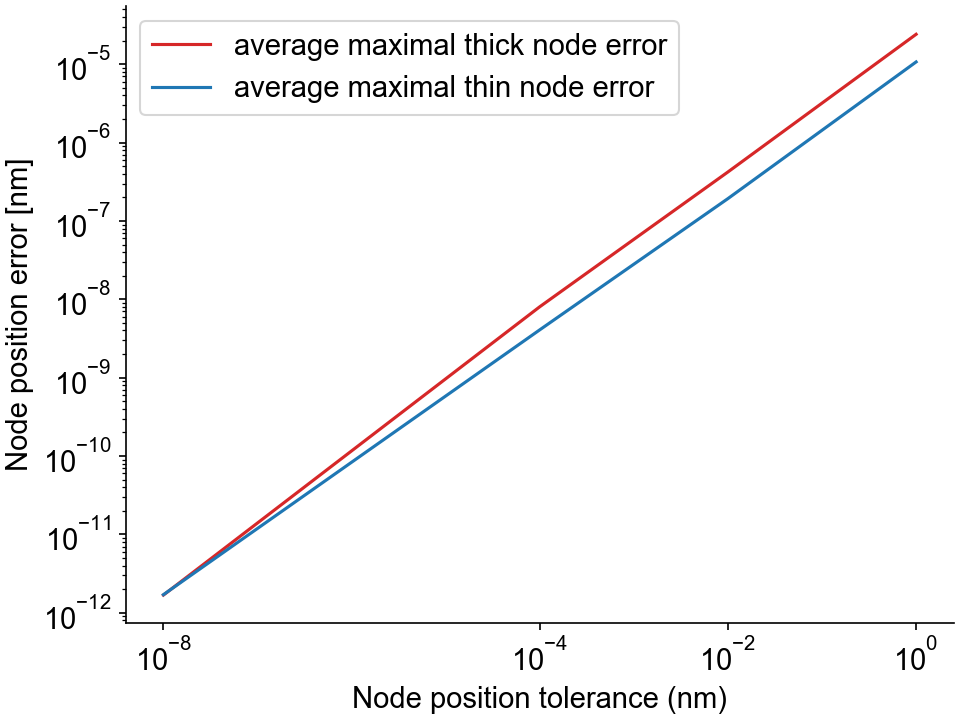

# Force-balance

FiberCpp solves a matrix equation of form +K x = F+, where +x+ is a vector containing the node positions, +K+ is the tridiagonal stiffness matrix, and +F+ is a vector containing the cross-bridges, titin, and myosin-binding protein C forces. The solving algorithm uses the conjugate gradient method, which is an iterative method to obtain the solution +x+. In the [option file](../../structures/options/options.html), the user can define `x_pos_tol`, which is the algorithm tolerance (the algorithm stops at iteration #+n+ when +\mid x_{n} - x_{n-1} \mid \lt x_{pos_{tol}}+). 

The force-balance test is a Python code written to evaluate +\epsilon = K x - F+, which is a measurement of the solving algorithm precision. The testing code calculates the residual forces at each node, for both the thick and thin filaments. This residual force (or error force) is then divided by the filament springs stiffness to obtain a node position error in nm. This position error should get closer to zero as the position tolerance decreases. 

## What this test does

The force-balance test:

+ Runs 4 simulations in which a half-sarcomere is held isometric and activated in a solution with a pCa of 4.5. Each simulations is run with a decreasing `x_pos_tol`.

+ Saves 4 status files (for each simulation) where the node positions for each thick and thin filament are stored. 

+ Computes the average maximal node position error for all thick/thin filaments from each dump file.

The batch file containing the instructions for this test is:

```

{
  "FiberSim_batch": {
    "FiberCpp_exe": {
      "relative_to": "this_file",
      "exe_file": "../../bin/FiberCpp.exe"
    },
    "job": [
      {
        "relative_to": "this_file",
        "model_file": "sim_input/model.json",
        "options_file": "sim_input/options_0.json",
        "protocol_file": "sim_input/pCa45_protocol.txt",
        "results_file": "sim_output/0/results.txt",
        "output_handler_file": "sim_input/output_handler_0.json"
      },
      {
        "relative_to": "this_file",
        "model_file": "sim_input/model.json",
        "options_file": "sim_input/options_1.json",
        "protocol_file": "sim_input/pCa45_protocol.txt",
        "results_file": "sim_output/1/results.txt",
        "output_handler_file": "sim_input/output_handler_1.json"
      },
      {
        "relative_to": "this_file",
        "model_file": "sim_input/model.json",
        "options_file": "sim_input/options_2.json",
        "protocol_file": "sim_input/pCa45_protocol.txt",
        "results_file": "sim_output/2/results.txt",
        "output_handler_file": "sim_input/output_handler_2.json"
      },
      {
        "relative_to": "this_file",
        "model_file": "sim_input/model.json",
        "options_file": "sim_input/options_3.json",
        "protocol_file": "sim_input/pCa45_protocol.txt",
        "results_file": "sim_output/3/results.txt",
        "output_handler_file": "sim_input/output_handler_3.json"
      }
    ],
    "batch_validation": [
      {
        "validation_type": "force_balance",
        "relative_to": "this_file",
        "model_file": "sim_input/model.json",
        "options_file": [ "sim_input/options_0.json", "sim_input/options_1.json", "sim_input/options_2.json", "sim_input/options_3.json" ],
        "protocol_file": "sim_input/pCa45_protocol.txt",
        "output_data_folder": "sim_output/analysis"
      }
    ]
  }
}

```

As explained above, this batch file consists in 4 jobs with the same protocol file but different [option files](../../structures/options/options.html)). `x_pos_tol` from the option files ranges from 1 nm to 10 <sup>-12</sup> nm.

The last block called `batch_validation` provides the type of validation that must be run and the necessary files information.

## Instructions

Before proceeding, make sure that you have followed the [installation instructions](../../installation/installation.html) and that you already tried to run the [getting started demos](../../demos/getting_started/getting_started.html).

### Getting ready

+ Open an Anaconda Prompt

+ Activate the FiberSim Anaconda Environment by executing:
```
conda activate fibersim
```
+ Change directory to `<FiberSim_dir>/code/FiberPy/FiberPy`, where `<FiberSim_dir>` is the directory where you installed FiberSim. 

### Run the test

+ Type:
 ```
python Fiberpy.py run_batch "../../../testing_suite/force_balance/batch_force_balance.json"
 ```

+ You should see text appearing in the terminal window, showing that the simulations are running. When it finishes (this should take less than one minute), you should see something similar to the image below.



### Viewing the results

Results and summary figures from the 4 simulations are written to different folders in `<FiberSim_dir>/testing_suite/force_balance/sim_output`. 



The folder `analysis` contains the file `filaments_error.png` which shows the maximal node position error as a function of `x_pos_tol` for the last time-step calculation. As expected, the error on the calculated node position decreases if `x_pos_tol` decreases.


