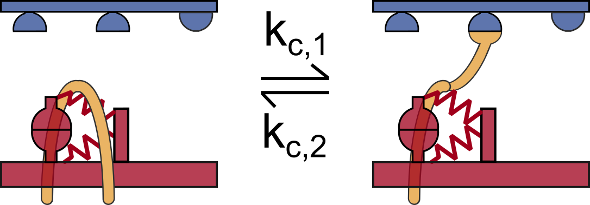
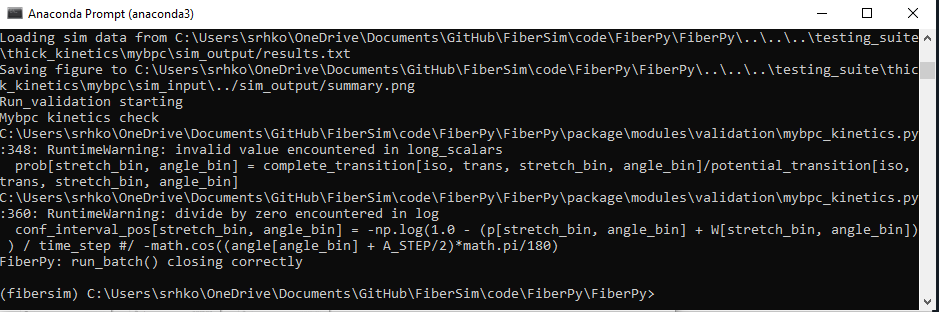
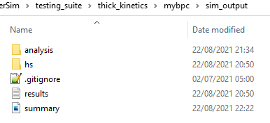
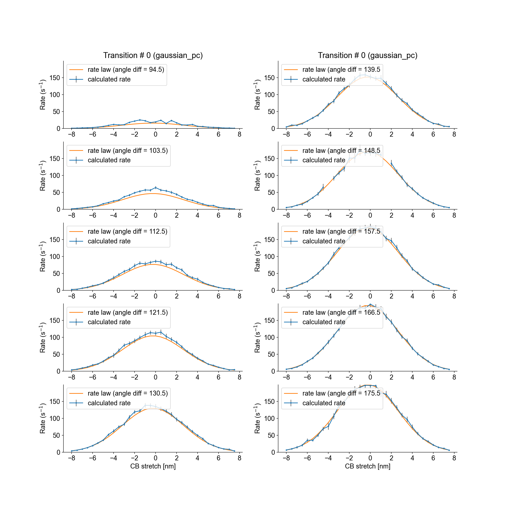
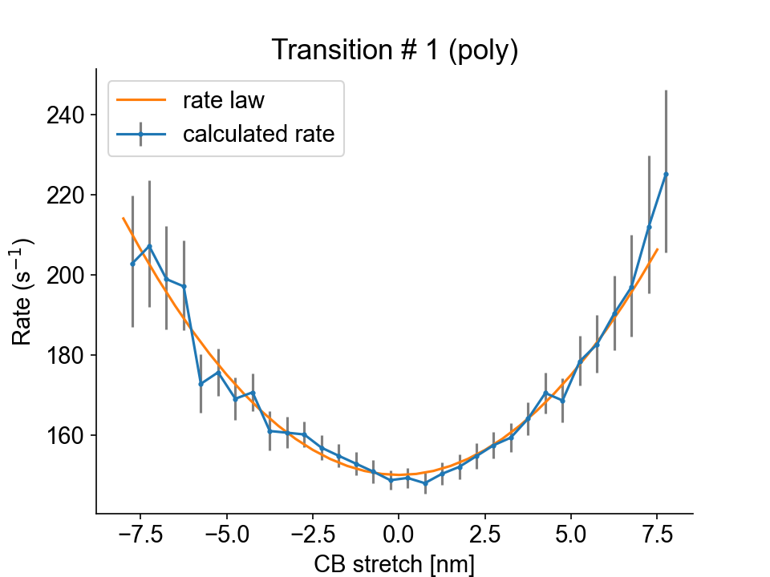

# MyBPC

The following test verifies MyBPC kinetics for the 2-state model schematized below.

<p align="center">

</p>

In this model, MyBPC (yellow) is able to bind to an active actin binding site and transition from an unbound to a bound state.

## What this test does

The MyBPC kinetics test:

+ Runs a simulations in which a half-sarcomere is held isometric and activated in a solution with a pCa of 4.5. 

+ Saves a status file at each time step, which contains the state of every mybpc molecule. 

+ Assesses all the mybpc transitions occuring between two consecutive time-steps, and calculates the apparent rate constants.

+ Compares the calculated rate constants with those provided in the following model file:

```
 "c_kinetics": [
    {
      "no_of_states": 2,
      "max_no_of_transitions": 1,
      "scheme": [
        {
          "number": 1,
          "type": "D",
          "extension": 0,
          "transition": [
            {
              "new_state": 2,
              "rate_type": "gaussian_pc",
              "rate_parameters": [
                200
              ]
            }
          ]
        },
        {
          "number": 2,
          "type": "A",
          "extension": 0.0,
          "transition": [
            {
              "new_state": 1,
              "rate_type": "poly",
              "rate_parameters": [
                150,
                1,
                2
              ]
            }
          ]
        }
      ]
    }
  ]
}
```

## Instructions

Before proceeding, make sure that you have followed the [installation instructions](../../installation/installation.html) and that you already tried to run the [getting started demos](../../demos/getting_started/getting_started.html).

### Getting ready

+ Open an Anaconda Prompt

+ Activate the FiberSim Anaconda Environment by executing:
```
conda activate fibersim
```
+ Change directory to `<FiberSim_dir>/code/FiberPy/FiberPy`, where `<FiberSim_dir>` is the directory where you installed FiberSim. 

### Run the test

+ Type:
 ```
python Fiberpy.py run_batch "../../../testing_suite/thick_kinetics/mybpc/batch_c_kinetics.json"
 ```

+ You should see text appearing in the terminal window, showing that the simulations are running. When it finishes (this can take ~20-30 minutes), you should see something similar to the image below.



### Viewing the results

The results and summary figure from the simulation are written to files in `<FiberSim_dir>/testing_suite/thick_kinetics/mybpc/sim_output`



The `hs` folder contains the status files that were dumped at each time-step calculation.

The `analysis` folder contains figure files showing the calculated rate laws for all mybpc transitions, as well as the model rate laws.



