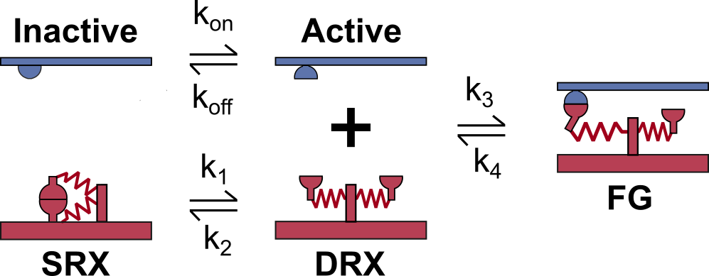
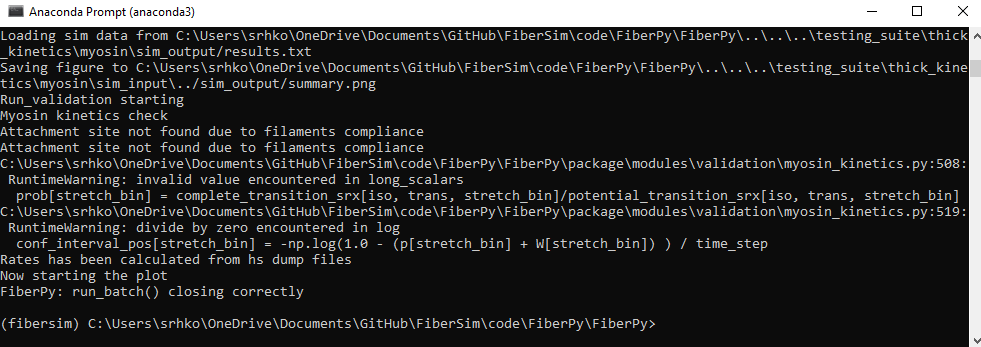
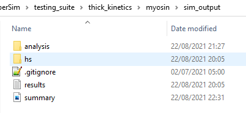
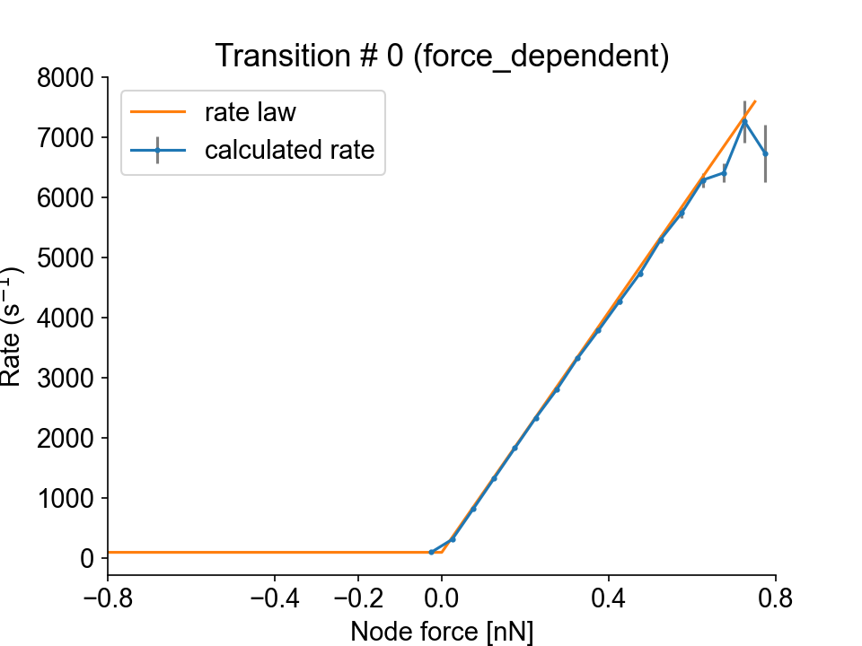
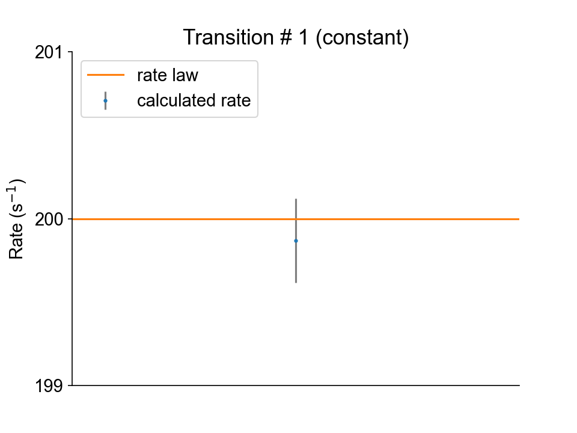
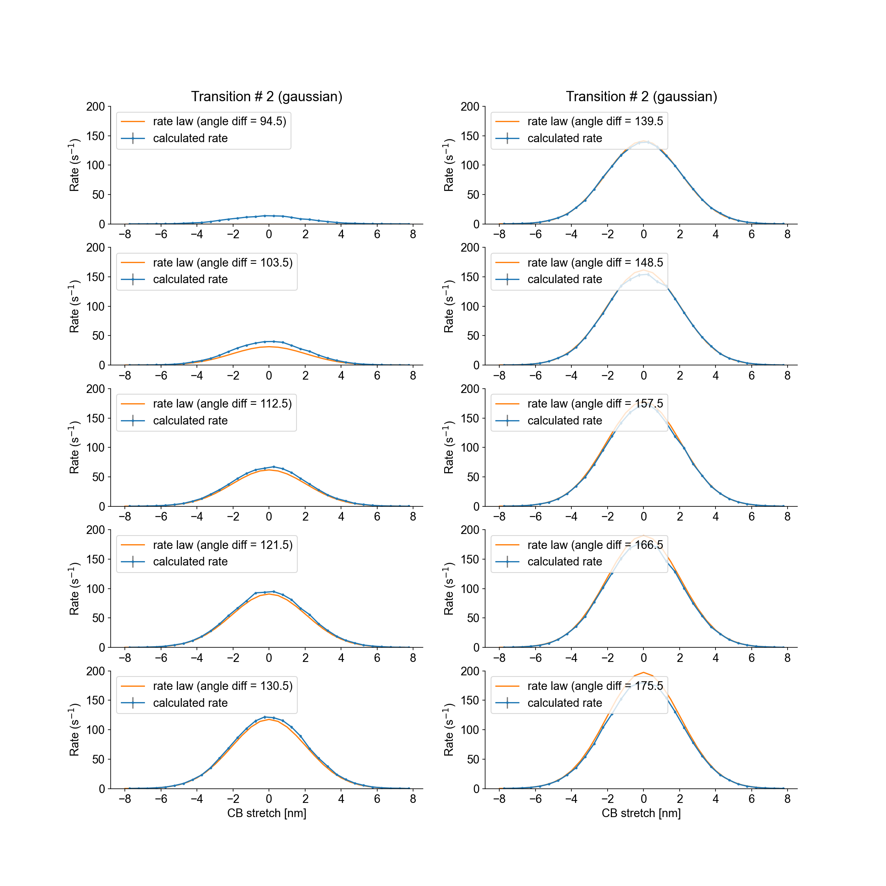
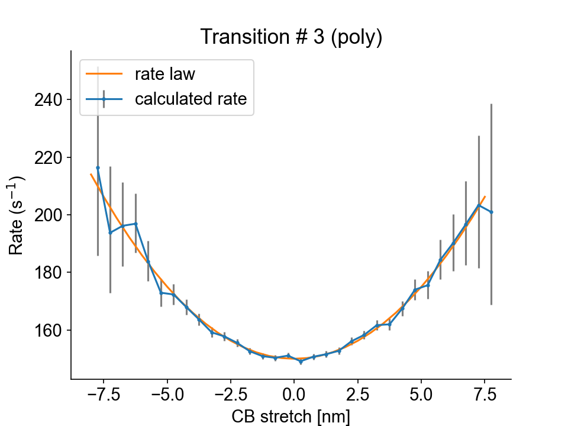

# Myosin

Thick filaments are composed of myosin and myosin-binding protein C. The kinetics scheme for both molecules is defined in the [model file](../../structures/model/model.html).

The following test verifies myosin kinetics for the 3-state model schematized below.

<p align="center">

</p>

In this model, dimers of myosin heads (red) can transition together from the super-relaxed state (SRX) to the disordered-relaxed state (DRX). Then each myosin head is able to bind to an active binding site (blue) and transition to a force-generating state (FG).

## What this test does

The myosin kinetics test:

+ Runs a simulations in which a half-sarcomere is held isometric and activated in a solution with a pCa of 4.5. 

+ Saves a status file at each time step, which contains the state of every myosin molecules. 

+ Assesses all the myosin transitions occuring between two consecutive time-steps, and calculates the apparent rate constants.

+ Compares the calculated rate constants with those provided in the following model file (the transition parameters between each states are described in the `transition` blocks):

```
"m_kinetics": [
    {
      "no_of_states": 3,
      "max_no_of_transitions": 2,
      "scheme": [
        {
          "number": 1,
          "type": "S",
          "extension": 0,
          "transition": [
            {
              "new_state": 2,
              "rate_type": "force_dependent",
              "rate_parameters": [
                100,
                100
              ]
            }
          ]
        },
        {
          "number": 2,
          "type": "D",
          "extension": 0,
          "transition": [
            {
              "new_state": 1,
              "rate_type": "constant",
              "rate_parameters": [
                200
              ]
            },
            {
              "new_state": 3,
              "rate_type": "gaussian",
              "rate_parameters": [
                200
              ]
            }
          ]
        },
        {
          "number": 3,
          "type": "A",
          "extension": 7.0,
          "transition": [
            {
              "new_state": 2,
              "rate_type": "poly",
              "rate_parameters": [
                150,
                1,
                2
              ]
            }
          ]
        }
      ]
    }
  ]
```


## Instructions

Before proceeding, make sure that you have followed the [installation instructions](../../installation/installation.html) and that you already tried to run the [getting started demos](../../demos/getting_started/getting_started.html).


### Getting ready

+ Open an Anaconda Prompt

+ Activate the FiberSim Anaconda Environment by executing:
```
conda activate fibersim
```
+ Change directory to `<FiberSim_dir>/code/FiberPy/FiberPy`, where `<FiberSim_dir>` is the directory where you installed FiberSim. 

### Run the test

+ Type:
 ```
python Fiberpy.py run_batch "../../../testing_suite/thick_kinetics/myosin/batch_m_kinetics.json"
 ```

+ You should see text appearing in the terminal window, showing that the simulations are running. When it finishes (this can take ~20-30 minutes), you should see something similar to the image below.



### Viewing the results

The results and summary figure from the simulation are written to files in `<FiberSim_dir>/testing_suite/thick_kinetics/myosin/sim_output`



The `hs` folder contains the status files that were dumped at each time-step calculation.

The `analysis` folder contains figure files showing the calculated rate laws for all myosin transitions, as well as the model rate laws.

Transition #0 (from state 1 to state 2) is force-dependent, and the transition rate is plotted as a function of the node force.



Transition #1 (from state 2 to state 1) is constant.



Transition #2 (from state 2 to state 3) is stretch-dependent, and the transition rate is plotted as a function of the stretch values. Furthermore, the attachement probabilities are modulated by the angle difference between a myosin head and the nearest binding sites. Each panel represents an angle difference interval and shows the calculated and theoretical attachment rates for the mid-interval angle difference. 



Transition #3 (from state 3 to state 2) is stretch-dependent, and the transition rate is plotted as a function of the stretch values.

