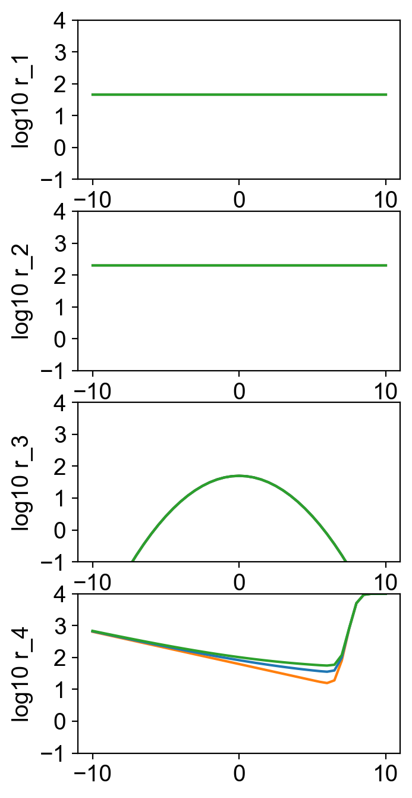
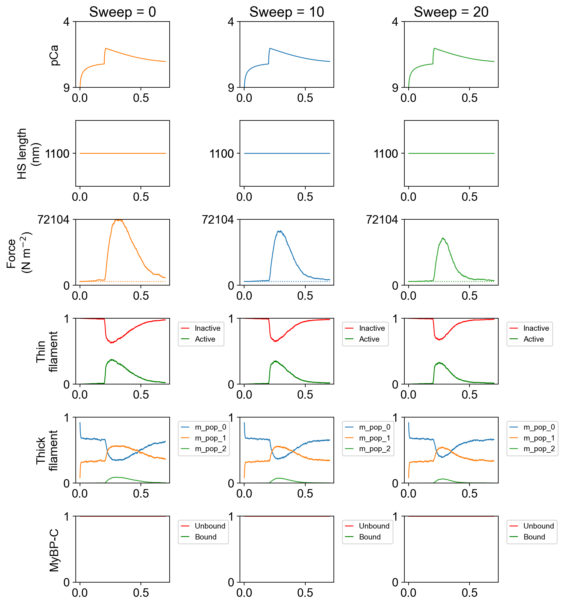

# Thin sweep

## Overview

This demo shows how to compare twitches simulated using 3 models where tropomyosin has different abilities to "sweep" myosin heads off the thin filament.

See [exp_wall_sweep](../../../structures/kinetics/kinetics.html#exp_wall_sweep) for more details on the sweeping mechanism.

## What this demo does

This demo:

+ Simulates a twitch using three different models, each with a different value for the sweep parameter.

+ Creates a figure that summarizes the simulations

## Instructions

Before proceeding, make sure that you have [installed FiberSim](../../../installation/installation.html).

You need:
+ the FiberSim folder
+ an Anaconda distribution of Python
+ and an active FiberSim environment to run this demo.

### Getting ready

+ Open an Anaconda Prompt

+ Activate the FiberSim Anaconda Environment by executing:
```
conda activate fibersim
```
+ Change directory to `<FiberSim_dir>/code/FiberPy/FiberPy`, where `<FiberSim_dir>` is the directory where you installed FiberSim.
+ See [Getting started](../../getting_started/getting_started.html) if you need help.

### Run a simulation

+ Type:
 ```
 python FiberPy.py characterize "../../../demo_files/characterization/thin_sweep/sweep_comparison.json.json"
 ```

+ You should see text appearing in the terminal window, showing that the simulations are running.

### Viewing the results

All of the results from the simulation are written to files in `<repo>/demo_files/characterization/thin_sweep/simulations/sim_output`

`rates.png` shows the rate functions for the three simulations superposed. Note that the only difference is in the r4 myosin detachment step (drawn here assuming that `no_of_active_neighbors` is zero).



`superposed_traces.png` shows the simulated twitches. Note that as the sweep parameter increases:
+ the peak twitch force is reduced
+ the relaxation becomes faster



## How this worked

This demonstration used a [characterization structure](../../../structures/characterization/characterization.html) and the
+ `freeform` characterization mode
to run simulations:
+ using a single protocol file
  + `<repo>/demo_files/characterization/thin_sweep/data/protocols/twitch_protocol.txt`
+ for each of 3 models
  + `<repo>/demo_files/characterization/thin_sweep/data/models/model_sweep_0.json`
  + `<repo>/demo_files/characterization/thin_sweep/data/models/model_sweep_10.json`
  + `<repo>/demo_files/characterization/thin_sweep/data/models/model_sweep_20.json`

````
{
    "FiberSim_characterization":
    {
        "FiberCpp_exe":
        {
            "relative_to": "this_file",
            "exe_file": "../../../bin/FiberCpp.exe"
        },
        "model":
        {
            "relative_to": "this_file",
            "model_files": ["models/model_sweep_0.json",
                            "models/model_sweep_10.json",
                            "models/model_sweep_20.json"],
            "options_file": "sim_options.json"
        },
        "characterization":
        [
            {
                "type": "freeform",
                "relative_to": "this_file",
                "protocol_files": ["protocols/twitch_protocol.txt"],
                "sim_folder": "../simulations",
                "m_n": 4,
                "output_image_formats": ["png"],
                "figures_only": "False",
                "trace_figures_on": "True",
                "formatting":
                {
                    "column_titles": [  "Sweep = 0",
                                        "Sweep = 10",
                                        "Sweep = 20"]
                }
            }
        ]
    }
}
````

The model files are identical, except for the last parameter in the [exp_wall_sweep](../../../structures/kinetics/kinetics.html#exp_wall_sweep) definition which takes the values of 0, 10, and 20 for the three files.

````
{
    "number": 3,
    "type": "A",
    "extension": 5.0,
    "transition": [
        {
            "new_state": 2,
            "rate_type": "exp_wall_sweep",
            "rate_parameters": [
                200,
                1,
                8,
                5,
                0
            ]
        }
    ]
}
````
