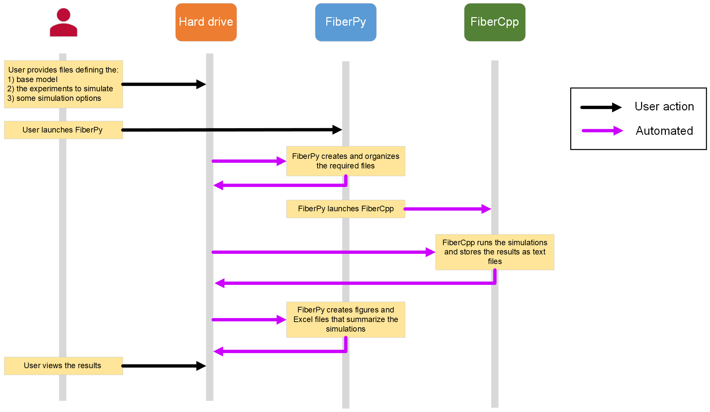

# Demos
{:.no_toc}

This section of the documentation demonstrates how to use FiberSim.

A high-level overview is provided immediately below. The sub-pages provide examples that show how to run a wide range of simulations.

Advanced options include:

+ fitting simulations to experimental data
+ 'sampling' the model by running simulations with parameters selected from a defined hyperspace

The demos explain how to use most of FiberSim's current capabilities but the team sometimes has new options under development. If you want to try and use FiberSim to do something that is not documented, [contact us](../getting_help/getting_help.html).

## Note

None of the simulations (other than the [fitting ones](fitting/fitting.html)) in the demonstrations are specifically tied to experimental data. They are designed to help people use the software and not intended to reproduce specific experimental results.

# Overview

The overarching strategy is to automate as much as possible.

As shown below, users can run every demo on this site by launching FiberPy with the following files:
+ a model file
+ a setup file
+ an options file

FiberPy handles everything else.

The model file describes the properties of a *base* half-sarcomere and, in the case of myofibrils, how many of them are arranged in series.

The setup file describes the experimental protocol (e.g. pCa levels, length-changes, loadeded shortening) and provides options for comparing simulations at different starting lengths, models with different parameters, etc.

The options file provides fine control over the way FiberCpp runs simulations and, if desired, how FiberCpp will write status files to disk.

