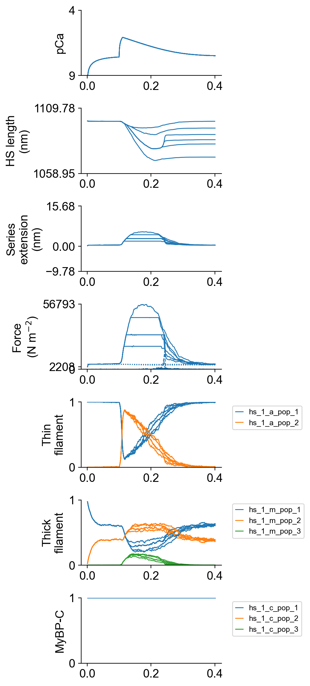
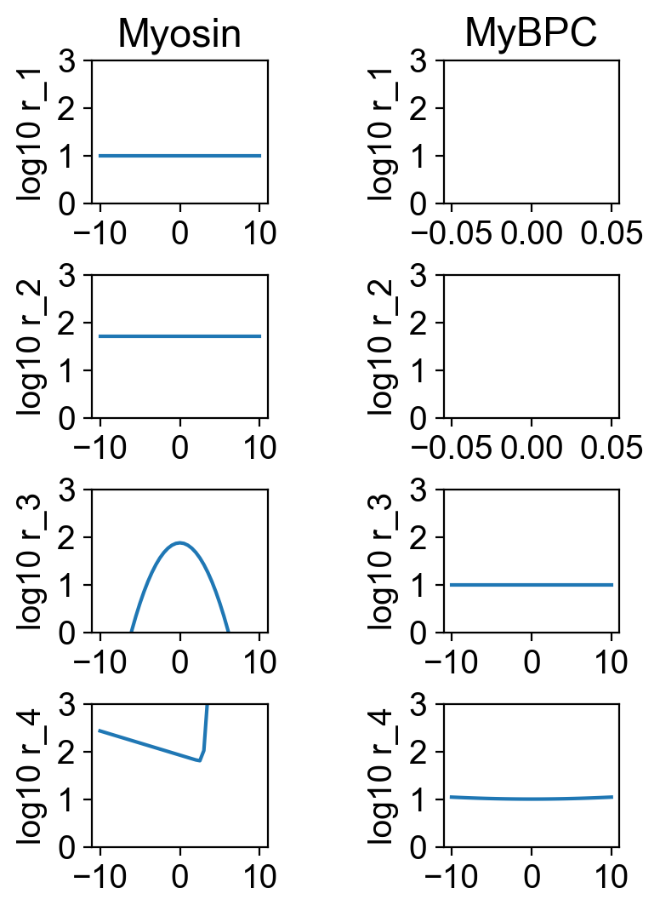

# Afterloads

## Overview

This demo shows how to simulate twitches with afterloads.

## What this demo does

This demo:

+ Runs a set of simulations in which a half-sarcomere is activated by a Ca<sup>2+</sup> transient and allowed to shorten against a range of afterloads.

## Instructions

If you need help with these step, check the [installation instructions](../../../installation/installation.html).

+ Open an Anaconda prompt
+ Activate the FiberSim environment
+ Change directory to `<FiberSim_repo>/code/FiberPy/FiberPy`
+ Run the command
```
 python FiberPy.py characterize "../../../demo_files/electrical_stimulation/afterloads/base/setup.json"
 ```

### Viewing the results

All of the results from the simulation are written to files in `<FiberSim_repo>/demo_files/electrical_stimulation/afterloads/sim_data/sim_output`

The file `superposed_traces.png` shows pCa, length, force per cross-sectional area (stress), and thick and thin filamnt properties plotted against time.



The file `rates.png` summarizes the kinetic scheme.



### How this worked

The setup file is very similar to that used in the prior examples.

```text
{
  "FiberSim_setup":
  {
    "FiberCpp_exe": {
      "relative_to": "this_file",
      "exe_file": "../../../../bin/FiberCpp.exe"
    },
    "model": {
      "relative_to": "this_file",
      "options_file": "sim_options.json",
      "model_files": ["model.json"]
    },
    "characterization": [
        {
            "type": "twitch",
            "relative_to": "this_file",
            "sim_folder": "../sim_data",
            "m_n": 9,
            "protocol":
            {
                "protocol_folder": "../protocols",
                "data": [
                    {
                        "time_step_s": 0.001,
                        "n_points": 400,
                        "stimulus_times_s": [0.1],
                        "Ca_content": 1e-3,
                        "stimulus_duration_s": 0.01,
                        "k_leak": 6e-4,
                        "k_act": 8.2e-2,
                        "k_serca": 20,
                        "afterload":
                        {
                            "load": [20000, 30000, 30000, 30000, 45000, 100000],
                            "break_delta_hs_length": [1, 1, 4, 8, 1, 1]
                        }
                    }
                ]
            },
            "output_image_formats": [ "png" ],
            "figures_only": "False",
            "trace_figures_on": "False"
        }
    ]
  }
}
```

The critical difference here lies in the `characterization` element.

The `protocol->data` element has a new component, labeled `aferload`.

``` text
 "afterload":
{
    "load": [20000, 30000, 30000, 30000, 45000, 100000],
    "break_delta_hs_length": [1, 1, 4, 8, 1, 1]
}
````

`load` and `break_delta_hs_length` are arrays (one value in each array for each simulation) defined as below.

| Parameter | Sets |
| ----| ---------|
| load | The muscle will remain isometric until the stress (N m<sup>-2</sup>) equals this value, at which point the muscle will start to contract isotonically. |
|break_delta_hs_length | The maximum lengthening (in nm) allowed before the muscle breaks out of isotonic shortening and returns to isometric control at the prevailing length |

Since there are 6 values in this example, the demo ran 6 separate trials.

| Simulation | Comments |
| ---- | ---- |
| 1 | Afterload at 20000, break when lengthening exceeds 1 nm |
| 2 | Afterload at 30000, break when lengthening exceeds 1 nm |
| 3 | Afterload at 30000, break when lengthening exceeds 4 nm |
| 4 | Afterload at 30000, break when lengthening exceeds 8 nm |
| 5 | Afterload at 45000, break when lengthening exceeds 1 nm |
| 6 | Afterload at 100000, break when lengthening exceeds 1 nm. The muscle never generates this much force, so the entire simulation is isometric. |


