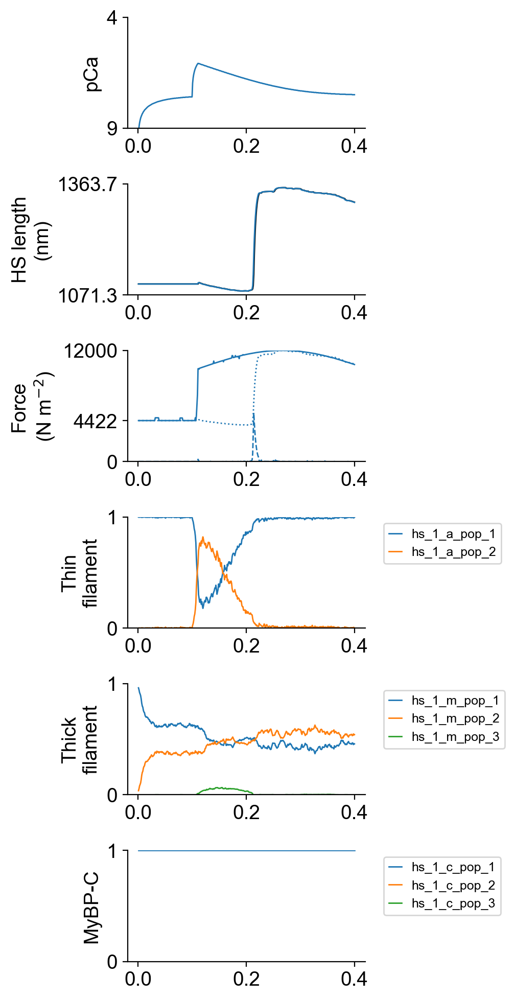
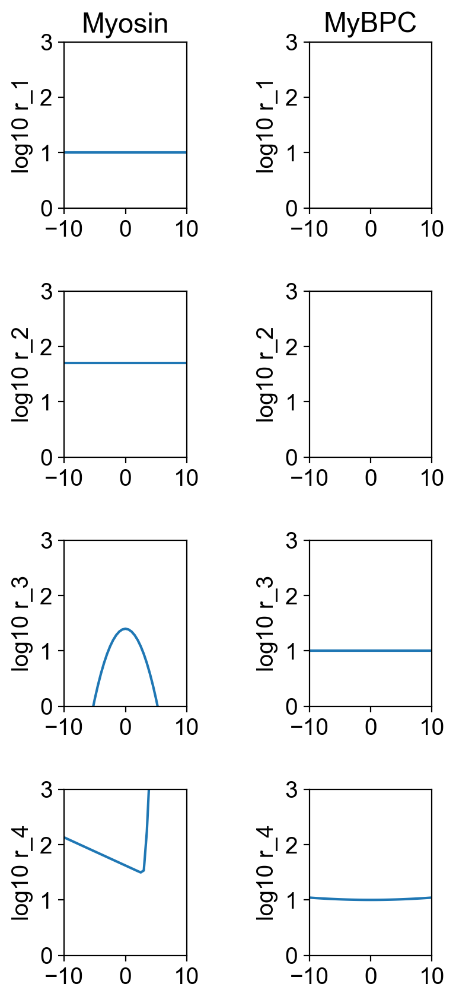

# Arbitrary loads

## Overview

This demo shows how to simulate a muscle that is subjected to a time-varying load while activated by a single stimulus.

## What this demo does

This demo:

+ Runs a single simulation which switches from isometric to force control with an arbitrary signal with a single electrical stimulus activating the muscle

## Instructions

If you need help with these step, check the [installation instructions](../../../installation/installation.html).

+ Open an Anaconda prompt
+ Activate the FiberSim environment
+ Change directory to `<FiberSim_repo>/code/FiberPy/FiberPy`
+ Run the command
```
 python FiberPy.py characterize "../../../demo_files/electrical_stimulation/arbirary_load/base/setup.json"
 ```

### Viewing the results

All of the results from the simulation are written to files in `<FiberSim_repo>/demo_files/electrical_stimulation/arbirary_load/sim_data/sim_output`

The file `superposed_traces.png` shows pCa, length, force per cross-sectional area (stress), and thick and thin filament properties plotted against time.



The file `rates.png` summarizes the kinetic scheme.



### How this worked

The setup file is very similar to that used in the prior examples except that a `load_file` element has been added to the `data` structure.

```text
{
  "FiberSim_setup":
  {
    "FiberCpp_exe": {
      "relative_to": "this_file",
      "exe_file": "../../../../bin/FiberCpp.exe"
    },
    "model": {
      "relative_to": "this_file",
      "options_file": "sim_options.json",
      "model_files": ["model.json"]
    },
    "characterization": [
        {
            "type": "twitch",
            "relative_to": "this_file",
            "sim_folder": "../sim_data",
            "m_n": 4,
            "protocol":
            {
                "protocol_folder": "../protocols",
                "data": [
                    {
                        "time_step_s": 0.001,
                        "n_points": 400,
                        "stimulus_times_s": [0.1],
                        "Ca_content": 1e-3,
                        "stimulus_duration_s": 0.01,
                        "k_leak": 6e-4,
                        "k_act": 8.2e-2,
                        "k_serca": 20,
                        "load_file": "../test_load/test_load.txt"
                    }
                ]
            },
            "output_image_formats": [ "png" ],
            "figures_only": "False",
            "trace_figures_on": "False"
        }
    ]
  }
}
```

Here [`load_file`](load_file.txt) points to a text file with 400 values, arranged one per line.

Values are as follows:
+ -2 means hold muscle at fixed length
+ any float >= 0 means adjust muscle length to keep force at that float

The demo file is shown below:

```
-2
-2
-2
<SNIP>
-2
-2
-2
200
399.97
599.91
799.79
999.58
1199.3
1398.9
1598.3
1797.6
1996.7
2195.6
<SNIP>
7075.3
6887.9
6699.8
```

