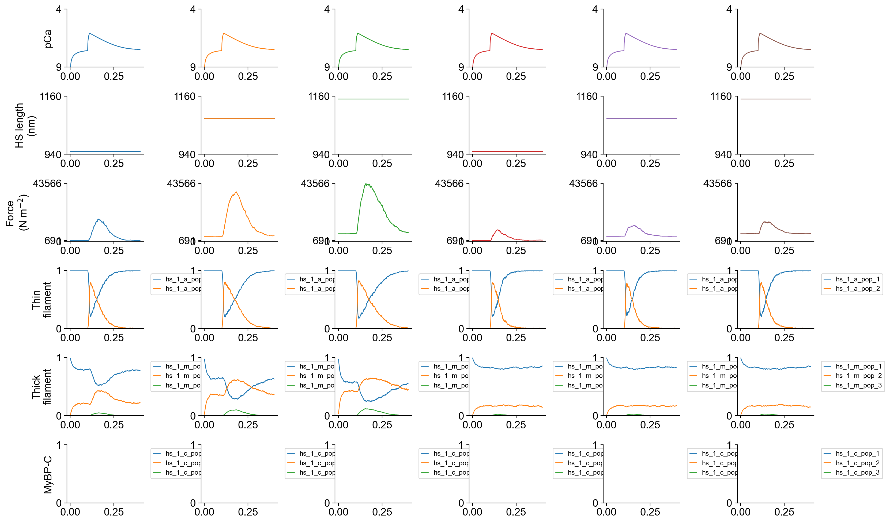
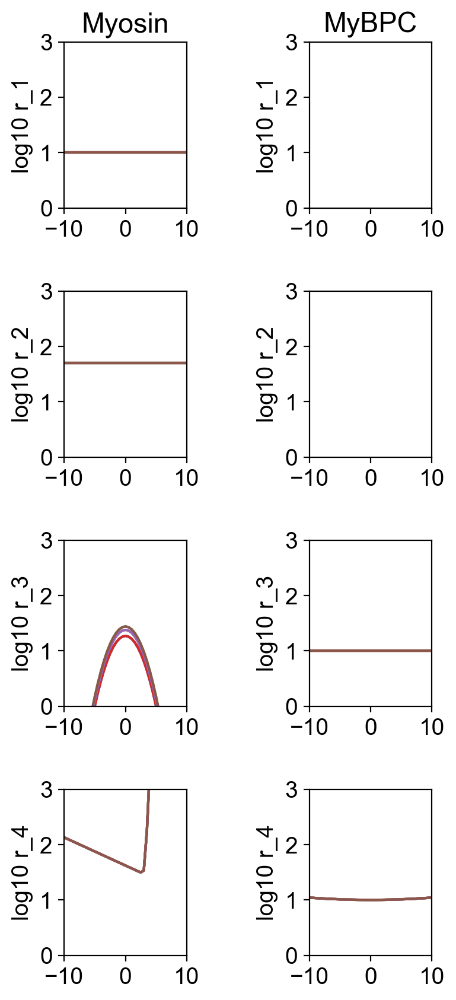

# Twitch length-dependence

## Overview

This demo shows how to simulate isometric twitches:

 + at different lengths
 + with and without force-dependent recruitment of myosin from a suppressed (SRX / OFF) state.

## What this demo does

This demo builds on the [single twitch](../twitch/twitch.html) and [model comparison](../../model_comparison/model_comparison.html) demos and runs

+ simulations of isometric twitches imposed at half-sarcomere lengths of 950, 1075, and 1150 nm
+ for a base model where force increases the transition rate from an SRX-like to a DRX-like state
+ and also for a model where the SRX to DRX transition rate does not increase with force.

## Instructions

If you need help with these step, check the [installation instructions](../../../installation/installation.html).

+ Open an Anaconda prompt
+ Activate the FiberSim environment
+ Change directory to `<FiberSim_repo>/code/FiberPy/FiberPy`
+ Run the command
```
 python FiberPy.py characterize "../../../demo_files/electrical_stimulation/twitch_length_dependence/base/setup.json"
 ```

### Viewing the results

All of the results from the simulation are written to files in `<FiberSim_repo>/demo_files/electrical_stimulation/twitch_length_dependence/sim_data/sim_output`

The file `superposed_traces.png` shows pCa, length, force per cross-sectional area (stress), and thick and thin filament properties plotted against time.



The first three columns show isometric twitches for the base model at the three lengths. Note that the baseline force (the passive force) increases with length. This reflects the increased stress in the titin molecules. The twitch force also increases markedly with length. If you look at the 5th row of the figure, you can seee that the SRX (blue) myosin population drops with length while the DRX population (orange) increases. Since more heads are available to bind actin (green) when the thin filament activates (4th row of figure), the peak twitch force increases too. The increased number of attached cross-bridges enhances cooperative activation of the thin filament (shown by the prolonged thin filament activation, orange traces).

Columns 4 to 6 show isometric twitches for simulations where the SRX to DRX transition does not increase with force. Note that passive force still increases with length but the other effects noted above are absent.

As usual, the file `rates.png` summarizes the kinetic scheme.



### How this worked

All these simulations were generated from a single setup file.

```text
{
  "FiberSim_setup":
  {
    "FiberCpp_exe": {
      "relative_to": "this_file",
      "exe_file": "../../../../bin/FiberCpp.exe"
    },
    "model": {
      "relative_to": "this_file",
      "options_file": "sim_options.json",
      "manipulations":
      {
        "base_model": "model.json",
        "generated_folder": "../generated",
        "adjustments":
        [
            {
                "variable": "m_kinetics",
                "isotype": 1,
                "state": 1,
                "transition": 1,
                "parameter_number": 2,
                "multipliers": [1, 0]
            }
        ]
      }
    },
    "characterization": [
        {
            "type": "twitch",
            "relative_to": "this_file",
            "sim_folder": "../sim_data",
            "m_n": 16,
            "hs_lengths": [950, 1075, 1150],
            "protocol":
            {
                "protocol_folder": "../protocols",
                "data": [
                    {
                        "time_step_s": 0.001,
                        "n_points": 400,
                        "stimulus_times_s": [0.1],
                        "Ca_content": 1e-3,
                        "stimulus_duration_s": 0.01,
                        "k_leak": 6e-4,
                        "k_act": 8.2e-2,
                        "k_serca": 20
                    }
                ]
            },
            "output_image_formats": [ "png" ],
            "figures_only": "False",
            "trace_figures_on": "False"
        }
    ]
  }
}
```

The different lengths were defined in the `characterization` element as in [length_dependent pCa curves](../../pCa_curves/different_lengths/different_lengths.html).

The absence and presence of force-dependence on the SRX to DRX transition were implemented using the `manipulations` element as in [parameter_adjustments](../../model_comparison/parameter_adjustments/parameter_adjustments.html).
