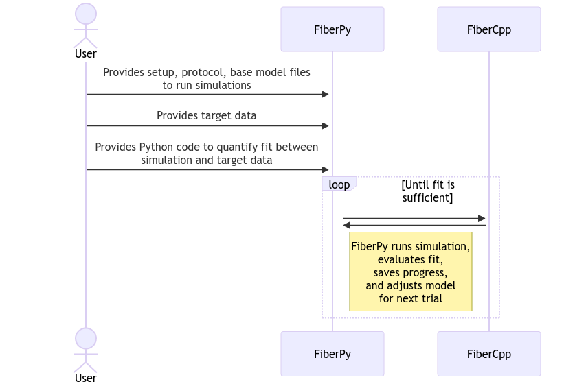

## Fitting

In FiberSim, _fitting_ a model means trying to find the set of parameter values that yields the optimal match to some _target data_.

In principle, fitting sounds relatively easy - few readers of this documentation would struggle to fit a straight line to data, which implies finding the best combination of `m` and `c` for `y = m x + c`.

In practice, fitting FiberSim models is typically more challenging, and sometimes feels more like an art than a science.

There are several reasons:

+ FiberSim models take a long time (typically tens of seconds) to run, so testing each potential combination of parameters is time-consuming.
+ There are _lots_ of parameters one could adjust - how does one decide which parameters to try?
+ FiberSim is stochastic, so each simulation has some (perhaps random?) uncertainty associated with it. The uncertainty can be reduced by averaging over more filaments, but this adds to the computational time.
+ FiberSim is complicated so each test involves generating, or at least organizing, different combinations of model, protocol, and options files.
+ How should the fit between the simulation and the target data be evaluated?

This set of demonstrations provides some examples. If you want to fit your own models, it's likely that you are involved some sort of active research. Please reach out if you need more help with a specific idea.

### Overview

The basic sequence is as follows.

<!---
sequenceDiagram
    actor User 
    User->>+FiberPy: Provides setup, protocol, base model files<br/>to run simulations
    User->>+FiberPy: Provides target data
    User->>+FiberPy: Provides Python code to quantify fit between<br/>simulation and target data
    
    loop Until fit is sufficient
        FiberPy->>+FiberCpp: 
        FiberCpp->>+FiberPy: 
        note right of FiberPy: FiberPy runs simulation,<br/>evaluates fit,<br/>saves progress,<br/>and adjusts model<br/>for next trial 
    end
--->



### Defining the fitting process

Fitting procedures are defined and initialized by a `setup file`. An example is shown below. Several components are idential to those used for [parameter adjustments](../model_comparison/parameter_adjustments/parameter_adjustments.html).

```text
"model":
{
    "relative_to": "this_file",
    "options_file": "sim_options.json",
    "fitting":
    {
        "base_model": "model.json",
        "generated_folder": "../generated",
        "working_folder": "../working",
        "progress_folder": "../progress",
        "Python_objective_call": "../Python_code/return_fit.py",
        "optimizer": "particle_swarm",
        "initial_guess": [0.5, 0.5, 0.5],
        "single_run": "False",
        "adjustments":
        [
            {
                "variable": "m_kinetics",
                "isotype": 1,
                "state": 2,
                "transition": 1,
                "parameter_number": 1,
                "factor_bounds": [-1, 1],
                "factor_mode": "log"
            },
            {
                "variable": "m_kinetics",
                "isotype": 1,
                "state": 3,
                "transition": 1,
                "parameter_number": 1,
                "factor_bounds": [-1, 1],
                "factor_mode": "log"
            },
            {
                "class": "thin_parameters",
                "variable": "a_k_on",
                "output_type": "float",
                "factor_bounds": [0.5, 1.5]
            }
        ]
    }
}
```

The fitting section is as follows.

| Parameter | Explanation |
| --- | --- |
| base_model | Path to the original model which will be adjusted in successive iterations to optimize the fit to the target data |
| generated_folder | Path to a folder that will contain the 'adjusted' files |
| working_folder | Path to another folder that contains files which define the current iteration |
| progress_folder | Path to a folder that contain files that describe how the fit is evolving and the best fit obtained to date |
| Python_objective_call | Path to a Python script that compares the output from a simulation to their target data and returns a single numerical value that quantifies the fit. In most cases, this will be some sort of least-squares error.<br/><b>Note that unless the code from a demo can be repurposed, the user needs to provide their own Python code.</b> |
| optimizer | `particle_swarm` or any method supported by [scipy.optimize.minimize](https://docs.scipy.org/doc/scipy/reference/generated/scipy.optimize.minimize.html) |
| initial_guess | (optional) vector of `p_values` - see below |
| single_run | True - runs a single trial and stops (useful for trouble-shooting) - or False to run a fit

## Adjustments and p vectors

Models are adjusted for successive iterations using a `p_vector` and an array of parameter adjustments.

The length of the `p_vector` is the same as the number of adjustments. Each element of the vector is constrained between 0 and 1. The mapping between the `p_vector` element and the parameter value in the model is defined by the adjustment.

Fitting thus requires finding the `p_vector` that produces the optimal fit to the experimental data.

The adjustment are best explained by example.

```text
{
    "variable": "m_kinetics",
    "isotype": 1,
    "state": 2,
    "transition": 1,
    "parameter_number": 1,
    "factor_bounds": [-1, 1],
    "factor_mode": "log"
}
```

As described in [parameter adjustments](../model_comparison/parameter_adjustments/parameter_adjustments.html), this section focuses on

+ m_kinetics
+ isotpye = 1
+ state = 2
+ transition = 1
+ parameter_number = 1

`factor_bounds` is a two-element array that defines the minimum and maximum scaling of the value in the `base_model`.

`factor_mode` is optional. When it is `log`, the `factor_bounds` are transferred to log<sub>10</sub> space.

`p` = 0 maps to the lower bound. `p` = 1 maps to the upper bound. Intermediate values are interpolated linearly.

Assuming the parameter value in the `base model` is 100

| p | Value in new model |
| --- | --- |
| 0 | 10<sup>-1</sup> * 100 = 10 |
| 0.5 | 10<sup>0</sup> * 100 = 100 |
| 1 | 10 <sup>1</sup> * 100 = 1000 |


#### Additional example

```text
{
    "class": "thin_parameters",
    "variable": "a_k_on",
    "output_type": "float",
    "factor_bounds": [0.5, 2.5]
}
```

Assuming the parameter value in `base_model` is 1e7.

| p | Value in new model |
| --- | --- |
| 0 | 0.5 * 1e7 = 5e6 |
| 0.5 | 1.5 * 1e7 = 1.5e7 |
| 1 | 2.5 * 1e7 = 2.5e7 |

