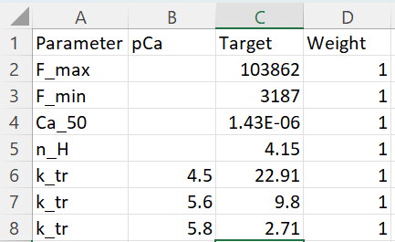

## Fitting to force-pCa and k_tr

## Overview

This demo shows how to fit a model to force-pCa and k_tr data.

## What this demo does

This demo:

+ uses a [fitting setup](../fitting.html) to iteratively adjust a `base model` seeking the best fit to `target data`.
+ shows how to analyze the fitting process.

## Instructions

If you need help with these step, check the [installation instructions](../../../installation/installation.html).

+ Open an Anaconda prompt
+ Activate the FiberSim environment
+ Change directory to `<FiberSim_repo>/code/FiberPy/FiberPy`
+ Run the command

<b>Note before you run this command that initializing a new fit will over-write the example data stored in your repo. Regenerating it will take a long time - potentially several hours. You may want to read through the rest of this page first.</b>

```text
 python FiberPy.py fit_model "../../../demo_files/fitting/force_pCa_and_k_tr/base/setup.json"
 ```

+ You should see text appearing in the terminal window, showing that the simulations are running. When it finishes (this may take a few minutes), you should see something similar to the image below.

### Viewing the results

All of the results from the simulation are written to files in `<FiberSim_repo>/demo_files/fitting/force_pCa_and_k_tr`

Lots of stuff here.

### How this worked

The `setup file` is shown below.

Most parts are standard.

+ the `FiberCpp_exe` section is as normal.
+ the `model` section was described in [fitting](../fitting.html)
+ the `characterization` section defines a [force-pCa with k_tr](../../pCa_curves/single_curve/single_curve.html) protocol.

```text
{
  "FiberSim_setup":
  {
    "FiberCpp_exe": {
      "relative_to": "this_file",
      "exe_file": "../../../../bin/FiberCpp.exe"
    },
    "model":
    {
      "relative_to": "this_file",
      "options_file": "sim_options.json",
      "fitting":
      {
        "base_model": "model.json",
        "generated_folder": "../generated",
        "working_folder": "../working",
        "progress_folder": "../progress",
        "Python_objective_call": "../Python_code/return_fit.py",
        "optimizer": "particle_swarm",
        "initial_guess": [0.5, 0.5, 0.5],
        "single_run": "False",
        "adjustments":
        [
            {
                "variable": "m_kinetics",
                "isotype": 1,
                "state": 2,
                "transition": 1,
                "parameter_number": 1,
                "factor_bounds": [-1, 1],
                "factor_mode": "log"
            },
            {
              "variable": "m_kinetics",
              "isotype": 1,
              "state": 3,
              "transition": 1,
              "parameter_number": 1,
              "factor_bounds": [-1, 1],
              "factor_mode": "log"
          },
          {
              "class": "thin_parameters",
              "variable": "a_k_on",
              "output_type": "float",
              "factor_bounds": [0.5, 1.5]
          }
      ]
    }
  },
  "characterization":
  [
        {
            "type": "pCa_length_control",
            "relative_to": "this_file",
            "sim_folder": "../sim_data",
            "m_n": 25,
            "pCa_values": [9, 6.1, 5.8, 5.6, 4.5],
            "sim_duration_s": 1.4,
            "time_step_s": 0.001,
            "pCa_step_up_s": 0.05,
            "k_tr_start_s": 0.8,
            "k_tr_duration_s": 0.02,
            "k_tr_ramp_s": 0.001,
            "k_tr_magnitude_nm": 100,
            "k_tr_fit_time_s": [0.822, 1.39],
            "output_image_formats": [ "png" ],
            "figures_only": "False",
            "trace_figures_on": "False"            
        }
    ]
  }
}
```

The only new feature included is the `Python_objective_call`. This defines a relative path to a Python script reproduced below.

The script:

+ accesses the results of a test simulation and extracts values of:
  + F<sub>max</sub>
  + F<sub>min</sub>
  + pCa<sub>50</sub>
  + n<sub>H</sub>
  + value of k<sub>tr</sub> calculated at:
    + pCa 4.5
    + pCa 5.6
    + pCa 5.8
+ compares these values to corresponding data stored in `../target_data/target_data.xlsx`
+ updates several files with information about the fitting process
+ returns a single value quantifying the least-squares error between the test simulation and the `target_data`.

The `target_data` file is shown here.



### Python script

```text
# -*- coding: utf-8 -*-
"""
Created on Mon Jan 22 21:56:54 2024

@author: ken
"""

import os
import sys

from pathlib import Path

import numpy as np
import pandas as pd

def return_fit():
    """ returns a single value defining the least squares fit
        between the current simulation and the target data """
        
    # Variables
    top_data_folder = '../sim_data/sim_output'
    pCa_data_file = 'pCa_analysis.xlsx'
    pCa_sheet = 'curve_1'
    k_tr_data_file = 'k_tr_analysis.xlsx'
    target_data_file = '../target/target_data.xlsx'
    trial_errors_file = '../working/trial_errors.xlsx'
    comparison_file = '../sim_data/sim_output/comparison.xlsx'
    
    # Code    
    # Adapt because files are relative to this file
    parent_dir = Path(__file__).parent.absolute()
    top_data_folder = Path(os.path.join(parent_dir, top_data_folder)).resolve()
    
    # Open the pCa data
    pCa_data_file = os.path.join(top_data_folder, pCa_data_file)
    
    pCa_data = pd.read_excel(pCa_data_file,
                             sheet_name = pCa_sheet)
    
    # Open the k_tr file
    k_tr_data_file = os.path.join(top_data_folder, k_tr_data_file)
    
    k_tr_data = pd.read_excel(k_tr_data_file)
    
    # Open the target_data
    target_data_file = os.path.join(parent_dir, target_data_file)
    
    target_data = pd.read_excel(target_data_file)
    
    # Set the trial errors file
    trial_errors_file = os.path.join(parent_dir, trial_errors_file)
    
    # Set the comparison file
    comparison_file = os.path.join(parent_dir, comparison_file)
    
    # Display
    print(pCa_data)
    print(k_tr_data)
    print(target_data)
    
    # Build up the error signal
    no_of_error_components = 7
    error_components = np.NaN * np.ones(no_of_error_components)
    
    # Cycle through them
    for i in range(no_of_error_components):
        
        # Pull test values from simulation spreadsheets
        if (i==0):
            test_value = pCa_data['y_min'].iloc[0] + \
                pCa_data['y_amp'].iloc[0]
            
            # Add in a column for test values
            target_data['Test_value'] = np.NaN * np.ones(len(target_data['Target']))
            
        if (i==1):
            test_value = pCa_data['y_min'].iloc[0]
            target_value = target_data['Target'].iloc[1]
            w = target_data['Weight'].iloc[1]
            
        if (i==2):
            test_pCa = pCa_data['pCa_50'].iloc[0]
            test_value = np.power(10, -test_pCa)
            
        if (i==3):
            test_value = pCa_data['n_H'].iloc[0]
            
        if (i==4):
            test_value = k_tr_data['k_tr'].iloc[0]
            
        if (i==5):
            test_value = k_tr_data['k_tr'].iloc[1]

        if (i==6):
            test_value = k_tr_data['k_tr'].iloc[2]

        # Pull targets
        target_value = target_data['Target'].iloc[i]
        w = target_data['Weight'].iloc[i]
        
        # Add test_value to target
        target_data.loc[i, 'Test_value'] = test_value

        # Calculate error_component    
        error_components[i] = w * np.power(
            (target_value - test_value) / target_value, 2.0)

    # Calculate final value
    e = np.sum(error_components)    
    
    # Write error data to file
    d = dict()
    for i in range(len(error_components)):
        d['error_cpt_%i' % (i+1)] = error_components[i]
    d['error_total'] = e
    
    # Make a dataframe    
    df = pd.DataFrame(data=d, index=[0])
    
    print(target_data)
    print(df)
    
    # Check the dir exists
    worker_parent_dir = Path(trial_errors_file).parent
    if not os.path.isdir(worker_parent_dir):
        os.makedirs(worker_parent_dir)
    
    # Clean the file and then write
    if (os.path.exists(trial_errors_file)):
        os.remove(trial_errors_file)
    df.to_excel(trial_errors_file, index=False)
        
    # Now write the test_values file
    target_data.to_excel(comparison_file, index=False)
    
if __name__ == "__main__":
    return_fit()


```
  
  

