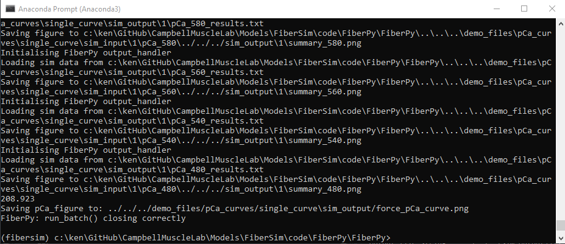
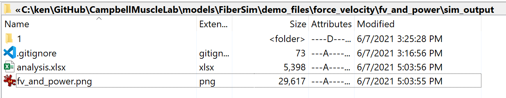
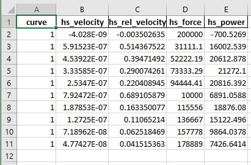
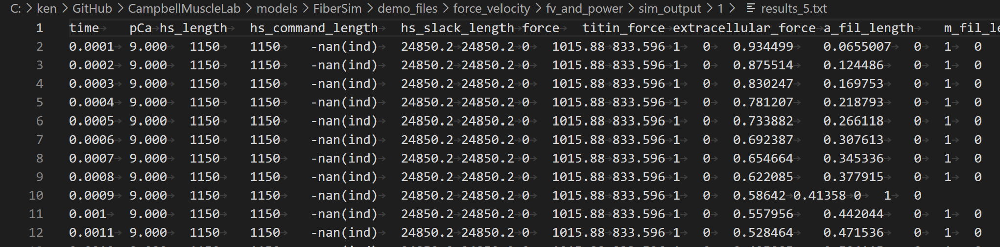
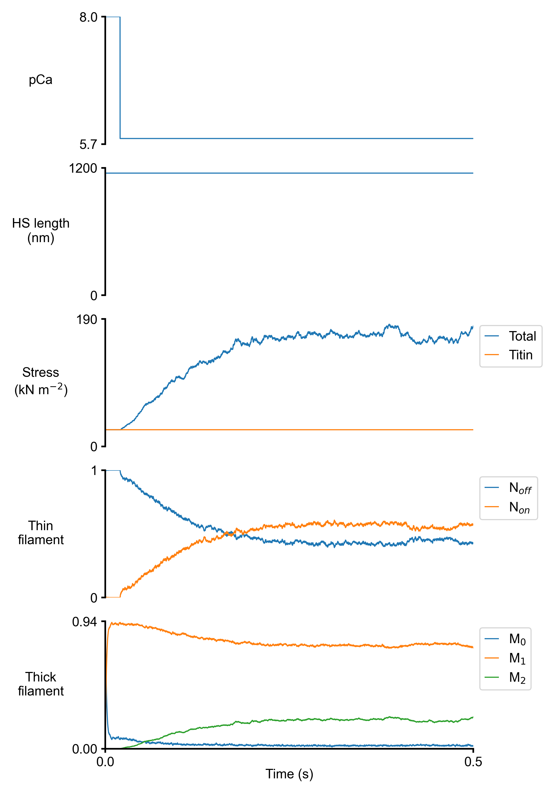

# Force velocity and power

## Overview

This demo shows how to use a batch structure to calculate force-velocity and power curves.

## What this demo does

This demo:

+ Runs a series of simulations in which a half-sarcomere is activated in a solution with a pCa of 4.5 and then allowed to shorten against a specified load

+ Calculates the shortening velocity for each load

+ Plots the force-velocity and force-power curves

## Instructions

Before proceeding, make sure that you have followed the [installation instructions](../../installation/installation.html). You need the FiberSim repository, an Anaconda distribution of Python, and an active FiberSim environment to run this demo.

### Getting ready

+ Open an Anaconda Prompt

+ Activate the FiberSim Anaconda Environment by executing:
```
conda activate fibersim
```
+ Change directory to `<repo>/code/FiberPy/FiberPy`, where `<repo>` is the directory where you installed FiberSim

### Run a simulation

+ Type:
 ```
 python FiberPy.py run_batch "../../../demo_files/force_velocity/fv_and_power/batch_fv_and_power.json"
 ```

+ You should see text appearing in the terminal window, showing that the simulations are running. When it finishes (this may take a few minutes), you should see something similar to the image below.



### Viewing the results

All of the results from the simulation are written to files in `<repo>/demo_files/force_velocity/fv_and_power/sim_output`



The file `fv_and_power.png` in the main `sim_output` folder shows the force-velocity and force-power curves.


The underlying data are stored in `analysis.xlsx`



+ Simulations for each isotonic load are stored in the sub-folder named `1`.

![sub_folder]sub_folder.png)

For each pCa value, there is:

+ a `*.txt` file with the main simulation results
+ a `*.png` file with a summary figure






## How this worked

These plots were generated by running a sequence of simulations, each of which corresponded to a half-sarcomere activated in pCa 4.5 solution and then allowed to shorten against a pre-defined load.

Each simulation was defined by a job, with the different jobs being grouped together as an array. All of this information is stored in the `batch_fv_and_power.json` file that was passed to FiberPy and which is displayed below.

Looking at the first job, you can see that FiberSim will run a simulation using:
+ `model_file: sim_input/1/model_1.json`
+ `options_file: sim_input/sim_options.json`
+ `protocol_file: sim_input/1/rel_f_5/prot_rel_f_5.txt`

with the results being written to `sim_output/1/results_5.txt` and summary figures being created based on `sim_input/1/rel_f_5/output_handler_5.json`

The other jobs in the array use a similar structure.

The final section of the batch file, labeled `batch_figures` tells FiberPy to:

+ collate the results in the `sim_output` folder
+ deduce the shortening velocity and mean force over the interval 0.21 to 0.24 s in the simulations
+ save the force-velocity data to `sim_output/analysis.xlsx`
+ create a figure and save it to `sim_output/fv_and_power.png`

The code underlying this part of the process assumes that all of the `*.txt` files in `sim_output\1` are the results files for a single curve. 

````
{
   "FiberSim_batch":
   {
        "FiberCpp_exe":
        {
            "relative_to": "this_file",
            "exe_file": "../../../bin/fibercpp.exe"
        },
        "job": [
            {
                "relative_to": "this_file",
                "model_file": "sim_input\\1\\model_1.json",
                "options_file": "sim_input/sim_options.json",
                "protocol_file": "sim_input\\1\\rel_f_5\\prot_rel_f_5.txt",
                "results_file": "sim_output\\1\\results_5.txt",
                "output_handler_file": "sim_input\\1\\rel_f_5\\output_handler_5.json"
            },
            {
                "relative_to": "this_file",
                "model_file": "sim_input\\1\\model_1.json",
                "options_file": "sim_input/sim_options.json",
                "protocol_file": "sim_input\\1\\rel_f_16\\prot_rel_f_16.txt",
                "results_file": "sim_output\\1\\results_16.txt",
                "output_handler_file": "sim_input\\1\\rel_f_16\\output_handler_16.json"
            },
            {
                "relative_to": "this_file",
                "model_file": "sim_input\\1\\model_1.json",
                "options_file": "sim_input/sim_options.json",
                "protocol_file": "sim_input\\1\\rel_f_26\\prot_rel_f_26.txt",
                "results_file": "sim_output\\1\\results_26.txt",
                "output_handler_file": "sim_input\\1\\rel_f_26\\output_handler_26.json"
            },
            {
                "relative_to": "this_file",
                "model_file": "sim_input\\1\\model_1.json",
                "options_file": "sim_input/sim_options.json",
                "protocol_file": "sim_input\\1\\rel_f_37\\prot_rel_f_37.txt",
                "results_file": "sim_output\\1\\results_37.txt",
                "output_handler_file": "sim_input\\1\\rel_f_37\\output_handler_37.json"
            },
            {
                "relative_to": "this_file",
                "model_file": "sim_input\\1\\model_1.json",
                "options_file": "sim_input/sim_options.json",
                "protocol_file": "sim_input\\1\\rel_f_47\\prot_rel_f_47.txt",
                "results_file": "sim_output\\1\\results_47.txt",
                "output_handler_file": "sim_input\\1\\rel_f_47\\output_handler_47.json"
            },
            {
                "relative_to": "this_file",
                "model_file": "sim_input\\1\\model_1.json",
                "options_file": "sim_input/sim_options.json",
                "protocol_file": "sim_input\\1\\rel_f_58\\prot_rel_f_58.txt",
                "results_file": "sim_output\\1\\results_58.txt",
                "output_handler_file": "sim_input\\1\\rel_f_58\\output_handler_58.json"
            },
            {
                "relative_to": "this_file",
                "model_file": "sim_input\\1\\model_1.json",
                "options_file": "sim_input/sim_options.json",
                "protocol_file": "sim_input\\1\\rel_f_68\\prot_rel_f_68.txt",
                "results_file": "sim_output\\1\\results_68.txt",
                "output_handler_file": "sim_input\\1\\rel_f_68\\output_handler_68.json"
            },
            {
                "relative_to": "this_file",
                "model_file": "sim_input\\1\\model_1.json",
                "options_file": "sim_input/sim_options.json",
                "protocol_file": "sim_input\\1\\rel_f_79\\prot_rel_f_79.txt",
                "results_file": "sim_output\\1\\results_79.txt",
                "output_handler_file": "sim_input\\1\\rel_f_79\\output_handler_79.json"
            },
            {
                "relative_to": "this_file",
                "model_file": "sim_input\\1\\model_1.json",
                "options_file": "sim_input/sim_options.json",
                "protocol_file": "sim_input\\1\\rel_f_89\\prot_rel_f_89.txt",
                "results_file": "sim_output\\1\\results_89.txt",
                "output_handler_file": "sim_input\\1\\rel_f_89\\output_handler_89.json"
            },
            {
                "relative_to": "this_file",
                "model_file": "sim_input\\1\\model_1.json",
                "options_file": "sim_input/sim_options.json",
                "protocol_file": "sim_input\\1\\rel_f_100\\prot_rel_f_100.txt",
                "results_file": "sim_output\\1\\results_100.txt",
                "output_handler_file": "sim_input\\1\\rel_f_100\\output_handler_100.json"
            }
        ],
        "batch_figures":
        {
            "force_velocity":
            [
                {
                    "relative_to": "this_file",
                    "results_folder": "sim_output",
                    "fit_time_interval_s": [0.21, 0.24],
                    "output_data_file_string": "sim_output/analysis.xlsx",
                    "output_image_file_string": "sim_output/fv_and_power.png"
                }
            ]
        }
    }
}
````
