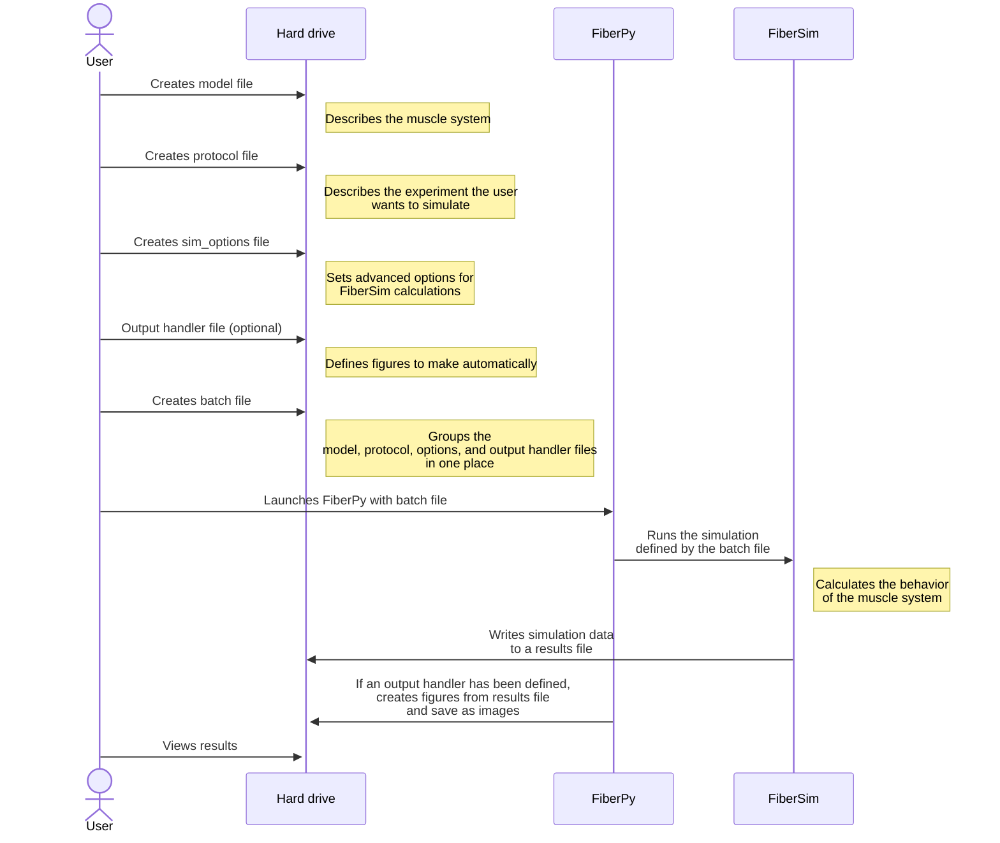
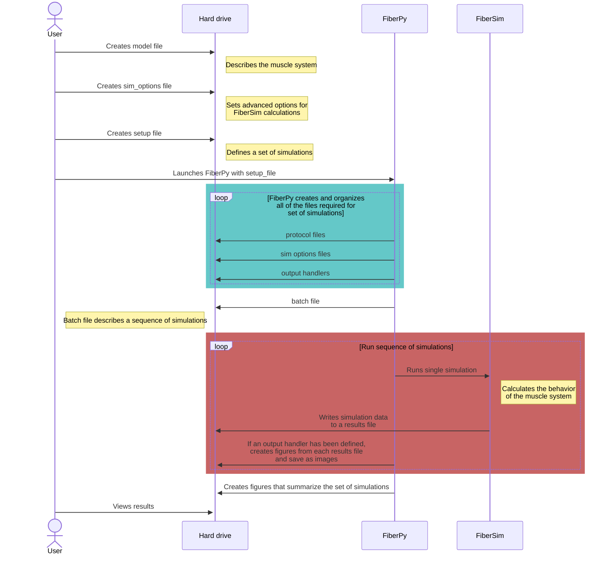

# Getting started

If this is the first time using FiberSim, make sure you have [installed the software](../../installation/installation.html) before trying the demos. You need a computer running Windows.

## Note

The simulations in the demonstrations have not been fitted to data and are intended to illustrate general mechanisms, as opposed to reproducing specific experimental results.

## Concept

## Simulations

