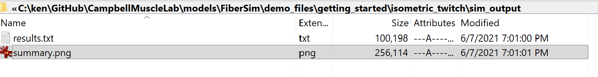
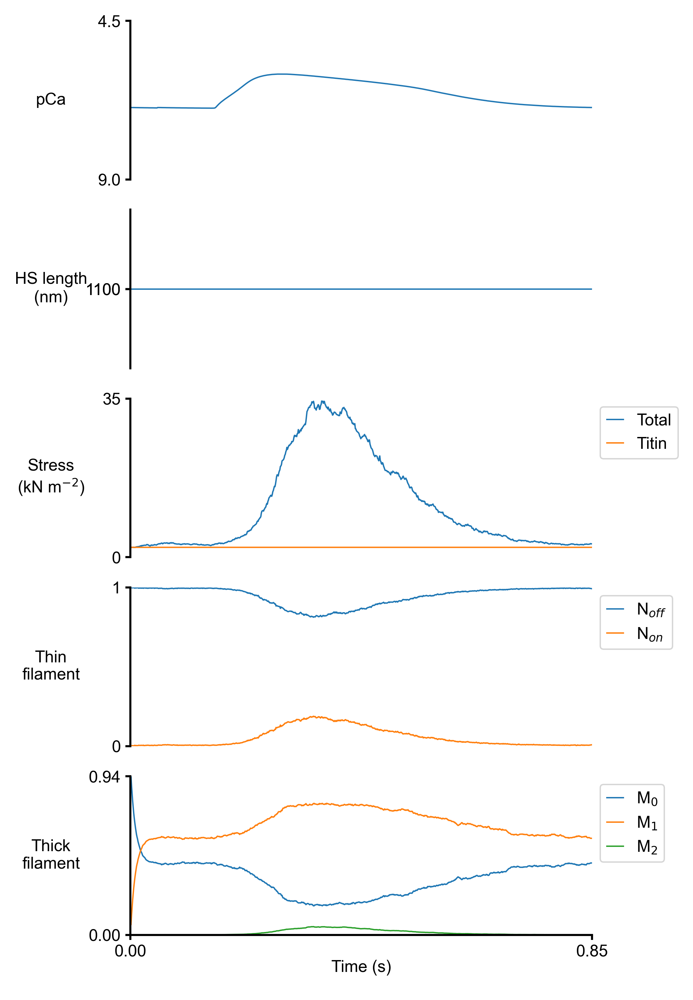

# Isometric twitch

## Overview

This demo builds on the [isometric activation demo](../isometric_activation/isometric_activation.html) and shows how to run a single simulation where the muscle is activated isometrically by a Ca<sup>2+</sup> transient.

## What this demo does

This demo:

+ Runs a single simulation in which a half-sarcomere is held isometric, and activated by a transient increase in the Calcium concentration

+ Plots a summary of the simulation

## Instructions

Before proceeding, make sure that you have followed the [installation instructions](../../../installation/installation.html). You need the FiberSim folder, an Anaconda distribution of Python, and an active FiberSim environment to run this demo.

### Getting ready

+ Open an Anaconda Prompt

+ Activate the FiberSim Anaconda Environment by executing:
```
conda activate fibersim
```
+ Change directory to `<FiberSim_dir>/code/FiberPy/FiberPy`, where `<FiberSim_dir>` is the directory where you installed FiberSim.

### Run a simulation

+ Type:
 ```
 python FiberPy.py run_batch "../../../demo_files/getting_started/isometric_twitch/batch_isometric_twitch.json"
 ```

+ You should see text appearing in the terminal window, showing that the simulations are running.

### Viewing the results

All of the results from the simulation are written to files in `<repo>/demo_files/getting_started/isometric_twitch/sim_output`



The file `summary.png` shows pCa, length, force per cross-sectional area (stress), and thick and thin filamnt properties plotted against time..



## How this worked

As described in the [isometric activation demo](../isometric_activation/isometric_activation.html), the simulation was described by a batch file.

The only difference is that this simulation used a different protocol file, which is described in the section below.

````
{
    "FiberSim_batch": {
        "FiberCpp_exe":
        {
            "relative_to": "this_file",
            "exe_file": "../../../bin/FiberCpp.exe"
        },
        "job":[
            {
                "relative_to": "this_file",
                "model_file": "sim_input/model.json",
                "options_file": "sim_input/options.json",
                "protocol_file": "sim_input/twitch_protocol.txt",
                "results_file": "sim_output/results.txt",
                "output_handler_file": "sim_input/output_handler.json"
            }
        ]
    }
}
````

### Protocol file

Here is a snip from the top of the protocol file.

````
dt     pCa dhsl mode
0.0001 6.9598 0.0 -2.0
0.0001 6.9598 0.0 -2.0
0.0001 6.9598 0.0 -2.0
0.0001 6.9598 0.0 -2.0
0.0001 6.9598 0.0 -2.0
0.0001 6.9598 0.0 -2.0
0.0001 6.9598 0.0 -2.0
0.0001 6.9598 0.0 -2.0
0.0001 6.9598 0.0 -2.0
0.0001 6.9598 0.0 -2.0
0.0001 6.9598 0.0 -2.0
0.0001 6.9601 0.0 -2.0
0.0001 6.9602 0.0 -2.0
0.0001 6.9602 0.0 -2.0
0.0001 6.9602 0.0 -2.0
0.0001 6.9602 0.0 -2.0
0.0001 6.9602 0.0 -2.0
0.0001 6.9602 0.0 -2.0
0.0001 6.9602 0.0 -2.0
0.0001 6.9602 0.0 -2.0
0.0001 6.9602 0.0 -2.0
0.0001 6.9602 0.0 -2.0
0.0001 6.9602 0.0 -2.0
0.0001 6.9602 0.0 -2.0
0.0001 6.9602 0.0 -2.0
0.0001 6.9606 0.0 -2.0
0.0001 6.9606 0.0 -2.0
0.0001 6.9606 0.0 -2.0
````

Note that in comparison to the other demos in this section, the pCa values are not "round" numbers like 9.0 or 4.5. Instead, they are floating point numbers that describe an idealized Ca<sup>2+</sup> transient.
