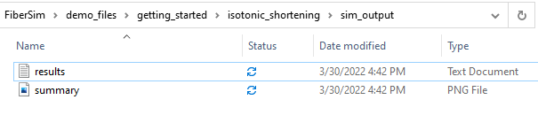
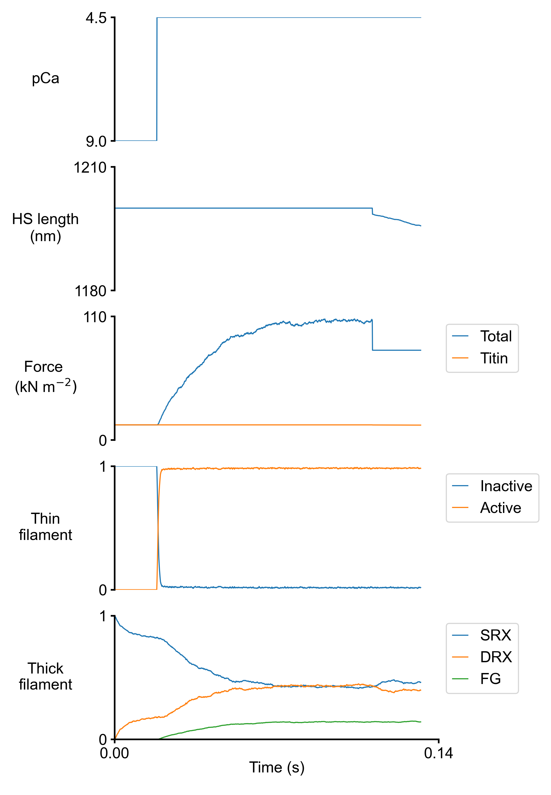

# Ramp shortening

## Overview

This demo builds on the [isometric activation]('../isometric_activation/isometric_activation.html') and [ramp shortening]('../ramp_shortening/ramp_shortening.html')demos and shows how to run a single simulation where the muscle is activated isometrically and then allowed to shorten against a constant load.

## What this demo does

This demo:

+ Runs a single simulation in which a half-sarcomere is held isometric, activated in a solution with a pCa of 4.5, and once force has stabilized, allowed to shortening against a constant load

+ Plots a summary of the simulation

## Instructions

Before proceeding, make sure that you have followed the [installation instructions](../../installation/installation.html). You need the FiberSim repository, an Anaconda distribution of Python, and an active FiberSim environment to run this demo.

### Getting ready

+ Open an Anaconda Prompt

+ Activate the FiberSim Anaconda Environment by executing:
```
conda activate fibersim
```
+ Change directory to `<FiberSim_dir>/code/FiberPy/FiberPy`, where `<FiberSim_dir>` is the directory where you installed FiberSim.

### Run a simulation

+ Type:
 ```
 python FiberPy.py run_batch "../../../demo_files/getting_started/isotonic_shortening/batch_isotonic_shortening.json"
 ```

+ You should see text appearing in the terminal window, showing that the simulations are running.

### Viewing the results

All of the results from the simulation are written to files in `<repo>/demo_files/getting_started/isotonic/sim_output`



The file `summary.png` shows pCa, length, force per cross-sectional area (stress), and thick and thin filamnt properties plotted against time..



## How this worked

Here's the batch file that ran this simulation.

````
{
    "FiberSim_batch": {
        "FiberCpp_exe":
        {
            "relative_to": "this_file",
            "exe_file": "../../../bin/FiberCpp.exe"
        },
        "job":[
            {
                "relative_to": "this_file",
                "model_file": "sim_input/model.json",
                "options_file": "sim_input/options.json",
                "protocol_file": "sim_input/pCa45_isotonic_shortening.txt",
                "results_file": "sim_output/results.txt",
                "output_handler_file": "sim_input/output_handler.json"
            }
        ]
    }
}
````

### Protocol file

The only difference between this demo and the [ramp shortening demo](../ramp_shortening/ramp_shortening.html) is in the last section of the protocol file. Here's a snippet from around the 1000th line.

````
dt	pCa	dhsl	mode
0.0001	4.5	0.0	-2.0
0.0001	4.5	0.0	-2.0
0.0001	4.5	0.0	-2.0
0.0001	4.5	0.0	-2.0
0.0001	4.5	0.0	90000
0.0001	4.5	0.0	90000
0.0001	4.5	0.0	90000
0.0001	4.5	0.0	90000
0.0001	4.5	0.0	90000
0.0001	4.5	0.0	90000
````

Note how the last column changes from -2.0 to 90000. This means switch from length-control model to isotonic hold with the muscle changing length as requried to keep the stress at 90,000 N m^{-2}.