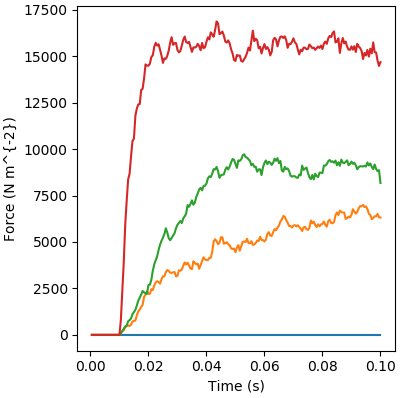

# Multiple

## Overview

This demo builds on the [single run demo](../single_run/single_run.html) and shows you how to run multiple simulations in parallel.

## Instructions

+ Start Anaconda Navigator
+ Select the Environments tab (left-hand side)
+ Open a FiberSim terminal
+ Change directory to `repo/code/python/FiberSim_utilities`
+ Type `python FiberSim_utilities.py demos getting_started multiple_run`
+ You should see
  + some text appearing in the terminal window
  + a new figure popping up
+ Close the figure to return focus to the terminal window

## Output

