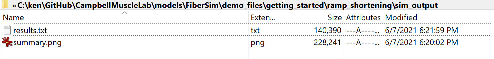
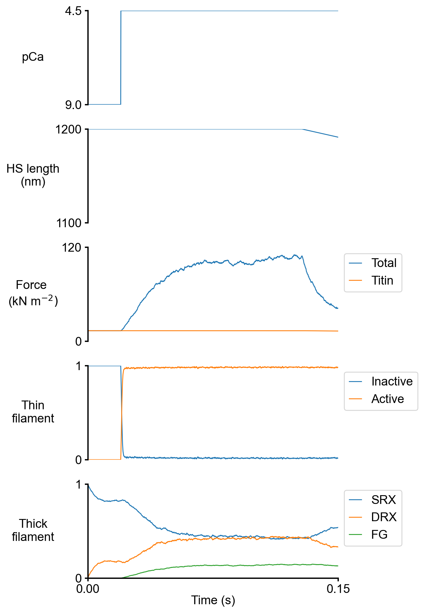

# Ramp shortening

## Overview

This demo builds on the [isometric activation demo]('../isometric_activation/isometric_activation.html') and shows how to run a single simulation where the muscle is activated isometrically and then shortened at a constant speed

## What this demo does

This demo:

+ Runs a single simulation in which a half-sarcomere is held isometric, activated in a solution with a pCa of 4.5, and once force has stabilized shortened at a constant speed

+ Plots a summary of the simulation

## Instructions

Before proceeding, make sure that you have followed the [installation instructions](../../installation/installation.html). You need the FiberSim repository, an Anaconda distribution of Python, and an active FiberSim environment to run this demo.

### Getting ready

+ Open an Anaconda Prompt

+ Activate the FiberSim Anaconda Environment by executing:
```
conda activate fibersim
```
+ Change directory to `<repo>/code/FiberPy/FiberPy`, where `<repo>` is the directory where you installed FiberSim

### Run a simulation

+ Type:
 ```
 python FiberPy.py run_batch "../../../demo_files/getting_started/ramp_shortening/batch_ramp_shortening.json"
 ```

+ You should see text appearing in the terminal window, showing that the simulations are running.

### Viewing the results

All of the results from the simulation are written to files in `<repo>/demo_files/getting_started/ramp_shortening/sim_output`



The file `summary.png` shows pCa, length, force per cross-sectional area (stress), and thick and thin filamnt properties plotted against time..



## How this worked

As described in the [isometric activation demo]('../isometric_activation/isometric_activation.html'), the simulation was described by a batch file.

The only difference is that this simulation used a different protocol file, which is described in the section below.

````
{
    "FiberSim_batch": {
        "FiberCpp_exe":
        {
            "relative_to": "this_file",
            "exe_file": "../../../bin/FiberCpp.exe"
        },
        "job":[
            {
                "relative_to": "this_file",
                "model_file": "sim_input/model.json",
                "options_file": "sim_input/options.json",
                "protocol_file": "sim_input/pCa45_ramp_shortening.txt",
                "results_file": "sim_output/results.txt",
                "output_handler_file": "sim_input/output_handler.json"
            }
        ]
    }
}
````

### Protocol file

Here is a snip from the top of the protocol file.

````
dt	pCa	dhsl	mode
0.0001	9.0	0.0	-2.0
0.0001	9.0	0.0	-2.0
0.0001	9.0	0.0	-2.0
0.0001	9.0	0.0	-2.0
0.0001	9.0	0.0	-2.0
0.0001	9.0	0.0	-2.0
````

There are 4 columns of numbers, separated by tabs. Each row defines a single time-step in the simulation.

+ dt, the duration of the time-step in s
+ pCa, the calcium concentration (in pCa units) during the time-step
+ dhsl, the change in half-sarcomere length during the time-step
+ mode, can be -2, -1, 0
  + -2, standard length-control mode
  + -1, check for the half-sarcomere being slack
  + >= 0, switch to isotonic mode and hold the muscle at this stress

Looking at the above text, you can see that the simulation starts with the half-sarcomere held isometric in pCa 9.0 solution.

Around the 100th line, the protocol file looks like

````
0.0001	9.0	0.0	-2.0
0.0001	9.0	0.0	-2.0
0.0001	9.0	0.0	-2.0
0.0001	9.0	0.0	-2.0
0.0001	9.0	0.0	-2.0
0.0001	4.5	0.0	-2.0
0.0001	4.5	0.0	-2.0
0.0001	4.5	0.0	-2.0
0.0001	4.5	0.0	-2.0
````

Note that the pCa column changes from 9.0 to 4.5. This corresponds to the half-sarcomere being activated. It is still held isometric because the mode column is still -2.

Around the 1,000th line, the protocol file looks like

````
0.0001	4.5	0.0	-2.0
0.0001	4.5	0.0	-2.0
0.0001	4.5	0.0	-2.0
0.0001	4.5	0.0	-2.0
0.0001	4.5	-0.04	-2.0
0.0001	4.5	-0.04	-2.0
0.0001	4.5	-0.04	-2.0
0.0001	4.5	-0.04	-2.0
````

Note that the third column has changed from dhsl = 0 to dhsl = -0.04. Thus the muscle is shortening by 0.04 nm per half-sarcomere during each time-step.
