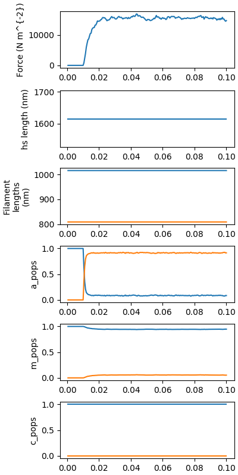
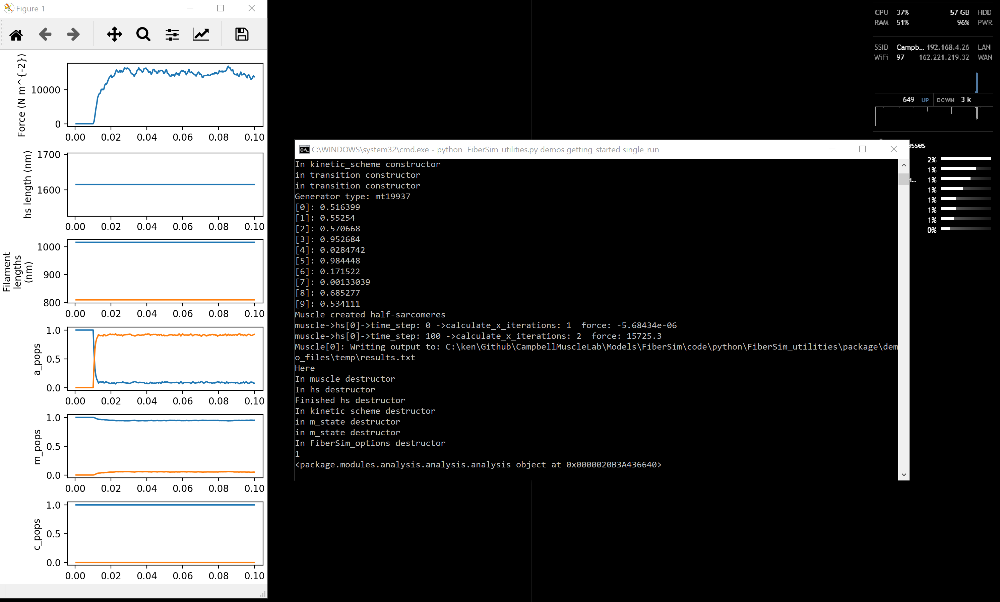

# Single run

## Overview

This demo shows you how to run a single simulation in FiberSim.

## Background

You will see from this website that the FiberSim suite is composed of two main components

+ [FiberCpp](../../../FiberCpp/FiberCpp.html)
  + which
    + implements the calculations underlying the simulation
    + is written in C++ for speed
    + is a low-level console application stored as `FiberSim.exe` in `repo/bin`
+ [FiberPy](../../../FiberPy/FiberPy.html)
  + which
    + make it easier to
      + run simulations
      + analyze the output of the simulations
      + make figures
      + fit models to experimental data
    + are written in Python for flexility

## What this demo does

This demo uses the utilities system to run a single simulation.

The code will
+ run a [batch process - link to be fixed](link) that
  + contains a single [job - link to be fixed](link) defined by
    + a [model description - link to be fixed](link)
    + a [protocol - link to be fixed](link)
    + [simulation_options - link to be fixed](link)

The batch process and simulation options are included at the bottom of this page.

## Instructions

+ Start Anaconda Navigator
+ Select the Environments tab (left-hand side)
+ Open a FiberSim terminal
+ Change directory to `repo/code/python/FiberSim_utilities`
+ Type `python FiberSim_utilities.py demos getting_started single_run`
+ You should see
  + some text appearing in the terminal window
  + a new figure popping up
+ Close the figure to return focus to the terminal window

## Output



## Video

Click on the screenshot below for a video demo
<a href="https://drive.google.com/file/d/1IqP5XdBfmSc9TSxgKWQoyXUfLmr64CJ4/view?usp=sharing">
</a>

## Batch file

````
{
    "FiberSim_batch": {
        "FiberSim_exe_path": "../../../bin/FiberSim.exe",
        "job":[
            {
                "input_folder": "package/demo_files/getting_started/single_run",
                "model_file_string": "model_single_run.json",
                "options_file_string": "options_single_run.json",
                "protocol_file_string": "pCa45_protocol.txt",
                "output_folder": "package/demo_files/temp"
            }
        ]
    }
}
````

## Simulation options

````
{
  "options": {
    "max_rate": 1e4,
    "x_pos_rel_tol": 1e-3
  }
}
````


