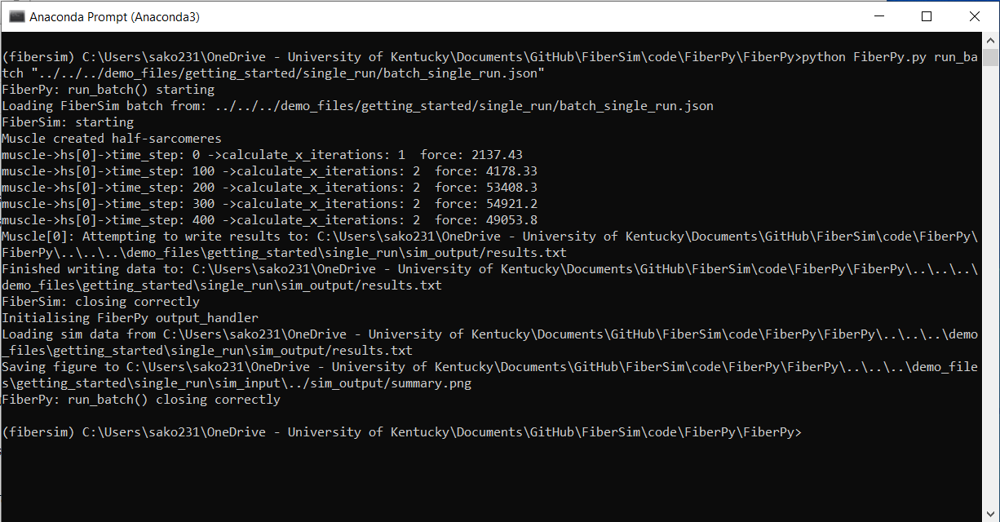
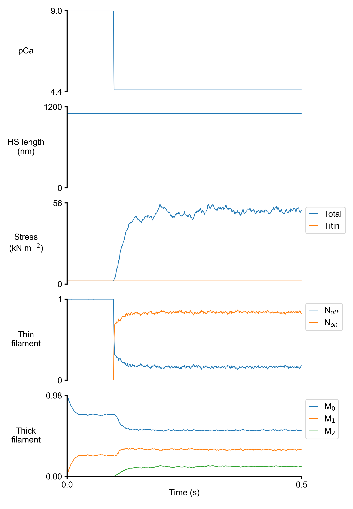

# Single run

## Overview

This demo shows how to run a simple simulation in FiberSim. 

## What this demo does

This demo simulates a single half-sarcomere that is held isometric and activated in pCa 4.5 solution. Summary results are saved to a data file and plotted as a figure. 

### How this works

The `single_run` demo initiates a simulation using this batch file:

````
{
    "FiberSim_batch": {
        "FiberSim_exe":
        {
            "relative_to": "this_file",
            "exe_file": "../../../bin/FiberSim.exe"
        },
        "job":[
            {
                "relative_to": "this_file",
                "model_file": "sim_input/model.json",
                "options_file": "sim_input/options.json",
                "protocol_file": "sim_input/pCa45_protocol.txt",
                "results_file": "sim_output/results.txt",
                "output_handler_file": "sim_input/output_handler.json"
            }
        ]
    }
}
````

This batch file will run a single `job` - that is, a single FiberSim simulation. The model, options, and protocol file paths are provided, as well as the output file path to store the results. The `output_handler.json` contains the instructions for making the summary figure. See [here](../../../FiberPy/structure/structure.html) for more information on the batch structure file. 

## Instructions

### Getting ready

1. Open an Anaconda Prompt
2. Activate the FiberSim Anaconda Environment by executing:
    ```
    conda activate fibersim
    ```
3. Change directory to `<repo>/code/FiberPy/FiberPy`, where `<repo>` is the directory where you installed FiberSim (e.g. `c:\temp\FiberSim`)

### Run a simulation

* Type:
 ```
 python FiberPy.py run_batch "../../../demo_files/getting_started/single_run/batch_single_run.json"
 ```

* You should see some text appearing in the terminal window, these are printed outputs showing some key procedures performed in the FiberSim code:


<p align="center">

</p>

## Viewing the results

* Use Windows File Explorer to open `<repo>/demo_files/getting_started/single_run/sim_output`
* You should see
  + `results.txt` - contains the raw data from the simulations
  + `summary.png`- summary figure showing the time traces

<br>

<p align="center">
    
</p>

