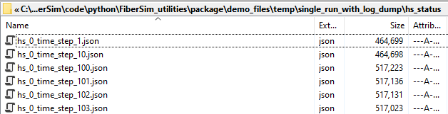

# Single run with log

## Overview

This demo builds on the [single_run_demo](../single_run/single_run.html) and shows you how to log additional information about the simulations.

The demo will:
+ write status files to a log folder
  + these are useful for debugging
+ save a snapshot of the simulation at each time-step
  + these are useful for debugging and for creating visualizations

## How this works

The demo `single_run_with_log.py` initiates a simulation using this batch file.

````
{
  "FiberSim_batch": {
    "FiberSim_exe_path": "../../../bin/FiberSim.exe",
    "job":[
      {
        "input_folder": "package/demo_files/getting_started/single_run_with_log",
        "model_file_string": "model_single_run_with_log.json",
        "options_file_string": "options_single_run_with_log.json",
        "protocol_file_string": "pCa45_protocol.txt",
        "output_folder": "package/demo_files/temp/single_run_with_log"
      }
    ]
  }
}
````

As you can see, the batch has a single job - that is, you are running just one simulation.

The model, protocol, and output folder are defined as explained in the [single_run_demo](../single_run/single_run.html).

The only significant difference is in the options file which is shown below.

````
{
  "options": {
    "max_rate": 1e4,
    "x_pos_rel_tol": 1e-3,
    "log_folder": "package/demo_files/temp/single_run_with_log_dump",
    "dump_hs_status": 1
  }
}
````

Two options have been added:
+ log folder - a relative path to a folder where log files will be created
+ dump_hs_status
  + 0 - do not save snapshots of the simulations
  + 1 - save snapshots of the simulations at each time-step in `<log_folder>/hs_status`

## Instructions

+ Start Anaconda Navigator
+ Select the Environments tab (left-hand side)
+ Open a FiberSim terminal
+ Change directory to `<repo>/code/FiberPy/FiberPy`
+ Type `python FiberPy.py demos getting_started single_run_with_log`
+ You should see
  + some text appearing in the terminal window
  + a new figure popping up
+ Close the figure to return focus to the terminal window

## Output

You should see the same figure output as for [single_run_demo](../single_run/single_run.html).

You will also see additional files in `package/temp/simple_run_with_log_dump`


If you look in the `hs_status` folder, you will see additional files.


Each file in the `hs_status_folder` shows a snapshot of the model in json format. Here are the first few lines of one of the files.

````
{
"hs_data": {
	"hs_id": 0,
	"time": 0.0005,
	"hs_length": 1615,
	"hs_force": -5.68434e-06,
	"pCa": 9,
	"m_nodes_per_thick_filament": 54,
	"a_nodes_per_thin_filament": 189,
"thick": [
{
	"thick_id": 0,
	"m_y": 0,
	"m_z": 0,
	"m_no_of_cbs": 324,
	"m_k_stiff": 100,
	"m_inter_crown_rest_length": 13.5,
	"m_cbs_per_node": 6,
	"m_lambda": 80,
	"c_no_of_pcs": 30,
	"nearest_actin_filaments": [9, 6, 3, 0, 5, 8],
	"cb_x": [1521.5, 1521.5, 1521.5, 1521.5, 1521.5, 1521.5, 1508, 1508, 1508, 1508, 1508, 1508, 1494.5, 1494.5, 1494.5, 1494.5, 1494.5, 1494.5, 1481, 1481, 1481, 1481, 1481, 1481, 1467.5, 1467.5, 1467.5, 1467.5, 1467.5, 1467.5, 1454, 1454, 1454, 1454, 1454, 1454, 1440.5, 1440.5, 1440.5, 1440.5, 1440.5, 1440.5, 1427, 1427, 1427, 1427, 1427, 1427, 1413.5, 1413.5, 1413.5, 1413.5, 1413.5, 1413.5, 1400, 1400, 1400, 1400, 1400, 1400, 1386.5, 1386.5, 1386.5, 1386.5, 1386.5, 1386.5, 1373, 1373, 1373, 1373, 1373, 1373, 1359.5, 1359.5, 1359.5, 1359.5, 1359.5, 1359.5, 1346, 1346, 1346, 1346, 1346, 1346, 1332.5, 1332.5, 1332.5, 1332.5, 1332.5, 1332.5, 1319, 1319, 1319, 1319, 1319, 1319, 1305.5, 1305.5, 1305.5, 1305.5, 1305.5, 1305.5, 1292, 1292, 1292, 1292, 1292, 1292, 1278.5, 1278.5, 1278.5, 1278.5, 1278.5, 1278.5, 1265, 1265, 1265, 1265, 1265, 1265, 1251.5, 1251.5, 1251.5, 1251.5, 1251.5, 1251.5, 1238, 1238, 1238, 1238, 1238, 1238, 1224.5, 1224.5, 1224.5, 1224.5, 1224.5, 1224.5, 1211, 1211, 1211, 1211, 1211, 1211, 1197.5, 1197.5, 1197.5, 1197.5, 1197.5, 1197.5, 1184, 1184, 1184, 1184, 1184, 1184, 1170.5, 1170.5, 1170.5, 1170.5, 1170.5, 1170.5, 1157, 1157, 1157, 1157, 1157, 1157, 1143.5, 1143.5, 1143.5, 1143.5, 1143.5, 1143.5, 1130, 1130, 1130, 1130, 1130, 1130, 1116.5, 1116.5, 1116.5, 1116.5, 1116.5, 1116.5, 1103, 1103, 1103, 1103, 1103, 1103, 1089.5, 1089.5, 1089.5, 1089.5, 1089.5, 1089.5, 1076, 1076, 1076, 1076, 1076, 1076, 1062.5, 1062.5, 1062.5, 1062.5, 1062.5, 1062.5, 1049, 1049, 1049, 1049, 1049, 1049, 1035.5, 1035.5, 1035.5, 1035.5, 1035.5, 1035.5, 1022, 1022, 1022, 1022, 1022, 1022, 1008.5, 1008.5, 1008.5, 1008.5, 1008.5, 1008.5, 995, 995, 995, 995, 995, 995, 981.5, 981.5, 981.5, 981.5, 981.5, 981.5, 968, 968, 968, 968, 968, 968, 954.5, 954.5, 954.5, 954.5, 954.5, 954.5, 941, 941, 941, 941, 941, 941, 927.5, 927.5, 927.5, 927.5, 927.5, 927.5, 914, 914, 914, 914, 914, 914, 900.5, 900.5, 900.5, 900.5, 900.5, 900.5, 887, 887, 887, 887, 887, 887, 873.5, 873.5, 873.5, 873.5, 873.5, 873.5, 860, 860, 860, 860, 860, 860, 846.5, 846.5, 846.5, 846.5, 846.5, 846.5, 833, 833, 833, 833, 833, 833, 819.5, 819.5, 819.5, 819.5, 819.5, 819.5, 806, 806, 806, 806, 806, 806],
	"cb_angle": [0, 20, 120, 140, 240, 260, 40, 60, 160, 180, 280, 300, 80, 100, 200, 220, 320, 340, 120, 140, 240, 260, 0, 20, 160, 180, 280, 300, 40, 60, 200, 220, 320, 340, 80, 100, 240, 260, 0, 20, 120, 140, 280, 300, 40, 60, 160, 180, 320, 340, 80, 100, 200, 220, 0, 20, 120, 140, 240, 260, 40, 60, 160, 180, 280, 300, 80, 100, 200, 220, 320, 340, 120, 140, 240, 260, 0, 20, 160, 180, 280, 300, 40, 60, 200, 220, 320, 340, 80, 100, 240, 260, 0, 20, 120, 140, 280, 300, 40, 60, 160, 180, 320, 340, 80, 100, 200, 220, 0, 20, 120, 140, 240, 260, 40, 60, 160, 180, 280, 300, 80, 100, 200, 220, 320, 340, 120, 140, 240, 260, 0, 20, 160, 180, 280, 300, 40, 60, 200, 220, 320, 340, 80, 100, 240, 260, 0, 20, 120, 140, 280, 300, 40, 60, 160, 180, 320, 340, 80, 100, 200, 220, 0, 20, 120, 140, 240, 260, 40, 60, 160, 180, 280, 300, 80, 100, 200, 220, 320, 340, 120, 140, 240, 260, 0, 20, 160, 180, 280, 300, 40, 60, 200, 220, 320, 340, 80, 100, 240, 260, 0, 20, 120, 140, 280, 300, 40, 60, 160, 180, 320, 340, 80, 100, 200, 220, 0, 20, 120, 140, 240, 260, 40, 60, 160, 180, 280, 300, 80, 100, 200, 220, 320, 340, 120, 140, 240, 260, 0, 20, 160, 180, 280, 300, 40, 60, 200, 220, 320, 340, 80, 100, 240, 260, 0, 20, 120, 140, 280, 300, 40, 60, 160, 180, 320, 340, 80, 100, 200, 220, 0, 20, 120, 140, 240, 260, 40, 60, 160, 180, 280, 300, 80, 100, 200, 220, 320, 340, 120, 140, 240, 260, 0, 20, 160, 180, 280, 300, 40, 60, 200, 220, 320, 340, 80, 100, 240, 260, 0, 20, 120, 140, 280, 300, 40, 60, 160, 180, 320, 340, 80, 100, 200, 220],
	"cb_state": [1, 1, 1, 1, 1, 1, 1, 1, 1, 1, 1, 1, 1, 1, 1, 1, 1, 1, 1, 1, 1, 1, 1, 1, 1, 1, 1, 1, 1, 1, 1, 1, 1, 1, 1, 1, 1, 1, 1, 1, 1, 1, 1, 1, 1, 1, 1, 1, 1, 1, 1, 1, 1, 1, 1, 1, 1, 1, 1, 1, 1, 1, 1, 1, 1, 1, 1, 1, 1, 1, 1, 1, 1, 1, 1, 1, 1, 1, 1, 1, 1, 1, 1, 1, 1, 1, 1, 1, 1, 1, 1, 1, 1, 1, 1, 1, 1, 1, 1, 1, 1, 1, 1, 1, 1, 1, 1, 1, 1, 1, 1, 1, 1, 1, 1, 1, 1, 1, 1, 1, 1, 1, 1, 1, 1, 1, 1, 1, 1, 1, 1, 1, 1, 1, 1, 1, 1, 1, 1, 1, 1, 1, 1, 1, 1, 1, 1, 1, 1, 1, 1, 1, 1, 1, 1, 1, 1, 1, 1, 1, 1, 1, 1, 1, 1, 1, 1, 1, 1, 1, 1, 1, 1, 1, 1, 1, 1, 1, 1, 1, 1, 1, 1, 1, 1, 1, 1, 1, 1, 1, 1, 1, 1, 1, 1, 1, 1, 1, 1, 1, 1, 1, 1, 1, 1, 1, 1, 1, 1, 1, 1, 1, 1, 1, 1, 1, 1, 1, 1, 1, 1, 1, 1, 1, 1, 1, 1, 1, 1, 1, 1, 1, 1, 1, 1, 1, 1, 1, 1, 1, 1, 1, 1, 1, 1, 1, 1, 1, 1, 1, 1, 1, 1, 1, 1, 1, 1, 1, 1, 1, 1, 1, 1, 1, 1, 1, 1, 1, 1, 1, 1, 1, 1, 1, 1, 1, 1, 1, 1, 1, 1, 1, 1, 1, 1, 1, 1, 1, 1, 1, 1, 1, 1, 1, 1, 1, 1, 1, 1, 1, 1, 1, 1, 1, 1, 1, 1, 1, 1, 1, 1, 1, 1, 1, 1, 1, 1, 1, 1, 1, 1, 1, 1, 1],
	"cb_isoform": [0, 0, 0, 0, 0, 0, 0, 0, 0, 0, 0, 0, 0, 0, 0, 0, 0, 0, 0, 0, 0, 0, 0, 0, 0, 0, 0, 0, 0, 0, 0, 0, 0, 0, 0, 0, 0, 0, 0, 0, 0, 0, 0, 0, 0, 0, 0, 0, 0, 0, 0, 0, 0, 0, 0, 0, 0, 0, 0, 0, 0, 0, 0, 0, 0, 0, 0, 0, 0, 0, 0, 0, 0, 0, 0, 0, 0, 0, 0, 0, 0, 0, 0, 0, 0, 0, 0, 0, 0, 0, 0, 0, 0, 0, 0, 0, 0, 0, 0, 0, 0, 0, 0, 0, 0, 0, 0, 0, 0, 0, 0, 0, 0, 0, 0, 0, 0, 0, 0, 0, 0, 0, 0, 0, 0, 0, 0, 0, 0, 0, 0, 0, 0, 0, 0, 0, 0, 0, 0, 0, 0, 0, 0, 0, 0, 0, 0, 0, 0, 0, 0, 0, 0, 0, 0, 0, 0, 0, 0, 0, 0, 0, 0, 0, 0, 0, 0, 0, 0, 0, 0, 0, 0, 0, 0, 0, 0, 0, 0, 0, 0, 0, 0, 0, 0, 0, 0, 0, 0, 0, 0, 0, 0, 0, 0, 0, 0, 0, 0, 0, 0, 0, 0, 0, 0, 0, 0, 0, 0, 0, 0, 0, 0, 0, 0, 0, 0, 0, 0, 0, 0, 0, 0, 0, 0, 0, 0, 0, 0, 0, 0, 0, 0, 0, 0, 0, 0, 0, 0, 0, 0, 0, 0, 0, 0, 0, 0, 0, 0, 0, 0, 0, 0, 0, 0, 0, 0, 0, 0, 0, 0, 0, 0, 0, 0, 0, 0, 0, 0, 0, 0, 0, 0, 0, 0, 0, 0, 0, 0, 0, 0, 0, 0, 0, 0, 0, 0, 0, 0, 0, 0, 0, 0, 0, 0, 0, 0, 0, 0, 0, 0, 0, 0, 0, 0, 0, 0, 0, 0, 0, 0, 0, 0, 0, 0, 0, 0, 0, 0, 0, 0, 0, 0, 0],
	"cb_bound_to_a_f": [-1, -1, -1, -1, -1, -1, -1, -1, -1, -1, -1, -1, -1, -1, -1, -1, -1, -1, -1, -1, -1, -1, -1, -1, -1, -1, -1, -1, -1, -1, -1, -1, -1, -1, -1, -1, -1, -1, -1, -1, -1, -1, -1, -1, -1, -1, -1, -1, -1, -1, -1, -1, -1, -1, -1, -1, -1, -1, -1, -1, -1, -1, -1, -1, -1, -1, -1, -1, -1, -1, -1, -1, -1, -1, -1, -1, -1, -1, -1, -1, -1, -1, -1, -1, -1, -1, -1, -1, -1, -1, -1, -1, -1, -1, -1, -1, -1, -1, -1, -1, -1, -1, -1, -1, -1, -1, -1, -1, -1, -1, -1, -1, -1, -1, -1, -1, -1, -1, -1, -1, -1, -1, -1, -1, -1, -1, -1, -1, -1, -1, -1, -1, -1, -1, -1, -1, -1, -1, -1, -1, -1, -1, -1, -1, -1, -1, -1, -1, -1, -1, -1, -1, -1, -1, -1, -1, -1, -1, -1, -1, -1, -1, -1, -1, -1, -1, -1, -1, -1, -1, -1, -1, -1, -1, -1, -1, -1, -1, -1, -1, -1, -1, -1, -1, -1, -1, -1, -1, -1, -1, -1, -1, -1, -1, -1, -1, -1, -1, -1, -1, -1, -1, -1, -1, -1, -1, -1, -1, -1, -1, -1, -1, -1, -1, -1, -1, -1, -1, -1, -1, -1, -1, -1, -1, -1, -1, -1, -1, -1, -1, -1, -1, -1, -1, -1, -1, -1, -1, -1, -1, -1, -1, -1, -1, -1, -1, -1, -1, -1, -1, -1, -1, -1, -1, -1, -1, -1, -1, -1, -1, -1, -1, -1, -1, -1, -1, -1, -1, -1, -1, -1, -1, -1, -1, -1, -1, -1, -1, -1, -1, -1, -1, -1, -1, -1, -1, -1, -1, -1, -1, -1, -1, -1, -1, -1, -1, -1, -1, -1, -1, -1, -1, -1, -1, -1, -1, -1, -1, -1, -1, -1, -1, -1, -1, -1, -1, -1, -1, -1, -1, -1, -1, -1, -1],
	"cb_bound_to_a_n": [-1, -1, -1, -1, -1, -1, -1, -1, -1, -1, -1, -1, -1, -1, -1, -1, -1, -1, -1, -1, -1, -1, -1, -1, -1, -1, -1, -1, -1, -1, -1, -1, -1, -1, -1, -1, -1, -1, -1, -1, -1, -1, -1, -1, -1, -1, -1, -1, -1, -1, -1, -1, -1, -1, -1, -1, -1, -1, -1, -1, -1, -1, -1, -1, -1, -1, -1, -1, -1, -1, -1, -1, -1, -1, -1, -1, -1, -1, -1, -1, -1, -1, -1, -1, -1, -1, -1, -1, -1, -1, -1, -1, -1, -1, -1, -1, -1, -1, -1, -1, -1, -1, -1, -1, -1, -1, -1, -1, -1, -1, -1, -1, -1, -1, -1, -1, -1, -1, -1, -1, -1, -1, -1, -1, -1, -1, -1, -1, -1, -1, -1, -1, -1, -1, -1, -1, -1, -1, -1, -1, -1, -1, -1, -1, -1, -1, -1, -1, -1, -1, -1, -1, -1, -1, -1, -1, -1, -1, -1, -1, -1, -1, -1, -1, -1, -1, -1, -1, -1, -1, -1, -1, -1, -1, -1, -1, -1, -1, -1, -1, -1, -1, -1, -1, -1, -1, -1, -1, -1, -1, -1, -1, -1, -1, -1, -1, -1, -1, -1, -1, -1, -1, -1, -1, -1, -1, -1, -1, -1, -1, -1, -1, -1, -1, -1, -1, -1, -1, -1, -1, -1, -1, -1, -1, -1, -1, -1, -1, -1, -1, -1, -1, -1, -1, -1, -1, -1, -1, -1, -1, -1, -1, -1, -1, -1, -1, -1, -1, -1, -1, -1, -1, -1, -1, -1, -1, -1, -1, -1, -1, -1, -1, -1, -1, -1, -1, -1, -1, -1, -1, -1, -1, -1, -1, -1, -1, -1, -1, -1, -1, -1, -1, -1, -1, -1, -1, -1, -1, -1, -1, -1, -1, -1, -1, -1, -1, -1, -1, -1, -1, -1, -1, -1, -1, -1, -1, -1, -1, -1, -1, -1, -1, -1, -1, -1, -1, -1, -1, -1, -1, -1, -1, -1, -1],
	"cb_nearest_a_f": [9, 9, 3, 3, 5, 5, 6, 6, 0, 0, 8, 8, 6, 3, 0, 5, 8, 9, 3, 3, 5, 5, 9, 9, 0, 0, 8, 8, 6, 6, 0, 5, 8, 9, 6, 3, 5, 5, 9, 9, 3, 3, 8, 8, 6, 6, 0, 0, 8, 9, 6, 3, 0, 5, 9, 9, 3, 3, 5, 5, 6, 6, 0, 0, 8, 8, 6, 3, 0, 5, 8, 9, 3, 3, 5, 5, 9, 9, 0, 0, 8, 8, 6, 6, 0, 5, 8, 9, 6, 3, 5, 5, 9, 9, 3, 3, 8, 8, 6, 6, 0, 0, 8, 9, 6, 3, 0, 5, 9, 9, 3, 3, 5, 5, 6, 6, 0, 0, 8, 8, 6, 3, 0, 5, 8, 9, 3, 3, 5, 5, 9, 9, 0, 0, 8, 8, 6, 6, 0, 5, 8, 9, 6, 3, 5, 5, 9, 9, 3, 3, 8, 8, 6, 6, 0, 0, 8, 9, 6, 3, 0, 5, 9, 9, 3, 3, 5, 5, 6, 6, 0, 0, 8, 8, 6, 3, 0, 5, 8, 9, 3, 3, 5, 5, 9, 9, 0, 0, 8, 8, 6, 6, 0, 5, 8, 9, 6, 3, 5, 5, 9, 9, 3, 3, 8, 8, 6, 6, 0, 0, 8, 9, 6, 3, 0, 5, 9, 9, 3, 3, 5, 5, 6, 6, 0, 0, 8, 8, 6, 3, 0, 5, 8, 9, 3, 3, 5, 5, 9, 9, 0, 0, 8, 8, 6, 6, 0, 5, 8, 9, 6, 3, 5, 5, 9, 9, 3, 3, 8, 8, 6, 6, 0, 0, 8, 9, 6, 3, 0, 5, 9, 9, 3, 3, 5, 5, 6, 6, 0, 0, 8, 8, 6, 3, 0, 5, 8, 9, 3, 3, 5, 5, 9, 9, 0, 0, 8, 8, 6, 6, 0, 5, 8, 9, 6, 3, 5, 5, 9, 9, 3, 3, 8, 8, 6, 6, 0, 0, 8, 9, 6, 3, 0, 5],
	"cb_nearest_a_n": [376, 376, 377, 377, 377, 376, 376, 376, 377, 377, 376, 376, 377, 377, 377, 377, 376, 376, 377, 377, 377, 376, 376, 376, 377, 377, 376, 376, 376, 376, 377, 377, 376, 376, 377, 377, 377, 376, 376, 376, 377, 377, 376, 376, 376, 376, 377, 377, 376, 376, 377, 377, 377, 377, 376, 376, 377, 377, 377, 376, 376, 376, 377, 377, 376, 376, 377, 377, 377, 377, 376, 376, 377, 377, 377, 376, 376, 376, 377, 377, 376, 376, 376, 376, 377, 377, 376, 376, 377, 377, 377, 376, 376, 376, 377, 377, 376, 376, 376, 376, 377, 377, 376, 376, 377, 377, 377, 377, 376, 376, 377, 377, 377, 376, 376, 376, 377, 377, 376, 376, 377, 377, 377, 377, 376, 376, 377, 377, 377, 376, 376, 376, 377, 377, 376, 376, 376, 376, 377, 377, 376, 376, 377, 377, 377, 376, 376, 376, 377, 377, 376, 376, 376, 376, 377, 377, 376, 376, 377, 377, 377, 377, 376, 376, 377, 377, 377, 376, 376, 376, 377, 377, 376, 376, 377, 377, 377, 377, 376, 376, 377, 377, 377, 376, 376, 376, 377, 377, 376, 376, 376, 376, 377, 377, 376, 376, 377, 377, 377, 376, 376, 376, 377, 377, 376, 376, 376, 376, 377, 377, 376, 376, 377, 377, 377, 377, 376, 376, 377, 377, 377, 376, 376, 376, 377, 377, 376, 376, 375, 375, 375, 374, 374, 374, 369, 369, 368, 368, 369, 369, 364, 364, 365, 365, 365, 365, 359, 359, 359, 359, 358, 358, 355, 355, 354, 354, 354, 354, 348, 348, 348, 348, 349, 349, 344, 344, 345, 345, 344, 344, 339, 339, 338, 338, 338, 338, 335, 335, 334, 334, 335, 335, 328, 328, 329, 329, 329, 329, 325, 325, 325, 325, 324, 324, 319, 319, 318, 318, 319, 319, 312, 312, 312, 313, 313, 313, 308, 308, 309, 309, 308, 308, 303, 303, 302, 302, 302, 302, 299, 298, 298, 298, 299, 299],
	"cb_nearest_bs_angle_diff": [154.2884, 134.2884, 145.7116, 165.7116, 94.2884, 105.7116, 114.2884, 94.2884, 174.2884, 154.2884, 125.7116, 145.7116, 105.7116, 125.7116, 134.2884, 114.2884, 165.7116, 174.2884, 145.7116, 165.7116, 94.2884, 105.7116, 154.2884, 134.2884, 174.2884, 154.2884, 125.7116, 145.7116, 114.2884, 94.2884, 134.2884, 114.2884, 165.7116, 174.2884, 105.7116, 125.7116, 94.2884, 105.7116, 154.2884, 134.2884, 145.7116, 165.7116, 125.7116, 145.7116, 114.2884, 94.2884, 174.2884, 154.2884, 165.7116, 174.2884, 105.7116, 125.7116, 134.2884, 114.2884, 154.2884, 134.2884, 145.7116, 165.7116, 94.2884, 105.7116, 114.2884, 94.2884, 174.2884, 154.2884, 125.7116, 145.7116, 105.7116, 125.7116, 134.2884, 114.2884, 165.7116, 174.2884, 145.7116, 165.7116, 94.2884, 105.7116, 154.2884, 134.2884, 174.2884, 154.2884, 125.7116, 145.7116, 114.2884, 94.2884, 134.2884, 114.2884, 165.7116, 174.2884, 105.7116, 125.7116, 94.2884, 105.7116, 154.2884, 134.2884, 145.7116, 165.7116, 125.7116, 145.7116, 114.2884, 94.2884, 174.2884, 154.2884, 165.7116, 174.2884, 105.7116, 125.7116, 134.2884, 114.2884, 154.2884, 134.2884, 145.7116, 165.7116, 94.2884, 105.7116, 114.2884, 94.2884, 174.2884, 154.2884, 125.7116, 145.7116, 105.7116, 125.7116, 134.2884, 114.2884, 165.7116, 174.2884, 145.7116, 165.7116, 94.2884, 105.7116, 154.2884, 134.2884, 174.2884, 154.2884, 125.7116, 145.7116, 114.2884, 94.2884, 134.2884, 114.2884, 165.7116, 174.2884, 105.7116, 125.7116, 94.2884, 105.7116, 154.2884, 134.2884, 145.7116, 165.7116, 125.7116, 145.7116, 114.2884, 94.2884, 174.2884, 154.2884, 165.7116, 174.2884, 105.7116, 125.7116, 134.2884, 114.2884, 154.2884, 134.2884, 145.7116, 165.7116, 94.2884, 105.7116, 114.2884, 94.2884, 174.2884, 154.2884, 125.7116, 145.7116, 105.7116, 125.7116, 134.2884, 114.2884, 165.7116, 174.2884, 145.7116, 165.7116, 94.2884, 105.7116, 154.2884, 134.2884, 174.2884, 154.2884, 125.7116, 145.7116, 114.2884, 94.2884, 134.2884, 114.2884, 165.7116, 174.2884, 105.7116, 125.7116, 94.2884, 105.7116, 154.2884, 134.2884, 145.7116, 165.7116, 125.7116, 145.7116, 114.2884, 94.2884, 174.2884, 154.2884, 165.7116, 174.2884, 105.7116, 125.7116, 134.2884, 114.2884, 154.2884, 134.2884, 145.7116, 165.7116, 94.2884, 105.7116, 114.2884, 94.2884, 174.2884, 154.2884, 125.7116, 145.7116, 131.4259, 151.4259, 108.5741, 91.4259, 168.5741, 148.5741, 111.4312, 91.4312, 171.4312, 151.4312, 128.5688, 148.5688, 159.9974, 179.9974, 99.9974, 119.9974, 140.0026, 120.0026, 97.1403, 117.1403, 142.8597, 122.8597, 157.1403, 177.1403, 171.4311, 151.4311, 128.5689, 148.5689, 111.4311, 91.4311, 125.7118, 145.7118, 114.2882, 94.2882, 174.2882, 154.2882, 142.8596, 122.8596, 157.1404, 177.1404, 97.1404, 117.1404, 154.2833, 174.2833, 94.2833, 114.2833, 145.7167, 125.7167, 114.2881, 94.2881, 174.2881, 154.2881, 125.7119, 145.7119, 177.1452, 157.1452, 122.8548, 142.8548, 117.1452, 97.1452, 94.2834, 114.2834, 145.7166, 125.7166, 154.2834, 174.2834, 148.5737, 128.5737, 151.4263, 171.4263, 91.4263, 111.4263, 148.5692, 168.5692, 91.4308, 108.5692, 151.4308, 131.4308, 120.0022, 100.0022, 179.9978, 160.0022, 119.9978, 139.9978, 177.1407, 162.8593, 117.1407, 137.1407, 122.8593, 102.8593, 91.4307, 108.5693, 151.4307, 131.4307, 148.5693, 168.5693],
	"cb_controlling_pc_index": [-1, -1, -1, -1, -1, -1, -1, -1, -1, -1, -1, -1, -1, -1, -1, -1, -1, -1, -1, -1, -1, -1, -1, -1, -1, -1, -1, -1, -1, -1, -1, -1, -1, -1, -1, -1, -1, -1, -1, -1, -1, -1, -1, -1, -1, -1, -1, -1, -1, -1, -1, -1, -1, -1, 0, 0, 1, 1, 2, 2, 0, 0, 1, 1, 2, 2, 0, 1, 1, 2, 2, 0, 4, 4, 5, 5, 3, 3, 4, 4, 5, 5, 3, 3, 4, 5, 5, 3, 3, 4, 8, 8, 6, 6, 7, 7, 8, 8, 6, 6, 7, 7, 8, 6, 6, 7, 7, 8, 9, 9, 10, 10, 11, 11, 9, 9, 10, 10, 11, 11, 9, 10, 10, 11, 11, 9, 13, 13, 14, 14, 12, 12, 13, 13, 14, 14, 12, 12, 13, 14, 14, 12, 12, 13, 17, 17, 15, 15, 16, 16, 17, 17, 15, 15, 16, 16, 17, 15, 15, 16, 16, 17, 18, 18, 19, 19, 20, 20, 18, 18, 19, 19, 20, 20, 18, 19, 19, 20, 20, 18, 22, 22, 23, 23, 21, 21, 22, 22, 23, 23, 21, 21, 22, 23, 23, 21, 21, 22, 26, 26, 24, 24, 25, 25, 26, 26, 24, 24, 25, 25, 26, 24, 24, 25, 25, 26, 27, 27, 28, 28, 29, 29, 27, 27, 28, 28, 29, 29, 27, 28, 28, 29, 29, 27, -1, -1, -1, -1, -1, -1, -1, -1, -1, -1, -1, -1, -1, -1, -1, -1, -1, -1, -1, -1, -1, -1, -1, -1, -1, -1, -1, -1, -1, -1, -1, -1, -1, -1, -1, -1, -1, -1, -1, -1, -1, -1, -1, -1, -1, -1, -1, -1, -1, -1, -1, -1, -1, -1, -1, -1, -1, -1, -1, -1, -1, -1, -1, -1, -1, -1, -1, -1, -1, -1, -1, -1, -1, -1, -1, -1, -1, -1, -1, -1, -1, -1, -1, -1, -1, -1, -1, -1, -1, -1],
	"node_forces": [-2.273736754e-11, -4.547473509e-11, 0, -6.821210263e-11, -4.547473509e-11, -2.273736754e-11, 0, -2.273736754e-11, 2.273736754e-11, 0, -2.273736754e-11, 0, 2.273736754e-11, -2.273736754e-11, 0, -2.273736754e-11, -2.273736754e-11, -2.273736754e-11, 0, 0, -2.273736754e-11, -2.273736754e-11, -2.273736754e-11, -2.273736754e-11, 0, 2.273736754e-11, 0, -2.273736754e-11, 0, 0, 0, 4.547473509e-11, 2.273736754e-11, 2.273736754e-11, 2.273736754e-11, 2.273736754e-11, 4.547473509e-11, 2.273736754e-11, 3.410605132e-11, 3.410605132e-11, 3.410605132e-11, 2.273736754e-11, 2.273736754e-11, 2.273736754e-11, 1.136868377e-11, 2.273736754e-11, 2.273736754e-11, 1.136868377e-11, 1.136868377e-11, -1.136868377e-11, 0, 0, 1.136868377e-11, 1.136868377e-11],
	"pc_node_index": [9, 9, 9, 12, 12, 12, 15, 15, 15, 18, 18, 18, 21, 21, 21, 24, 24, 24, 27, 27, 27, 30, 30, 30, 33, 33, 33, 36, 36, 36],
	"pc_angle": [30, 150, 270, 30, 150, 270, 30, 150, 270, 30, 150, 270, 30, 150, 270, 30, 150, 270, 30, 150, 270, 30, 150, 270, 30, 150, 270, 30, 150, 270],
	"pc_state": [1, 1, 1, 1, 1, 1, 1, 1, 1, 1, 1, 1, 1, 1, 1, 1, 1, 1, 1, 1, 1, 1, 1, 1, 1, 1, 1, 1, 1, 1],
	"pc_phos": [0, 0, 0, 0, 0, 0, 0, 0, 0, 0, 0, 0, 0, 0, 0, 0, 0, 0, 0, 0, 0, 0, 0, 0, 0, 0, 0, 0, 0, 0],
	"pc_bound_to_a_f": [-1, -1, -1, -1, -1, -1, -1, -1, -1, -1, -1, -1, -1, -1, -1, -1, -1, -1, -1, -1, -1, -1, -1, -1, -1, -1, -1, -1, -1, -1],
	"pc_bound_to_a_n": [-1, -1, -1, -1, -1, -1, -1, -1, -1, -1, -1, -1, -1, -1, -1, -1, -1, -1, -1, -1, -1, -1, -1, -1, -1, -1, -1, -1, -1, -1],
	"pc_nearest_a_f": [9, 3, 5, 9, 3, 5, 9, 3, 5, 9, 3, 5, 9, 3, 5, 9, 3, 5, 9, 3, 5, 9, 3, 5, 9, 3, 5, 9, 3, 5],
	"pc_nearest_a_n": [376, 377, 376, 376, 377, 376, 376, 377, 376, 376, 377, 376, 376, 377, 376, 376, 377, 376, 376, 377, 376, 376, 377, 376, 376, 377, 376, 376, 377, 376]
},
````
