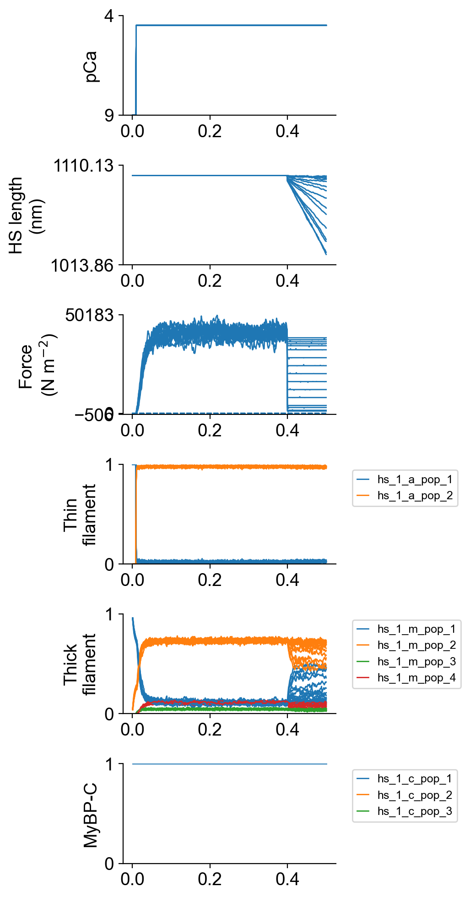

# Force velocity

## Overview

This demo shows how to simulate force-velocity and force-power curves.

## What this demo does

This demo:

+ Runs a simulation in which a half-sarcomere is activated in pCa 4.5 and held isometric.
  + This determines the isometric force. 
+ The code then runs a set of simulations in which the half-sarcomere is activated in pCa 4.5 and, once force has reached steady-state, allowed to shorten against different fractions of the isometric force.
+ Force-velocity and force-power curves are fitted to the simulation data.

## Instructions

If you need help with these step, check the [installation instructions](../../../installation/installation.html).

+ Open an Anaconda prompt
+ Activate the FiberSim environment
+ Change directory to `<FiberSim_repo>/code/FiberPy/FiberPy`
+ Run the command
```
 python FiberPy.py characterize "../../../demo_files/isotonic/force_velocity/base/setup.json"
 ```

### Viewing the results

All of the results from the isotonic simulations are written to files in `<FiberSim_repo>/demo_files/isotonic/force_velocity/sim_data/isotonic/sim_output`

The file `superposed_traces.png` shows pCa, length, force per cross-sectional area (stress), and thick and thin filamnt properties plotted against time.



The file `rates.png` summarizes the kinetic scheme.


The file `fv_traces_1.png` shows the loaded shortening segment of the simulation in more details.


The file `fv_and_power.png` shows the force-velocity and force-power curves.


Finally, data derived from the simulations are tabulated in `fv_analysis.xlsx`.


### How this worked

The setup file follows the normal template. The experimental protocols are defined by the `characterization` element. See the table below for more details.

```text
{
  "FiberSim_setup": {
    "FiberCpp_exe": {
      "relative_to": "this_file",
      "exe_file": "../../../../bin/FiberCpp.exe"
    },
    "model": {
      "relative_to": "this_file",
      "options_file": "sim_options.json",
      "model_files": ["model.json"]
    },
    "characterization": [
      {
        "type": "force_velocity",
        "pCa": 4.5,
        "hs_lengths": [1100],
        "m_n": 4,
        "randomized_repeats": 1,
        "length_fit_mode": "exponential",
        "time_step_s": 0.001,
        "sim_duration_s": 0.5,
        "sim_release_s": 0.4,
        "rel_isotonic_forces": [0.03, 0.04, 0.075, 0.1, 0.2, 0.3, 0.4, 0.5, 0.6, 0.7, 0.8, 0.85, 0.875, 0.9, 0.925, 0.95],
        "fit_time_s": [ 0.41, 0.49 ],
        "relative_to": "this_file",
        "sim_folder": "../sim_data",
        "output_image_formats": [ "png" ],
        "figures_only": "False",
        "trace_figures_on": "False"
      }
    ]
  }
}
```

| Parameter | Value | Comments |
| ---- | ---- | ---- |
| type | force_velocity | |
| pCa | float | The pCa value for the tests (as in this example) |
|  | "pCa_50" | Alternative mode, which runs isotonic shortening at pCa<sub>50</sub>. If this mode is selected, an additional parameter `pCa_values` must also be provided. FiberPy will run isometric simulations with these values to determine the pCa<sub>50</sub>. Example, `"pCa_values": [9, 6.5, 6.3, 6.1, 5.9, 5.7, 5.5, 5.3, 4.5]` |
| hs_lengths (optional)| array of floats | array of hs_lengths to run the simulations at. FiberPy uses the hs_length in the model file if not provided |
| randomized_repeats (optional) | integer | number of repeats to run at each length with different seeds |
| length_fit_mode | "linear" | fits shortening velocity with a straight line |
|  | "exponential" | fits shortening velocity with an exponential and extrapolates to the onset of shortening to establish fastest shortening (useful for traces where shortening slows progressively during shortening) |
| time_step_s | float | time step in seconds for simulation |
| sim_duration_s | float | total duration in seconds of each simulation |
| sim_release_s | float | time in seconds at which muscle starts to shorten isotonically |
| rel_isotonic_forces | array of floats | the forces (relative to isometric) which the muscle shortens against |
| fit_time_s | [2 element array of floats] | time range (in seconds) over which to fit shortening velocity |
