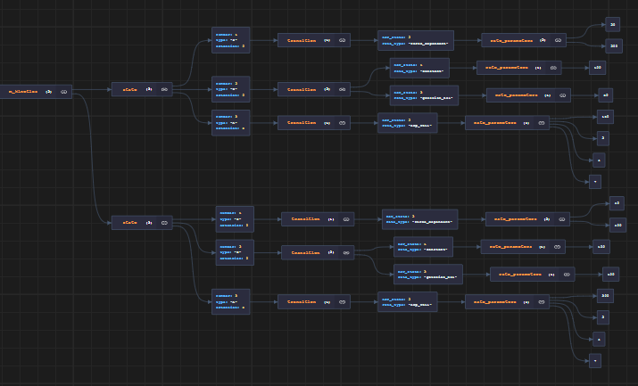

## Isotypes

In FiberSim, myosin and myosin binding protein-C molecules have an _isotype_.

Different isotypes follow different kinetic schemes. For example, you could define a myosin scheme with fast kinetics that represents alpha myosin heads and a scheme with slower kinetics that represents beta myosin heads. You could then test how changing the relative proportions of alpha and beta molecules influences contraction.

The framework can set the isotype of each myosin and/or MyBP-C molecule randomly (based on your chosen proportions) but you can also set the isotype of each specific molecule.

The latter approach allows you to:
+ have each myosin within a dimer follow a different kinetic scheme
+ test how different arrangements of MyBP-C isoforms modulate force development.

See the demonstrations for examples.

## Model files

Isotypes are defined via the model file. Here is the relevant section of a file that defines two myosin isotypes.

```text
"m_parameters": {
    "m_k_cb": 0.001,
    "m_isotype_proportions": [ 0.7, 0.3 ]
  },
  "m_kinetics": [
    {
      "state":
      [
        {
          "number": 1,
          "type": "S",
          "extension": 0,
          "transition": [
            {
              "new_state": 2,
              "rate_type": "force_dependent",
              "rate_parameters": [ 20, 200]
            }
          ]
        },
        {
          "number": 2,
          "type": "D",
          "extension": 0,
          "transition": [
            {
              "new_state": 1,
              "rate_type": "constant",
              "rate_parameters": [ 100 ]
            },
            {
              "new_state": 3,
              "rate_type": "gaussian_hsl",
              "rate_parameters": [ 50 ]
            }
          ]
        },
        {
            "number": 3,
            "type": "A",
            "extension": 5.0,
            "transition": [
              {
                "new_state": 2,
                "rate_type": "exp_wall",
                "rate_parameters": [ 150, 2, 4, 7]
              }
            ]
          }
      ]
    },
    {
        "state":
        [
          {
            "number": 1,
            "type": "S",
            "extension": 0,
            "transition": [
              {
                "new_state": 2,
                "rate_type": "force_dependent",
                "rate_parameters": [ 40, 400]
              }
            ]
          },
          {
            "number": 2,
            "type": "D",
            "extension": 0,
            "transition": [
              {
                "new_state": 1,
                "rate_type": "constant",
                "rate_parameters": [ 100 ]
              },
              {
                "new_state": 3,
                "rate_type": "gaussian_hsl",
                "rate_parameters": [ 100 ]
              }
            ]
          },
          {
              "number": 3,
              "type": "A",
              "extension": 5.0,
              "transition": [
                {
                  "new_state": 2,
                  "rate_type": "exp_wall",
                  "rate_parameters": [ 300, 2, 4, 7]
                }
              ]
            }
        ]
      }
  ]
````

The third line of the snippet is

```text
"m_isotype_proportions": [ 0.7, 0.3 ]
```

This tells FiberSim that there are two isotypes. 70% of the myosins should be the first isotype. The remaining 30% will be the second isotype.

If you are used to looking at JSON files, you will realize that the next section which starts

```text
"m_kinetics: [
  {
    <SNIP>
  }
 ]
 ```

 is defining an array. Each element of the array (there are two) is a complete scheme, containing different states (in this case 3) and different transitions.

 The structure might be easier to understand if you look at the image rendered by [JSON Crack](www.jsoncrack.com).

 

The first scheme corresponds to the first isotype, the second scheme to the second isotype.

If you run a simulation based on this model file, 70% of the myosins will follow the first kinetic scheme, and 30% will follow the second.

Check the examples for further explanations and tips.
