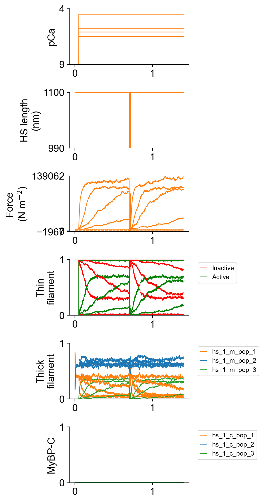
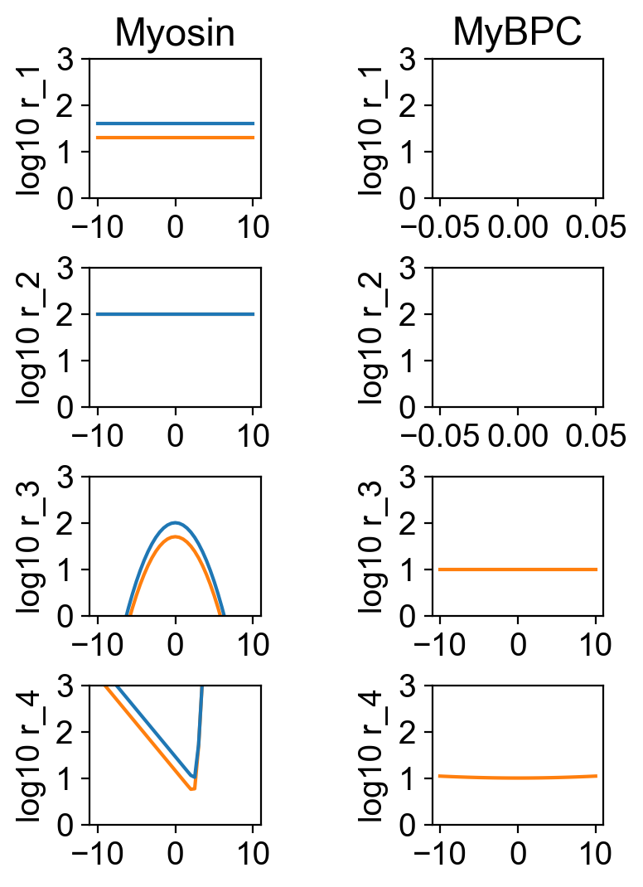
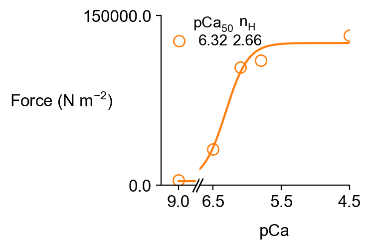
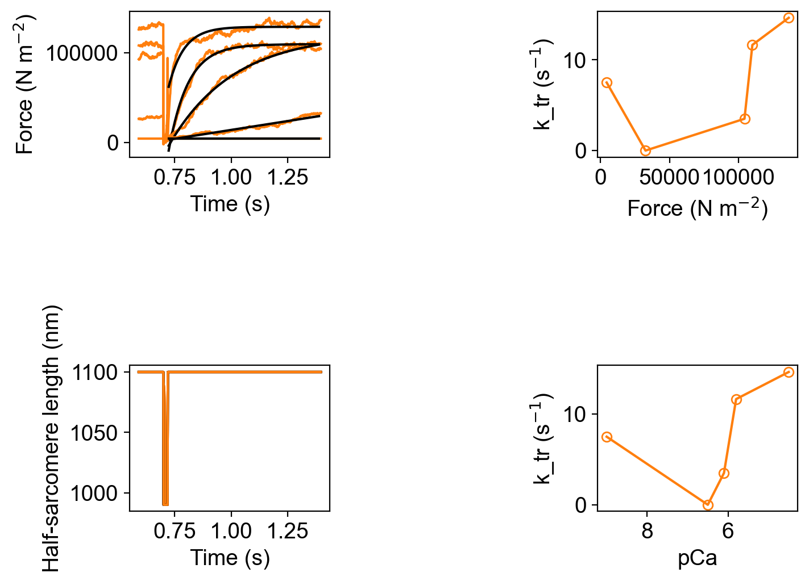
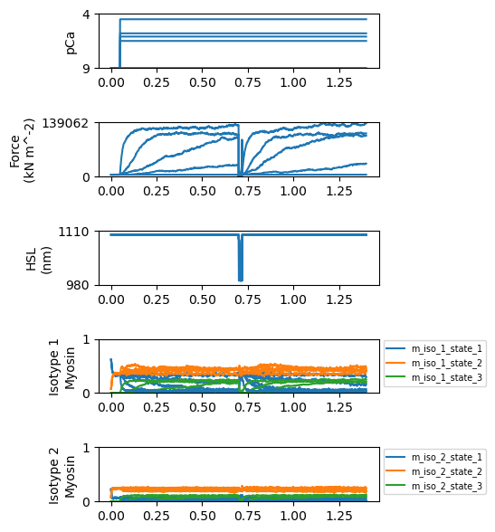
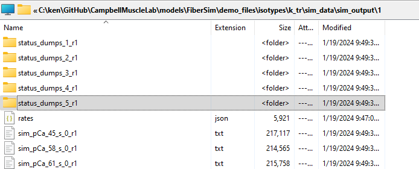

## Single half-sarcomere with two isotypes undergoing k_tr

## Overview

This demo shows how to simulate a single half-sarcomere that has two myosin isotypes.

## What this demo does

This demo:

+ Simulates a half-sarcomere activated in solutions with 5 different pCa values and subject to a k<sub>tr</sub> maneuver.
+ Plots a summary of the simulation.
+ Plots the number of molecules in each state against time for each isotype.

Note, as in all the demos, the simulations have been simplified so that they run relatively quickly. (This one is slower than most, as explained below.)

+ You can make the simulations smoother by increasing the `m_n` parameter in the setup file.
+ In this case, you would probably want to change the duration of the simulation and the initiation time for the k<sub>tr</sub> maneauver to ensure steady-state conditions.


## Instructions

If you need help with these step, check the [installation instructions](../../../installation/installation.html).

+ Open an Anaconda prompt
+ Activate the FiberSim environment
+ Change directory to `<FiberSim_repo>/code/FiberPy/FiberPy`
+ Run the command

```text
 python FiberPy.py characterize "../../../demo_files/isotypes/k_tr/base/setup.json"
 ```

+ You should see text appearing in the terminal window, showing that the simulations are running. When it finishes (this may take a few minutes), you should see something similar to the image below.

### Viewing the results

All of the results from the simulation are written to files in `<FiberSim_repo>/demo_files/isotypes/k_tr/sim_data/sim_output`

The file `superposed_traces.png` shows pCa, length, force per cross-sectional area (stress), and thick and thin filament properties plotted against time. In this figure, the thick filament state populations are the total number of heads in each state. This figure does not break these profiles out by isotype.



The file `rates.png` shows the rates for the different isotypes.



You will also see the usual analysis figures for force-pCa and k<sub>tr</sub>.





along with the corresponding excel files `pCa_analysis.xlsx` and `k_tr_analysis.xlsx` though see the caveats above about the simulations not reaching steady-state.

Most importantly for this demo, you will also see a new figure that shows the state population time-courses for each myosin isotype.



Note the first isotype populations sum to 0.7 (i.e. 70% of the heads) while the second populations sum to 0.3. The second isotype has much faster kinetics.

### How this worked

The model file (found in `<repo>/demo_files/isotypes/k_tr/base/model.json`)defined two isoforms as described [here](../isotypes.html).

The setup file was very similar to that used for the [base k_tr simulation](../../single_trials/k_tr/k_tr.html).

```text
{
  "FiberSim_setup":
  {
    "FiberCpp_exe": {
      "relative_to": "this_file",
      "exe_file": "../../../../bin/FiberCpp.exe"
    },
    "model": {
      "relative_to": "this_file",
      "options_file": "sim_options.json",
      "model_files": ["model.json"]
    },
    "characterization": [
        {
            "type": "pCa_length_control",
            "relative_to": "this_file",
            "sim_folder": "../sim_data",
            "m_n": 4,
            "pCa_values": [9.0, 6.5, 6.1, 5.8, 4.5],
            "sim_duration_s": 1.4,
            "time_step_s": 0.001,
            "pCa_step_up_s": 0.05,
            "k_tr_duration_s": 0.02,
            "k_tr_start_s": 0.7,
            "k_tr_ramp_s": 0.001,
            "k_tr_magnitude_nm": 100,
            "k_tr_fit_time_s": [0.723, 1.39],
            "output_image_formats": [ "png" ],
            "figures_only": "False",
            "trace_figures_on": "False",
            "post_sim_Python_call": "../Python_code/plot_myosin_isotypes.py"
        }
    ]
  }
}
```

The only important difference is the last text line

```text
"post_sim_Python_call": "../Python_code/plot_myosin_isotypes.py"
```

This tells FiberPy to wait until the simulations are finished and then run the specified Python function. We need to do this because the isotype information is not contained in the main summary output file. To get that extra level of detail, we need to look at status files that define the state of the half-sarcomere at each time-point in the simulation.

These aren't normally saved (because it takes a long time to write all the files to disk) but if you look at the `sim_options.json` file that was used for these simulations ...

```text
{
  "options": {
    "max_rate": 5e4,
    "x_pos_rel_tol": 1e-1,
    "hs_force_control_max_delta_hs_length": 100,
    "adjacent_bs": 1,
    "lambda_jitter" : 0,
    "myofibrils":
    {
        "force_tolerance": 1,
        "max_iterations": 100,
        "max_delta_hs_length": 300,
        "multithreading": 0
    },
    "status_files":
    {
        "relative_to": "this_file",
        "status_folder": "status_dumps",
        "time_steps": "1:1:1578"
    }
  }
}
```

... you can see that FiberSim was told to write status files to disk for each time-step.

These are stored in `<FiberSim_repo>/demo_files/isotypes/k_tr/sim_data/sim_output/1/status_dumps_x_r1` where x ranges from 1 to 5 for the different pCa values.



Within each status folder are 1578 status files. Each is written in JSON format and describes the status of the system at a given time-point.

For this example, the most important part of the status description are the arrays that describe the isotype and state of each myosin head on each thick filament. Here's a snippet for a single filament.

```text
	"cb_state": [2, 2, 2, 2, 3, 2, 2, 2, 3, 2, 3, 2, 3, 2, 2, 3, 2, 2, 2, 3, 2, 3, 1, 1, 2, 3, 3, 2, 2, 3, 3, 2, 2, 2, 3, 2, 3, 3, 3, 2, 2, 2, 3, 2, 3, 2, 3, 2, 3, 2, 3, 3, 2, 2, 2, 2, 2, 2, 2, 2, 3, 2, 3, 2, 2, 2, 2, 2, 2, 3, 2, 2, 2, 3, 2, 2, 3, 2, 3, 2, 2, 2, 2, 2, 2, 2, 2, 3, 3, 2, 2, 2, 2, 2, 2, 3, 2, 3, 2, 3, 2, 2, 3, 3, 2, 3, 1, 1, 3, 2, 2, 3, 2, 2, 3, 2, 2, 2, 2, 3, 2, 3, 2, 2, 3, 2, 2, 2, 2, 2, 2, 2, 1, 1, 3, 2, 2, 2, 2, 2, 2, 2, 2, 3, 2, 3, 2, 2, 2, 2, 2, 2, 2, 2, 2, 2, 3, 3, 2, 3, 2, 2, 3, 2, 2, 2, 2, 2, 2, 2, 2, 2, 3, 2, 3, 2, 2, 2, 2, 3, 3, 2, 2, 3, 2, 3, 3, 2, 2, 3, 2, 2, 3, 3, 3, 3, 2, 2, 2, 3, 2, 2, 2, 2, 2, 3, 2, 2, 2, 2, 2, 2, 1, 1, 2, 2, 2, 2, 2, 2, 3, 2, 2, 2, 3, 2, 3, 2, 3, 2, 3, 3, 2, 3, 2, 2, 2, 3, 2, 2, 2, 3, 2, 2, 2, 2, 3, 2, 2, 2, 3, 2, 2, 3, 2, 2, 3, 2, 3, 2, 3, 2, 2, 3, 2, 2, 3, 3, 3, 2, 2, 3, 3, 2, 2, 2, 3, 2, 2, 3, 2, 2, 3, 3, 3, 3, 2, 2, 3, 2, 2, 2, 2, 2, 3, 2, 3, 2, 3, 2, 1, 1, 2, 2, 3, 3, 1, 1, 1, 1, 2, 3, 2, 2, 3, 2, 2, 3, 2, 2, 3, 3, 2, 3],
	"cb_iso": [1, 1, 1, 1, 2, 2, 1, 1, 2, 2, 1, 1, 1, 1, 1, 1, 1, 1, 2, 2, 1, 1, 1, 1, 1, 1, 2, 2, 1, 1, 2, 2, 2, 2, 1, 1, 2, 2, 1, 1, 1, 1, 1, 1, 2, 2, 1, 1, 1, 1, 2, 2, 1, 1, 2, 2, 1, 1, 1, 1, 1, 1, 1, 1, 2, 2, 1, 1, 2, 2, 2, 2, 1, 1, 1, 1, 2, 2, 1, 1, 1, 1, 1, 1, 2, 2, 1, 1, 1, 1, 1, 1, 2, 2, 1, 1, 1, 1, 2, 2, 1, 1, 1, 1, 1, 1, 1, 1, 1, 1, 2, 2, 1, 1, 1, 1, 2, 2, 2, 2, 2, 2, 2, 2, 1, 1, 1, 1, 1, 1, 1, 1, 1, 1, 2, 2, 2, 2, 1, 1, 1, 1, 2, 2, 2, 2, 2, 2, 1, 1, 1, 1, 1, 1, 2, 2, 1, 1, 1, 1, 2, 2, 1, 1, 2, 2, 2, 2, 1, 1, 2, 2, 2, 2, 1, 1, 1, 1, 1, 1, 2, 2, 1, 1, 1, 1, 1, 1, 1, 1, 2, 2, 1, 1, 1, 1, 1, 1, 1, 1, 1, 1, 1, 1, 1, 1, 1, 1, 2, 2, 1, 1, 1, 1, 1, 1, 2, 2, 1, 1, 1, 1, 1, 1, 1, 1, 1, 1, 1, 1, 1, 1, 1, 1, 1, 1, 1, 1, 1, 1, 1, 1, 2, 2, 2, 2, 2, 2, 1, 1, 1, 1, 1, 1, 1, 1, 1, 1, 1, 1, 2, 2, 1, 1, 2, 2, 1, 1, 1, 1, 1, 1, 1, 1, 1, 1, 1, 1, 2, 2, 2, 2, 1, 1, 2, 2, 1, 1, 1, 1, 1, 1, 2, 2, 1, 1, 1, 1, 1, 1, 1, 1, 1, 1, 1, 1, 1, 1, 1, 1, 2, 2, 1, 1, 1, 1, 1, 1, 2, 2, 1, 1, 1, 1],
```

The first array notes the state of each myosin head. Note that most are in state 2 (DRX) or state 3 (bound) because this example is from a half-sarcomere that is fully activated.

The second array notes the isotype of the corresponding head.

The Python code referenced above cycles through all the status files, counting how many heads are in each state for each isotype. It then plots the isotype-level data to a figure. This is the second reason this simulation took longer than normal; scanning through all the files takes a fair amount of time.

If you want to see how this analysis was accomplished, open `Python_code/plot_myosin_isotypes.py` in the demo folder but note that you will need to understand at least a little about Python, Numpy, and Pandas to make much sense of the workflow.
