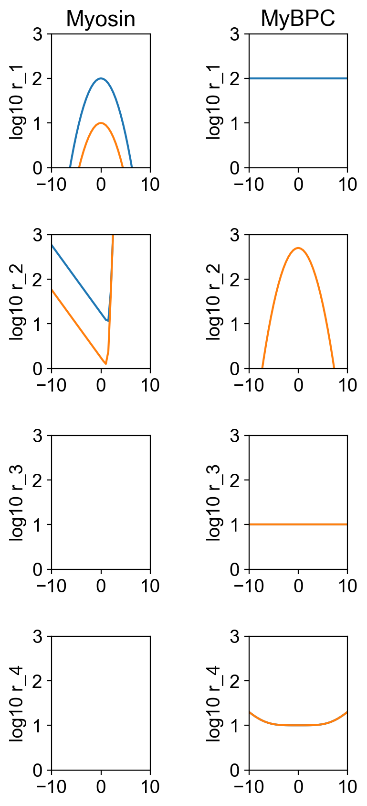

## Assigning the isotype of specific molecules

## Overview

The prior examples in this section define the proportion of myosin heads of each isotype through an instruction file key like

`"m_isotype_proportions": [0.7, 0.3]`

This approach assigns each head in a dimer to the same isotype. 70% of the dimers wil be of isotype 1. 30% of the heads will be of isotype 2. The allocation is random.

This demo shows how to assign specific myosin heads and specific MyBP-C molecules to defined isotypes.

## What this demo does

This demo:

+ Simulates a half-sarcomere undergoing an isometric contraction
+ There are two isotypes of myosin. The kinetics for the second isotype are slower than that of the first isotype
+ The first head in every myosin dimer is isotype 1. The second head in every dimer is isotype 2.
+ There are also two isotypes of MyBP-C. The first isotype attaches to actin. The second isotype can transition to a state where it stabilizes myosin heads.
+ There are 27 MyBP-C molecules arranged in 9 stripes of 3 molecules. All of the molecules within a stripe have the same isotype but the isotype alternates between stripes.
+ You can make the simulations smoother by increasing the `m_n` parameter in the setup file.
+ Status files are written for every 10th time-step. You can increase the time-resolution of the isotype plots by changing the `time_steps` parameter in the options file. For example, changing the string to `1:3:500` would save the status at every 3 time-step.


## Instructions

If you need help with these step, check the [installation instructions](../../../installation/installation.html).

+ Open an Anaconda prompt
+ Activate the FiberSim environment
+ Change directory to `<FiberSim_repo>/code/FiberPy/FiberPy`
+ Run the command

```text
 python FiberPy.py characterize "../../../demo_files/isotpyes/specific_molecules/base/setup.json"
 ```

+ You should see text appearing in the terminal window, showing that the simulations are running. When it finishes (this may take a few minutes), you should see something similar to the image below.

### Viewing the results

All of the results from the simulation are written to files in `<FiberSim_repo>/demo_files/isotypes/twitch/sim_data/sim_output`

The file `superposed_traces.png` shows pCa, length, force per cross-sectional area (stress), and thick and thin filament properties plotted against time. In this figure, the thick filament state populations are the total number of heads in each state. This figure does not break these profiles out by isotype.


You can also the rates for the two isotypes.



Most importantly for this demo, you will also see a new figure that shows the state population time-courses for each myosin isotype.


This code could be extended to show the MyBP-C isotypes in addition.


### How this worked

The model file (found in `<repo>/demo_files/isotypes/specific_molecules/base/model.json`) defined two isotypes for myosin as described [here](../isotypes.html).

Similarly, the model described two isotypes of MyBP-C.

The key difference in this demo is that the `isotype_proportion` keys for myosin and MyBP-C have been replaced by longer arrays. Specifically:

````
"m_parameters": {
    "m_k_cb": 0.001,
    "m_isotype_ints": [1, 2, 1, 2, 1, 2, 1, 2, 1, 2, 1, 2, 1, 2, 1, 2, 1, 2, 1, 2, 1, 2, 1, 2, 1, 2, 1, 2, 1, 2, 1, 2, 1, 2, 1, 2, 1, 2, 1, 2, 1, 2, 1, 2, 1, 2, 1, 2, 1, 2, 1, 2, 1, 2, 1, 2, 1, 2, 1, 2, 1, 2, 1, 2, 1, 2, 1, 2, 1, 2, 1, 2, 1, 2, 1, 2, 1, 2, 1, 2, 1, 2, 1, 2, 1, 2, 1, 2, 1, 2, 1, 2, 1, 2, 1, 2, 1, 2, 1, 2, 1, 2, 1, 2, 1, 2, 1, 2, 1, 2, 1, 2, 1, 2, 1, 2, 1, 2, 1, 2, 1, 2, 1, 2, 1, 2, 1, 2, 1, 2, 1, 2, 1, 2, 1, 2, 1, 2, 1, 2, 1, 2, 1, 2, 1, 2, 1, 2, 1, 2, 1, 2, 1, 2, 1, 2, 1, 2, 1, 2, 1, 2, 1, 2, 1, 2, 1, 2, 1, 2, 1, 2, 1, 2, 1, 2, 1, 2, 1, 2, 1, 2, 1, 2, 1, 2, 1, 2, 1, 2, 1, 2, 1, 2, 1, 2, 1, 2, 1, 2, 1, 2, 1, 2, 1, 2, 1, 2, 1, 2, 1, 2, 1, 2, 1, 2, 1, 2, 1, 2, 1, 2, 1, 2, 1, 2, 1, 2, 1, 2, 1, 2, 1, 2, 1, 2, 1, 2, 1, 2, 1, 2, 1, 2, 1, 2, 1, 2, 1, 2, 1, 2, 1, 2, 1, 2, 1, 2, 1, 2, 1, 2, 1, 2, 1, 2, 1, 2, 1, 2, 1, 2, 1, 2, 1, 2, 1, 2, 1, 2, 1, 2, 1, 2, 1, 2, 1, 2, 1, 2, 1, 2, 1, 2, 1, 2, 1, 2, 1, 2, 1, 2, 1, 2, 1, 2, 1, 2, 1, 2, 1, 2, 1, 2, 1, 2, 1, 2, 1, 2, 1, 2, 1, 2]
  }
  ````

  and

  ````
  "c_isotype_ints": [1, 1, 1, 2, 2, 2, 1, 1, 1, 2, 2, 2, 1, 1, 1, 2, 2, 2, 1, 1, 1, 2, 2, 2, 1, 1, 1]
  ````

  Each element in these arrays defines the isotypes for the corresponding molecule.
  
  Since `m_isotype_ints` alternates between 1 and 2, and heads are arranged in dimer pairs, each dimer contains one molecule of each isotype.
  
  In contrat, `c_isotype_ints` contain triplets. Since there are three MyBP-C molecules for every 3rd myosin crown, the MyBP-C molecules are arranged in isotype 'stripes'.
