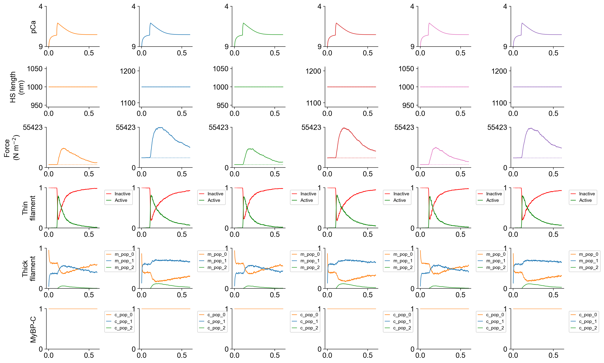
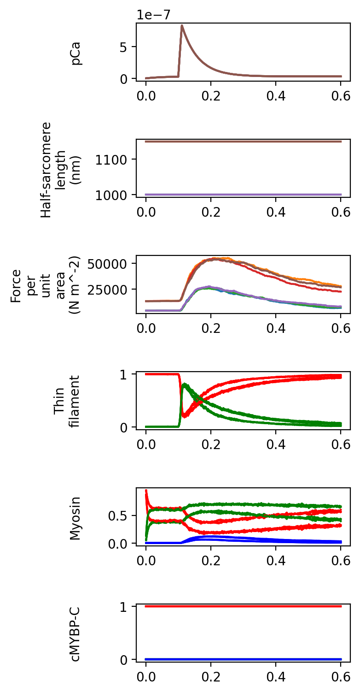

# Twitch

## Overview

This demo shows how to compare twitches at two lengths simulated using 3 models where the rate of alpha to beta myosin takes the values of:
+ 1 : 0
+ 0.5: 0.5
+ 0 : 1

## What this demo does

This demo:

+ Takes a model file with a single myosin isotype representating the alpha isoform
+ Creates copies of the model file where
  + the alpha isotype has been duplicated and slowed so that the model includes both an alpha and a beta isoform
  + the ratio of alpha to beta is set by the user
+ Simulates twitches at two different lengths for each model
+ Creates a figure that summarizes the simulations

## Instructions

Before proceeding, make sure that you have [installed FiberSim](../../../installation/installation.html).

You need:
+ the FiberSim folder
+ an Anaconda distribution of Python
+ and an active FiberSim environment to run this demo.

### Getting ready

+ Open an Anaconda Prompt

+ Activate the FiberSim Anaconda Environment by executing:
```
conda activate fibersim
```
+ Change directory to `<FiberSim_dir>/demo_files/isotypes/twitch/Python_code`, where `<FiberSim_dir>` is the directory where you installed FiberSim.
+ See [Getting started](../../getting_started/getting_started.html) if you need help.

### Run a simulation

+ Type:
 ```
 python simulate_twitches_with_isotypes.py
 ```

+ You should see text appearing in the terminal window, showing that the simulations are running.

### Viewing the results

All of the results from the simulation are written to files in `<repo>/demo_files/isotypes/isotypes/twitch/sim_data/sim_output`

`superposed_traces.png` shows the simulated twitches.



`summary.png` shows the simulated twitches on the same time axis.



## How this worked

This demonstration used a [characterization structure](../../../structures/characterization/characterization.html) and the
+ `freeform` characterization mode
to run simulations:
+ using a single protocol file
  + `<repo>/demo_files/isotypes/twitch/protocol_twitch.txt`
for each of 3 models:
+ `<repo>/demo_files/isotypes/twitch/generated/model_1.json`
+ `<repo>/demo_files/isotypes/twitch/generated/model_2.json`
+ `<repo>/demo_files/isotypes/twitch/generated/model_3.json`

These files are generated from a single base model by the Python code.