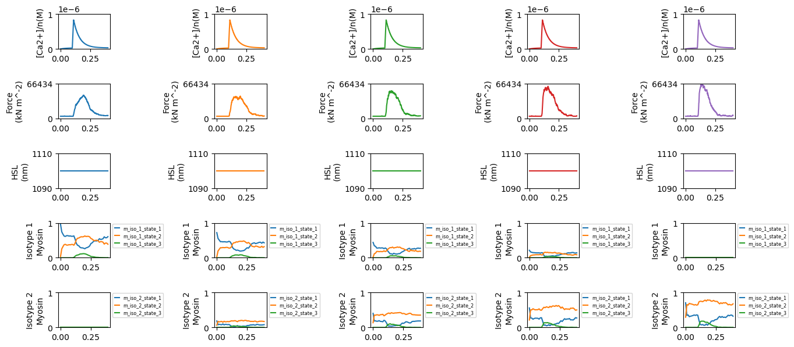

## Single half-sarcomere twitch contraction with two isotypes

## Overview

This demo simulates how changing the relative proportions of two isotypes of myosin influences a twitch contraction.

## What this demo does

This demo:

+ Simulates a half-sarcomere doing an isometric twitch contraction
+ There are two isotypes of myosin. The rates for the second isotype are 4 times faster than for the first
+ The relatives proportions of the two isotypes are shifted from [1, 0] to [0, 1] in 5 steps.

Note, as in all the demos, the simulations have been simplified so that they run relatively quickly. (This one is slower than most, as explained below.)

+ You can make the simulations smoother by increasing the `m_n` parameter in the setup file.
+ Status files are written for every 10th time-step. You can increase the time-resolution of the isotype plots by changing the `time_steps` parameter in the options file. For example, changing the string to `1:3:500` would save the status at every 3 time-step.


## Instructions

If you need help with these step, check the [installation instructions](../../../installation/installation.html).

+ Open an Anaconda prompt
+ Activate the FiberSim environment
+ Change directory to `<FiberSim_repo>/code/FiberPy/FiberPy`
+ Run the command

```text
 python FiberPy.py characterize "../../../demo_files/isotpyes/twitch/base/setup.json"
 ```

+ You should see text appearing in the terminal window, showing that the simulations are running. When it finishes (this may take a few minutes), you should see something similar to the image below.

### Viewing the results

All of the results from the simulation are written to files in `<FiberSim_repo>/demo_files/isotypes/twitch/sim_data/sim_output`

The file `superposed_traces.png` shows pCa, length, force per cross-sectional area (stress), and thick and thin filament properties plotted against time. In this figure, the thick filament state populations are the total number of heads in each state. This figure does not break these profiles out by isotype.


You can also the rates for the two isotypes.


Most importantly for this demo, you will also see a new figure that shows the state population time-courses for each myosin isotype.



Note the proportion of the first isotype shifts from 100% in the first condition (left column) to 0% in the last column.

### How this worked

The model file (found in `<repo>/demo_files/isotypes/twitch/base/model.json`)defined two isoforms as described [here](../isotypes.html).

The setup file was very similar to that used for the [base twitch simulation](../../single_trials/twitch/twitch.html) except for the `manipulations` section.

```text
{
  "FiberSim_setup":
  {
    "FiberCpp_exe": {
      "relative_to": "this_file",
      "exe_file": "../../../../bin/FiberCpp.exe"
    },
    "model": {
      "relative_to": "this_file",
      "options_file": "sim_options.json",
      "manipulations":
      {
        "base_model": "model.json",
        "generated_folder": "../generated",
        "adjustments":
        [
            {
                "variable": "m_isotype_proportions",
                "proportions":
                [
                    {
                        "isotype_proportions": [1.0, 0.0]
                    },
                    {
                        "isotype_proportions": [0.75, 0.25]
                    },
                    {
                        "isotype_proportions": [0.5, 0.5]
                    },
                    {
                        "isotype_proportions": [0.25, 0.75]
                    },
                    {
                        "isotype_proportions": [0.0, 1.0]
                    }
                ]
            }
        ]
      }
    },
    "characterization": [
        {
            "type": "twitch",
            "relative_to": "this_file",
            "sim_folder": "../sim_data",
            "m_n": 4,
            "protocol":
            {
                "protocol_folder": "../protocols",
                "data": [
                    {
                        "time_step_s": 0.001,
                        "n_points": 400,
                        "stimulus_times_s": [0.1],
                        "Ca_content": 1e-3,
                        "stimulus_duration_s": 0.01,
                        "k_leak": 6e-4,
                        "k_act": 8.2e-2,
                        "k_serca": 20
                    }
                ]
            },
            "output_image_formats": [ "png" ],
            "figures_only": "False",
            "trace_figures_on": "False",
            "post_sim_Python_call": "../Python_code/plot_myosin_isotypes.py"
        }
    ]
  }
}
```

Here, the `manipulations` section followed the same general approach as described in the [model comparison demos](../../model_comparison/model_comparison.html). The only difference is a different structure to allow changing the array values that define the proportion of isotpyes of each state.

The first condition, `"isotype_proportions": [1.0, 0.0]` sets all of the myosins to the first isotype. This shifts successively through 75%, 50%, 25% and finally to 0% in the last condition.

Finally, the last text line

```text
"post_sim_Python_call": "../Python_code/plot_myosin_isotypes.py"
```

tells FiberPy to wait until the simulations are finished and then run the specified Python function which generated `myosin_isotypes.png`. See the [k_tr example](../k_tr/k_tr.html) for more information.

