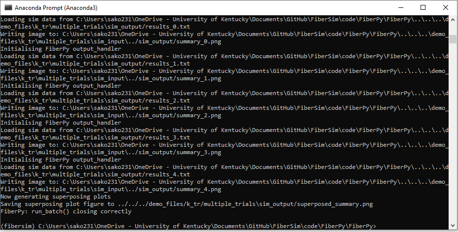
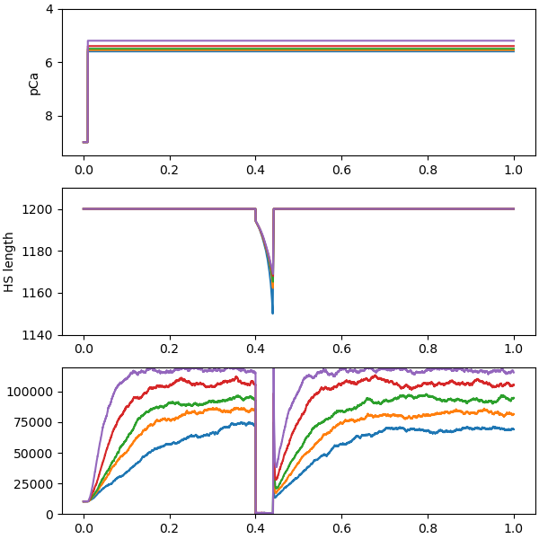

# k<sub>tr</sub> multiple trials

## Overview

This demo shows how to simulate a experiments assessing k<sub>tr</sub> at different levels of Ca<sup>2+</sup> activation.

## What this demo does

This demo:

+ Builds on the [ktr_single_trial demo](../single_trial/k_tr_single_trial.html)
+ Uses a [batch structure](../../../structures/batch/batch.html) to run mulitple trials, each of which consists of the muscle being activated in a given pCa solution and perturbed by a rapid shortening/re-stretch protocol.

## Instructions

Before proceeding, make sure that you have followed the [installation instructions](../../installation/installation.html). You need the FiberSim folder, an Anaconda distribution of Python, and an active FiberSim environment to run this demo.

### Getting ready

+ Open an Anaconda Prompt

+ Activate the FiberSim Anaconda Environment by executing:
```
conda activate fibersim
```
+ Change directory to `<FiberSim_dir>/code/FiberPy/FiberPy`, where `<FiberSim_dir>` is the directory where you installed FiberSim.

### Run a simulation

+ Type:
 ```
 python FiberPy.py run_batch "../../../demo_files/k_tr/multiple_trials/batch_ktr_multiple_trials.json"
 ```

+ You should see text appearing in the terminal window, showing that the simulations are running. When it finishes (this may take several minutes), you should see something similar to the image below.



### Viewing the results

All of the results from the simulation are written to files in `<FiberSim_dir>/demo_files/k_tr/multiple_trials/sim_output`


Each `*.txt` files contains the summary data for a given simulation.

The `*.png` files show a summary figure.

If you opened the text files and plotted the results on a single group of axes, you would see a figure that looked like this.



## How this worked

This demo uses the same approach as the [ktr_single_trial demo](../single_trial/k_tr_single_trial.html) but repeats the simulations at different levels of Ca<sup>2+</sup> using a distinct [protocol file](../../../structures/protocol/protocol.html) for each job.

The simulations are initiated using the [batch file](../../../structures/batch/batch.html) below.

````
{
    "FiberSim_batch": {
        "FiberCpp_exe":
        {
            "relative_to": "this_file",
            "exe_file": "../../../bin/FiberCpp.exe"
        },
        "job":[
            {
                "relative_to": "this_file",
                "model_file": "sim_input/model.json",
                "options_file": "sim_input/options.json",
                "protocol_file": "sim_input/protocol_0.txt",
                "results_file": "sim_output/results_0.txt",
                "output_handler_file": "sim_input/output_handler_0.json"
            },
            {
                "relative_to": "this_file",
                "model_file": "sim_input/model.json",
                "options_file": "sim_input/options.json",
                "protocol_file": "sim_input/protocol_1.txt",
                "results_file": "sim_output/results_1.txt",
                "output_handler_file": "sim_input/output_handler_1.json"
            },
            {
                "relative_to": "this_file",
                "model_file": "sim_input/model.json",
                "options_file": "sim_input/options.json",
                "protocol_file": "sim_input/protocol_2.txt",
                "results_file": "sim_output/results_2.txt",
                "output_handler_file": "sim_input/output_handler_2.json"
            },
            {
                "relative_to": "this_file",
                "model_file": "sim_input/model.json",
                "options_file": "sim_input/options.json",
                "protocol_file": "sim_input/protocol_3.txt",
                "results_file": "sim_output/results_3.txt",
                "output_handler_file": "sim_input/output_handler_3.json"
            }
        ]
    }
}
````
