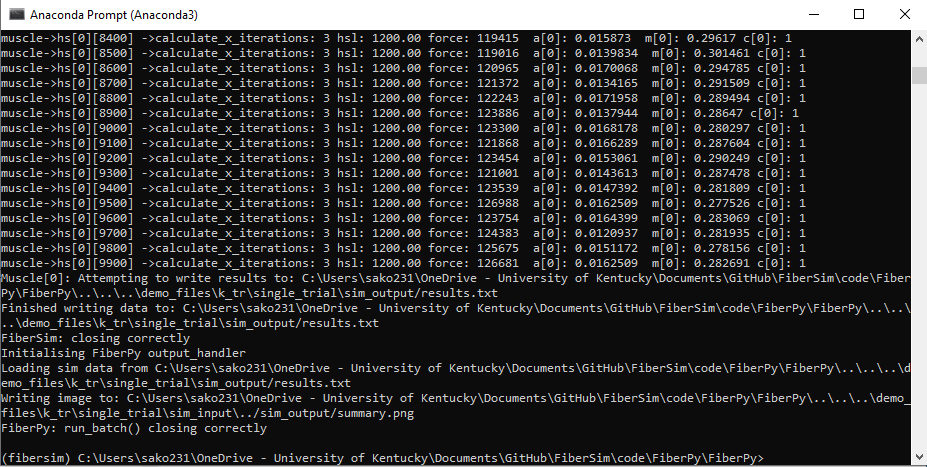
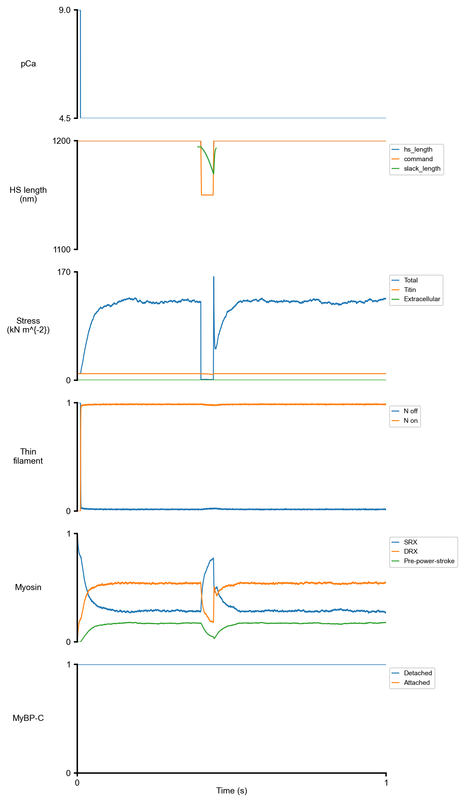
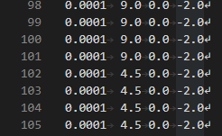
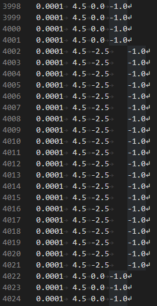
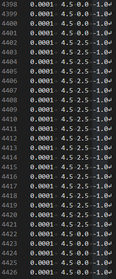

# k<sub>tr</sub> single trial

## Overview

This demo shows how to simulate a single trial assessing k<sub>tr</sub>.

## What this demo does

This demo:

+ Runs a single trial in which the muscle is activated at pCa 4.5 and subsequently perturbed by a rapid shortening/re-stretch protocol.

## Instructions

Before proceeding, make sure that you have followed the [installation instructions](../../../installation/installation.html). You need the FiberSim folder, an Anaconda distribution of Python, and an active FiberSim environment to run this demo.

### Getting ready

+ Open an Anaconda Prompt

+ Activate the FiberSim Anaconda Environment by executing:
```
conda activate fibersim
```
+ Change directory to `<FiberSim_dir>/code/FiberPy/FiberPy`, where `<FiberSim_dir>` is the directory where you installed FiberSim.

### Run a simulation

+ Type:
 ```
 python FiberPy.py run_batch "../../../demo_files/k_tr/single_trial/batch_ktr_single_trial.json"
 ```

+ You should see text appearing in the terminal window, showing that the simulations are running. When it finishes (this may take several minutes), you should see something similar to the image below.



### Viewing the results

All of the results from the simulation are written to files in `<FiberSim_dir>/demo_files/k_tr/single_trial/sim_output`


+ The file `results.txt` contains the summary data for the simulation.

+ The file `summary.png` shows the results.

<html>

</html>

## How this worked

This demo is very similar to the [getting started - isometric_activation demo](../../getting_started/isometric_activation/isometric_activation.demo).

The only difference is a slight change to the [protocol file](../../../structures/protocol.html).

Here's a screenshot from a section close to the beginning of the protocol.



+ The numbers in gray in the first column are line numbers and are not part of the actual file.
+ The second column (the first one in white) show time-steps of 0.0001 s.
+ The next column shows the pCa of the activating solution switching from 9.0 to 4.5 at the 101st time-step (there's a single header line at the top of the file so the line numbers show the time-step + 1)
+ The third column of numbers (all 0's here) show the half-sarcomere length change in nm for the time-step.
+ The last column shows the simulation mode, with -2.0 meaning we are in length-control. Since the half-sarcomere length change is 0, the model is isometric.

The next screenshot shows the protocol file around lines 4000.



Note that the simulation mode in the last column  is -1. This means keep the half-sarcomere under length control mode, unless doing so would cause force to drop below zero, in which case allow the muscle to shorten against no load.

Lines 4002 to 4021 have a half-sarcomere length change of -2.5 nm. Each line a time-step of 0.0001 s. The half-sarcomere thus shortens by 50 nm in 2 ms.

The next screenshot shows the protocol file around lines 4400.



The half-sarcomere length changes are now positive, so the muscle is re-stretched to its original length.
