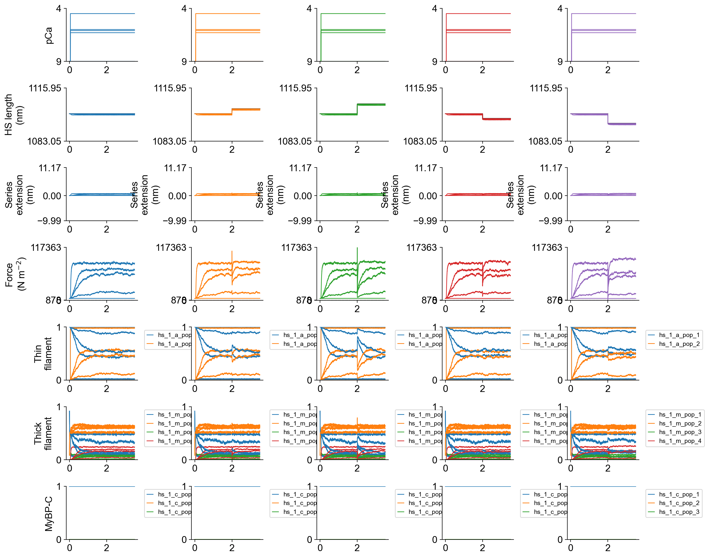
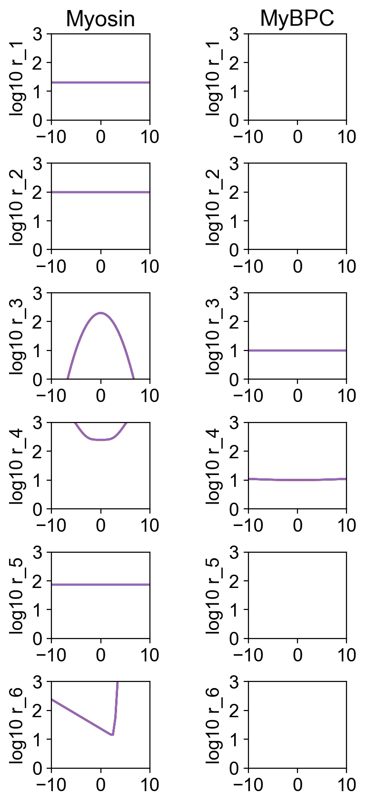

# Steps

## Overview

This demo shows how to simulate the force responses to steps of different sizes.

## What this demo does

This demo:

+ Runs a set of simulations with step stretches of different sizes imposed at different activation levels

## Instructions

If you need help with these step, check the [installation instructions](../../../installation/installation.html).

+ Open an Anaconda prompt
+ Activate the FiberSim environment
+ Change directory to `<FiberSim_repo>/code/FiberPy/FiberPy`
+ Run the command
```
 python FiberPy.py characterize "../../../demo_files/length_changes/steps/base/setup.json"
 ```

### Viewing the results

All of the results from the simulations are written to files in `<FiberSim_repo>/demo_files/length_changes/steps/sim_output`

The file `superposed_traces.png` shows pCa, length, force per cross-sectional area (stress), and thick and thin filamnt properties plotted against time.



The file `rates.png` summarizes the kinetic scheme.



### How this worked

The setup file follows the normal template. The experimental protocols are defined by the `characterization` element.

The new feature in this demo are the specifications for length steps.

```
    "length_step_nm" : [0, 3, 6, -3, -6],
    "length_step_s": 2,
    "length_step_ramp_s": 0.001
```

This means, for each pCa value, run 5 trials where a step is imposed at 2 s that is complete within 0.001 s and is one of the following values 0, 3, 6, -3, -6 nm.

```text
{
  "FiberSim_setup":
  {
    "FiberCpp_exe": {
      "relative_to": "this_file",
      "exe_file": "../../../../bin/FiberCpp.exe"
    },
    "model": {
      "relative_to": "this_file",
      "options_file": "sim_options.json",
      "model_files": ["model.json"]
    },
    "characterization": [
        {
            "type": "pCa_length_control",
            "relative_to": "this_file",
            "sim_folder": "../sim_data",
            "m_n": 16,
            "pCa_values": [9.0, 6.3, 6.1, 6.0, 4.5],
            "sim_duration_s": 3.5,
            "time_step_s": 0.001,
            "pCa_step_up_s": 0.05,
            "k_tr_start_s": 3.0,
            "k_tr_duration_s": 0.02,
            "k_tr_ramp_s": 0.001,
            "k_tr_magnitude_nm": 0,
            "k_tr_fit_time_s": [3.025, 3.95],
            "length_step_nm" : [0, 3, 6, -3, -6],
            "length_step_s": 2,
            "length_step_ramp_s": 0.001,
            "output_image_formats": [ "png" ],
            "figures_only": "False",
            "trace_figures_on": "False"
        }
    ]
  }
}
```
