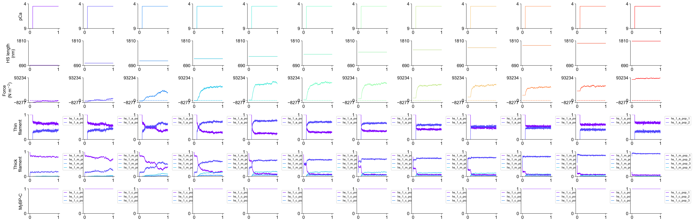
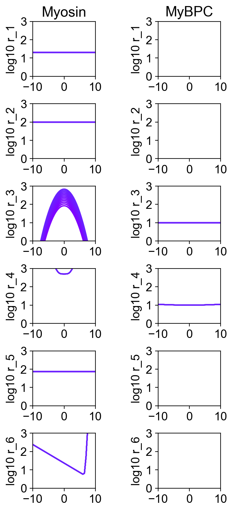
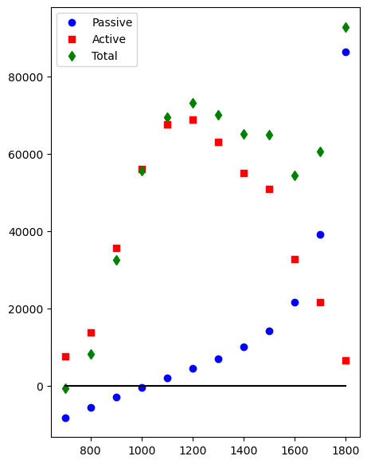

# Steady-state

## Overview

This demo shows how to simulate the steady-state passive and active length-tension curves for a model.

## What this demo does

This demo:

+ Runs a set of simulations
+ Each simulation calculates the properties of a half-sarcomere held at a different length
+ In each simulation, the fiber starts relaxed but is then maximally activated
+ Once the simulations have finished, the data are analyzed to determine the passive, active, and total length-tension curves
## Instructions

If you need help with these step, check the [installation instructions](../../../installation/installation.html).

+ Open an Anaconda prompt
+ Activate the FiberSim environment
+ Change directory to `<FiberSim_repo>/code/FiberPy/FiberPy`
+ Run the command
```
 python FiberPy.py characterize "../../../demo_files/length_tension/steady_state/base/setup.json"
 ```

### Viewing the results

All of the results from the isotonic simulations are written to files in `<FiberSim_repo>/demo_files/length_tension/steady_state/sim_output`

The file `superposed_traces.png` shows pCa, length, force per cross-sectional area (stress), and thick and thin filamnt properties plotted against time.



The file `rates.png` summarizes the kinetic scheme.



The file `length_tension.png` shows the active, passive, and total length-tension curves.




### How this worked

The setup file follows the normal template. The experimental protocols are defined by the `characterization` element.

The new feature in this demo is the `hs_lengths` option in the characterization structure. As you can see from the output figures, the code simulates a pCa 4.5 activation at half-sarcomere lengths ranging from 700 to 1800 nm.

The `post_sim_Python_call` generates the length-tension figure which is unique to this demo.


```text
{
  "FiberSim_setup":
  {
    "FiberCpp_exe": {
      "relative_to": "this_file",
      "exe_file": "../../../../bin/FiberCpp.exe"
    },
    "model": {
      "relative_to": "this_file",
      "options_file": "sim_options.json",
      "model_files": ["model.json"]
    },
    "characterization": [
        {
            "type": "pCa_length_control",
            "relative_to": "this_file",
            "sim_folder": "../sim_data",
            "hs_lengths": [700, 800, 900, 1000, 1100, 1200, 1300, 1400, 1500, 1600, 1700, 1800],
            "m_n": 4,
            "pCa_values": [4.5],
            "sim_duration_s": 1,
            "time_step_s": 0.001,
            "pCa_step_up_s": 0.1,
            "output_image_formats": [ "png" ],
            "figures_only": "False",
            "trace_figures_on": "False",
            "post_sim_Python_call": "../Python_code/plot_length_tension.py"
        }
    ]
  }
}
```
