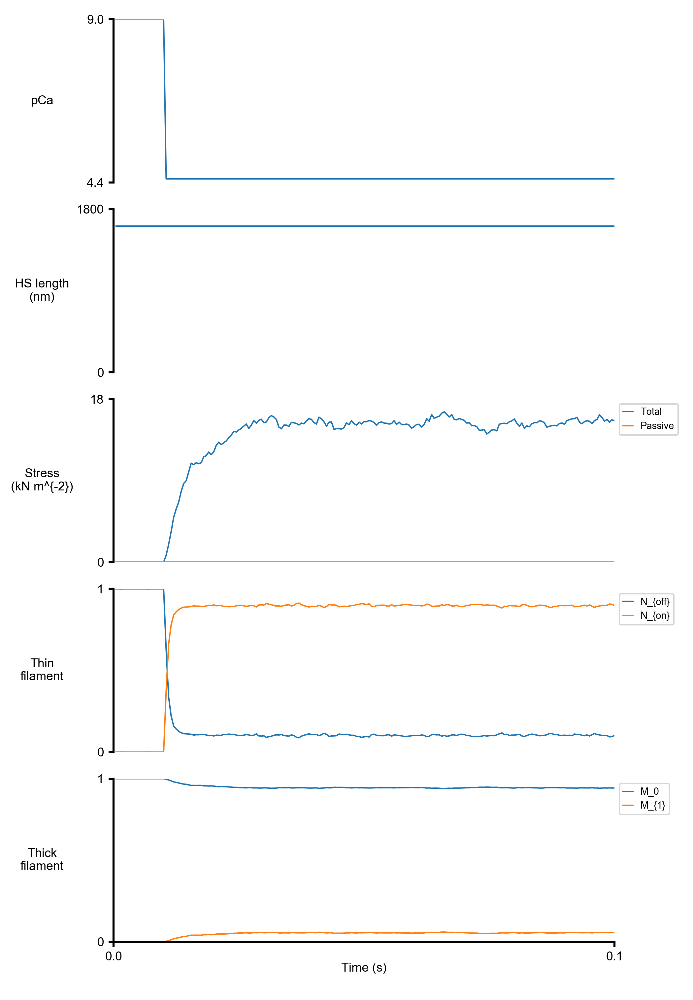

# Make figures

## Overview

This demo shows how to make new figures from an existing results file.

## What this demo does

This demo uses the [output handler system](../../FiberPy/structure/structure.html) to make two figures from a [summary results file](../../FiberPy/structure/structure.html). You can build on this approach to make figures for presentations and papers.

## Instructions

### Getting ready

1. Open an Anaconda Prompt
2. Activate the FiberSim Anaconda Environment by executing:
    ```
    conda activate fibersim
    ```
3. Change directory to `<repo>/code/FiberPy/FiberPy`, where `<repo>` is the directory where you installed FiberSim (e.g. `c:\temp\FiberSim`)

### Run a simulation

+ Type `python FiberPy.py make_figures "../../../demo_files/getting_started/make_figures/output_handler.json" "../../../demo_files/getting_started/make_figures/sim_output/results.txt"`
+ You should see some text appearing in the terminal window

## Viewing the results

+ Use Windows File Explorer to open `<repo>/demo_files/getting_started/make_figures/figures`
+ You should see
  + summary.png
  
<p align="center">
    
</p>
