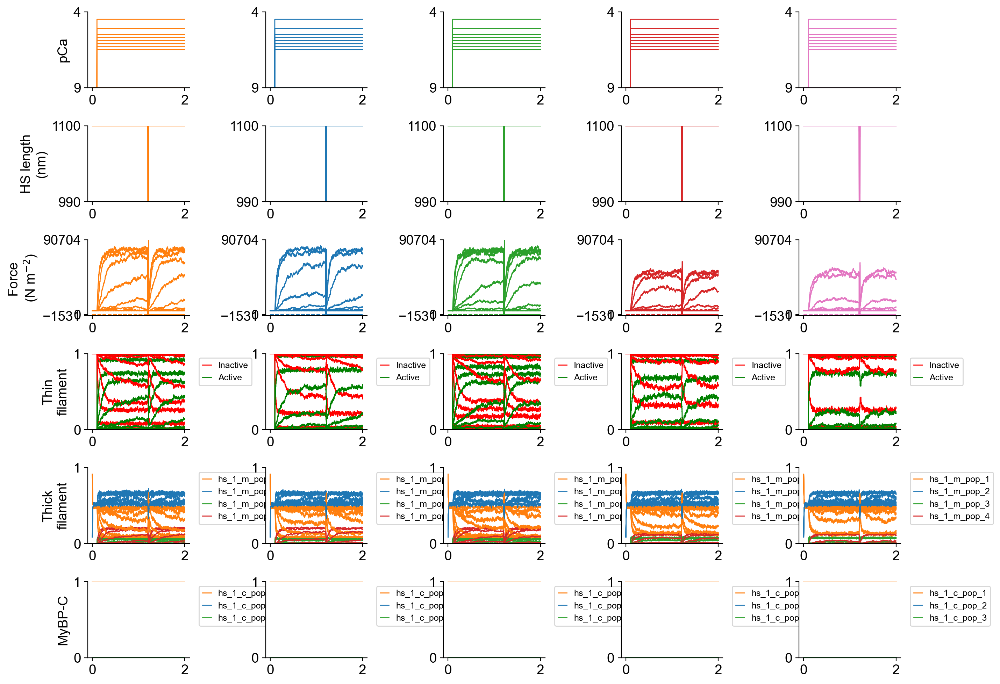
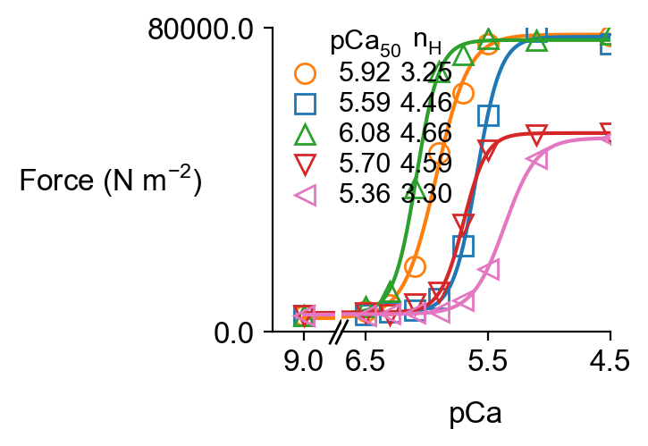
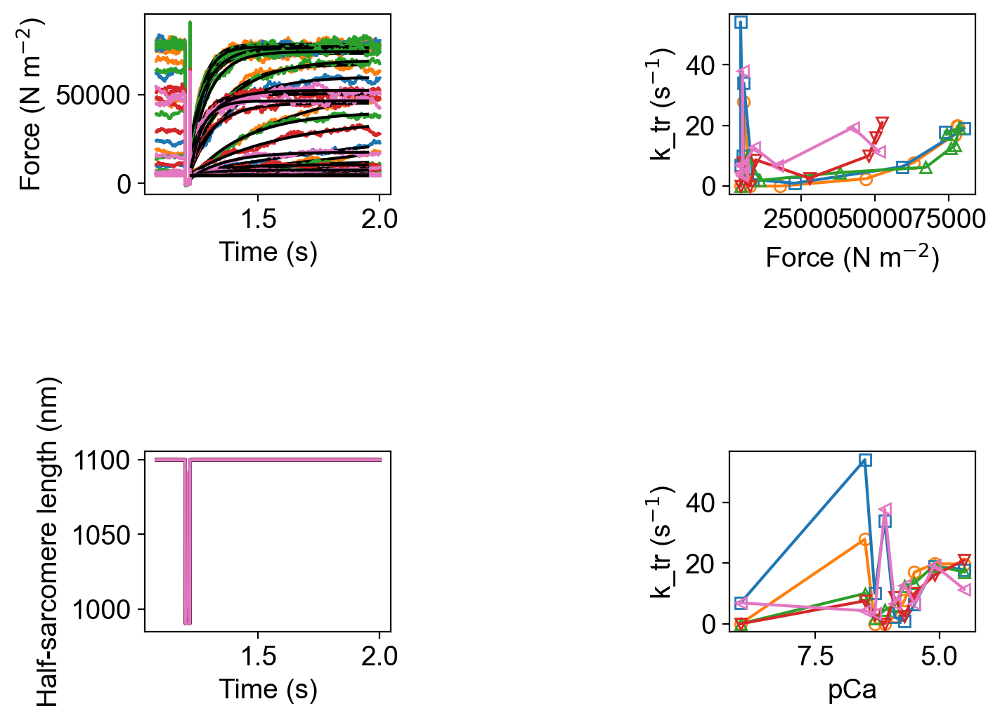
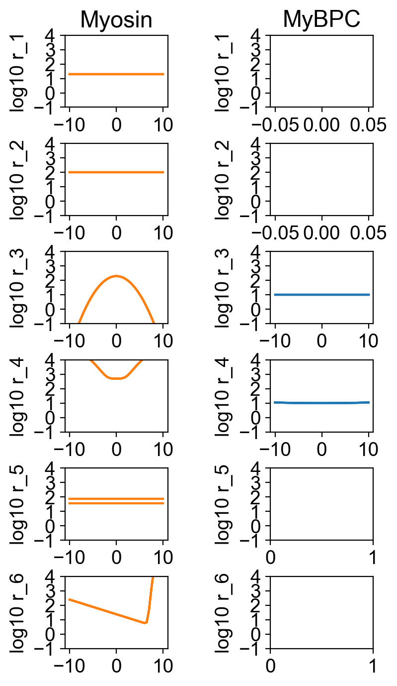

# Parameter adjustments

## Overview

This demo predicts how modulating the Ca<sup>2+</sup> sensitivity of the thin filament and / or the rate of a myosin power stroke changes the force-pCa relationship and k<sub>tr</sub>.

## What this demo does

This demo:

+ Builds on the [single pCa curve](../../pCa_curves/single_curve/single_curve.html) demo and runs simulations in which a half-sarcomere is subjected to a k<sub>tr</sub> maneuver at a range of pCa values
+ Uses an `adjustments` structure to create 4 models with different parameter values
+ Plots summaries of the simulation

## Instructions

If you need help with these step, check the [installation instructions](../../../installation/installation.html).

+ Open an Anaconda prompt
+ Activate the FiberSim environment
+ Change directory to `<FiberSim_repo>/code/FiberPy/FiberPy`
+ Run the command
```
 python FiberPy.py characterize "../../../demo_files/model_comparison/parameter_adjustments/base/setup.json"
 ```

### Viewing the results

**Notes** Be aware:
+ These simulations will look noisy because of the small `m_n` value.
+ Even then, this code is running 36 simulations, so it may take ~10 minutes on a laptop.

All of the results from the simulation are written to files in `<FiberSim_repo>/demo_files/model_comparison/parameter_adjustments/sim_data/sim_output`

The file `superposed_traces.png` shows pCa, length, force per cross-sectional area (stress), and thick and thin filamnt properties plotted against time.



Since the simulations included more than 1 pCa value, FiberPy created a pCa curve `force_pCa.png`



and wrote summary data to `pCa_analysis.xlsx`.

Since the code simulated a k<sub>tr</sub> maneuver, FiberPy also created a figure showing the analyis of the tension recovery.



and wrote summary data to `k_tr_analysis.xlsx`.

The rate constants for the different simulations are shown superposed in



### How this worked

The only difference between this simulation and the [single pCa curve](../../pCa_curves/single_curve/single_curve.html) demo is that the `model` section was updated to include an `adjustments` component.

```
"model":
{
    "relative_to": "this_file",
    "options_file": "sim_options.json",
    "manipulations":
    {
        "base_model": "model.json",
        "generated_folder": "../generated",
        "adjustments":
        [
            {
                "class": "thin_parameters",
                "variable": "a_k_on",
                "multipliers": [1, 0.5, 1.5, 1, 0.5],
                "output_type": "float"
            },
            {
                "variable": "m_kinetics",
                "isotype": 1,
                "scheme": 3,
                "transition": 2,
                "parameter_number": 1,
                "multipliers": [1, 1, 1, 0.5, 0.5],
                "output_type": "float"
            }
        ]
    }
}
```

The details are as follows:

+ `"relative_to": "this_file"` - defines the paths as relative to the set-up file
+ `"options_file": "sim_options.json"` - the filename for the options file
+ `"base_model": "model.json"` - the model to manipulate
+ `"generated_folder": "../generated"` - where to store the adjusted models

```
            {
                "class": "thin_parameters",
                "variable": "a_k_on",
                "multipliers": [1, 0.5, 1.5, 1, 0.5],
                "output_type": "float"
            },
```

+ Run simulations for 5 models in which `thin_parameters : a_k_on` is set to 1, 0.5, 1.5, 1, and 0.5 times its value in the base model
+ This approach works for any model parameter that is defined as a single value within a top-level class.

```
            {
                "variable": "m_kinetics",
                "isotype": 1,
                "scheme": 3,
                "transition": 2,
                "parameter_number": 1,
                "multipliers": [1, 1, 1, 0.5, 0.5],
                "output_type": "float"
            }
```

+ During the 5 trials adjust `parameter_number` 1 in the kinetics for myosin `isotype` 1, `scheme` 3, `transition` 2 to 1, 1, 1, 0.5, 0.5 times its value in the base model
+ If the variable is changed to `c_kinetics`, the parameters for cMyBP-C transitions will be adjusted instead.

This nomenclature is a bit more complicated but should be easier to understand when viewed in conjunction with the same section from the base model file.

```
"m_kinetics": [
    {
      "no_of_states": 4,
      "max_no_of_transitions": 2,
      "scheme": [
        {
            <snip>
        },
        {
            <snip>
        },
        {
          "number": 3,
          "type": "A",
          "extension": 0.0,
          "transition": [
            {
              "new_state": 2,
              "rate_type": "poly",
              "rate_parameters": [ 500, 10, 4]
            },
            {
                "new_state": 4,
                "rate_type": "constant",
                "rate_parameters": [ 75 ]
              }
          ]
        },
        {
            <snip>
        }
      ]
    }
  ],
```

This section describes the kinetics for a single myosin isoform. (There is is only one entry within the `"m_kinetics": []`.

The third component of the scheme describes transitions for an attached state with 0 power-stroke extension. The second transition from this state is defined by a single value (`parameter_number = 1`) and has a constant value corresponding to a rate of 75 s<sup>-1</sup>.

The 5 simulations are thus run with values of 75, 75, 75, 37.5, and 37.5 s<sup>-1</sup> respectively, where 37.5 = 0.5 * 75.

