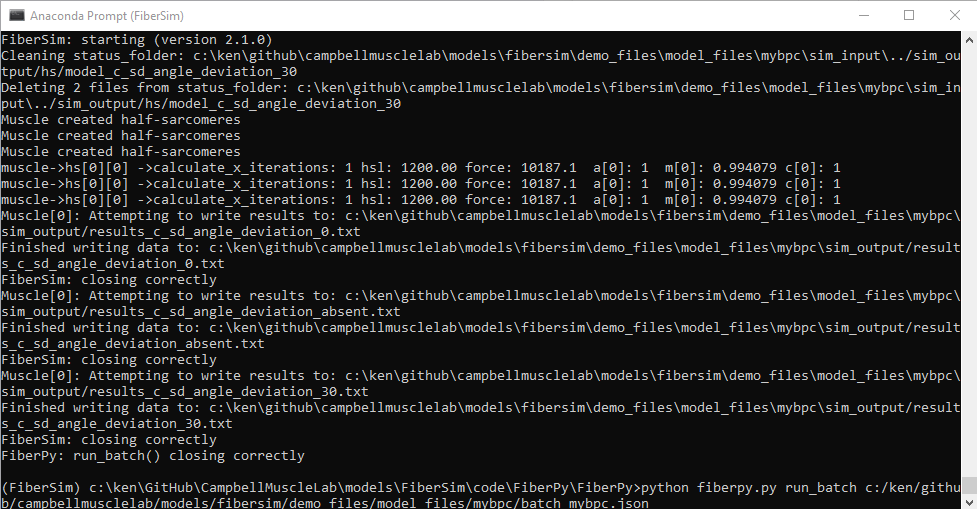
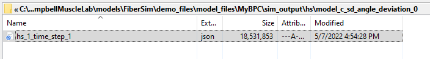
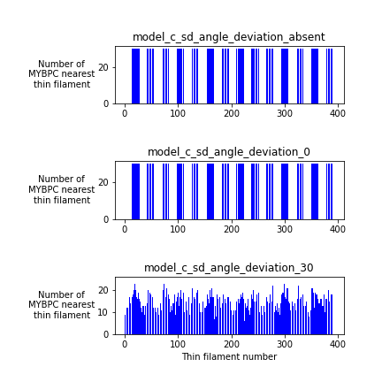

# MyBP-C

## Overview

This demo explains the `c_sd_angle_deviation` parameter in a [FiberSim model](../../../structures/model/model.html).

## What this demo does

This demo:

+ Runs trials with 3 different models in which the `c_sd_angle_deviation` parameter is
  + not defined
  + set to 0 degrees
  + set to 30 degrees

## Instructions

Before proceeding, make sure that you have followed the [installation instructions](../../../installation/installation.html). You need the FiberSim folder, an Anaconda distribution of Python, and an active FiberSim environment to run this demo.

### Getting ready

+ Open an Anaconda Prompt

+ Activate the FiberSim Anaconda Environment by executing:
````
conda activate fibersim
````

+ Change directory to `<FiberSim_dir>/code/FiberPy/FiberPy`, where `<FiberSim_dir>` is the directory where you installed FiberSim.

### Run a simulation

+ Type:
````
python FiberPy.py run_batch "../../../demo_files/model_files/mybpc/batch_mybpc.json"
````

+ You should see text appearing in the terminal window, showing that the simulations are running. This should only take a few seconds.



+ The code should have created 3 status files, nested in the `sim_output` folder



+ Now return to the command window and change the directory to `<FiberSim_dir>/demo_files/model_files/mybpc`

+ Type:
````
python draw_mybpc_distributions.py
````

+ This code should have a created a figure showing three histograms in the `sim_output` folder.



## How this worked

+ The batch file ran 3 simulations using 3 different model files.

  + with `c_sd_angular_deviation` absent

````
"mybpc_structure": {
    "c_thick_proximal_node": 10,
    "c_thick_stripes": 10,
    "c_thick_node_spacing": 3,
    "c_mols_per_node": 3,
    "c_starting_angle": 40.0,
    "c_inter_stripe_twist": 0
}
````

  + with `c_sd_angular_deviation` set to 0

````
"mybpc_structure": {
    "c_thick_proximal_node": 10,
    "c_thick_stripes": 10,
    "c_thick_node_spacing": 3,
    "c_mols_per_node": 3,
    "c_starting_angle": 40.0,
    "c_inter_stripe_twist": 0,
    "c_sd_angle_deviation": 0
}
````


  + with `c_sd_angular_deviation` set to 30

````
"mybpc_structure": {
    "c_thick_proximal_node": 10,
    "c_thick_stripes": 10,
    "c_thick_node_spacing": 3,
    "c_mols_per_node": 3,
    "c_starting_angle": 40.0,
    "c_inter_stripe_twist": 0,
    "c_sd_angle_deviation": 30
}
````

The parameter defines how far a MyBP-C molecule can rotate around the thick filament to reach an actin filament. It is defined once when the half-sarcomere is initiated, and defaults to 0 if missing from the model.

+ The `draw_mybpc_distributions.py` code loads the status file generated by each distribution and draws histograms showing the number of MyBP-C nearest each of the thin filaments.

+ If the `c_sd_angle_distribution` is 0, MyBP-C molecules are only able to reach 3 of the thin filaments around each thick filament. Thus, some of the thin filaments never interact with MYBP-C. This describes the situation for the top two panels

+ When `c_sd_angle_distribution` is 30 degrees, MyBP-C molecules are more likely to interact with the thin filament they are pointing closest towards. However, there is some probability that they will be able to interact with others. Thus the histogram shows a cyclical variation.
