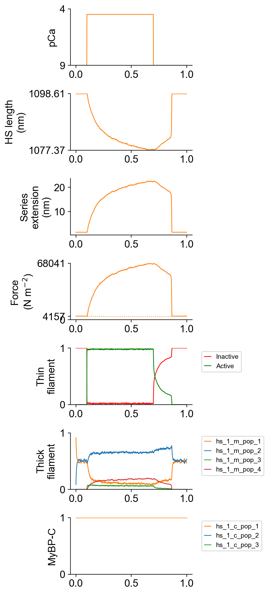

# Single half-sarcomere wtih series compliance

## Overview

This demo shows how to simulate a single half-sarcomere that is connected in series with a linear spring.

## What this demo does

This demo:

+ Runs a single simulation in which a single half-sarcomere connected in series with a linear spring is activated and deactivated by step changes in the Ca<sup>2+</sup> concentration
+ Plots a summary of the simulation

## Instructions

If you need help with these step, check the [installation instructions](../../../installation/installation.html).

+ Open an Anaconda prompt
+ Activate the FiberSim environment
+ Change directory to `<FiberSim_repo>/code/FiberPy/FiberPy`
+ Run the command
```
 python FiberPy.py characterize "../../../demo_files/myofibrils/hs_with_sec/base/setup.json"
 ```

+ You should see text appearing in the terminal window, showing that the simulations are running. When it finishes (this may take a few minutes), you should see something similar to the image below.

### Viewing the results

All of the results from the simulation are written to files in `<FiberSim_repo>/demo_files/myofibrils/hs_with_sec/sim_data/sim_output`

The file `superposed_traces.png` shows pCa, length, force per cross-sectional area (stress), and thick and thin filament properties plotted against time. Note the complex time-course of relaxation.



### How this worked

The myofibril was defined by adding a series elastic stiffness `sc_k_stiff` to the `muscle` section of `<FiberSim_repo>/demo_files/myofibrils/hs_with_sec/base/model.json`.

````
  "muscle": {
    "no_of_half_sarcomeres": 1,
    "no_of_myofibrils": 1,
    "sc_k_stiff": 3000,
    "initial_hs_length": 1100,
    "prop_fibrosis": 0.0,
    "prop_myofilaments": 0.5,
    "m_filament_density": 0.407e15
  }
````

If the `sc_k_stiffness` is not provided, FiberCpp assumes that it is infinite (that is, there is no series compliance).

The `characterization` defined in the `setup.json` is similar to those defined for the [single trials](../../single_trials/single_trials.html) except that `pCa_step_up_s` and `pCa_step_down_s` were added to set the time intervals for the change in Ca<sup>2+</sup> concentration.

````
{
  "FiberSim_setup":
  {
    "FiberCpp_exe": {
      "relative_to": "this_file",
      "exe_file": "../../../../bin/FiberCpp.exe"
    },
    "model": {
      "relative_to": "this_file",
      "options_file": "sim_options.json",
      "model_files": ["model.json"]
    },
     "characterization": [
        {
            "type": "pCa_length_control",
            "relative_to": "this_file",
            "sim_folder": "../sim_data",
            "m_n": 9,
            "pCa_values": [4.5],
            "sim_duration_s": 1.0,
            "time_step_s": 0.001,
            "pCa_step_up_s": 0.1,
            "pCa_step_down_s": 0.7,
            "output_image_formats": [ "png" ],
            "figures_only": "False",
            "trace_figures_on": "False"
        }
    ]
  }
}
````
