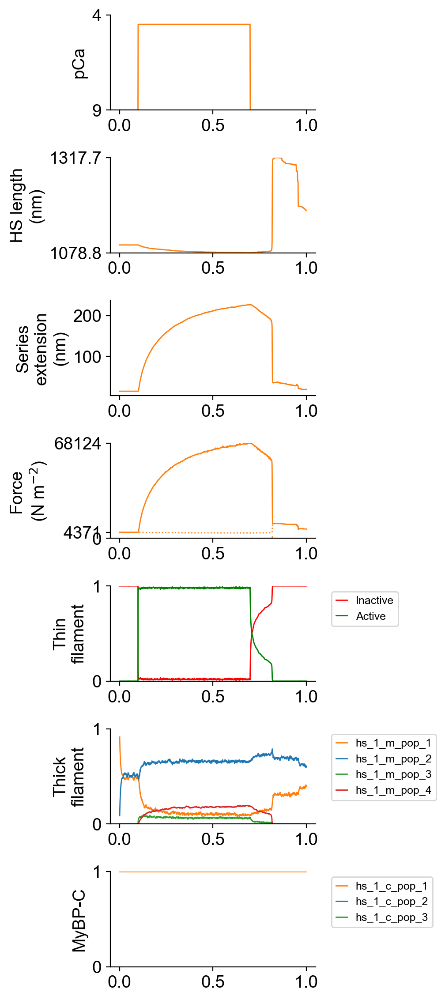
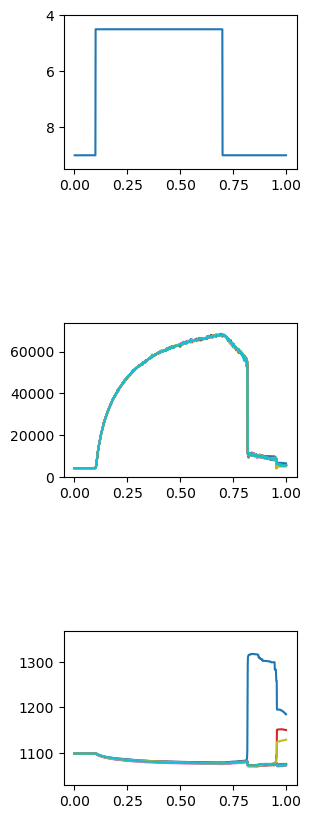

# Single half-sarcomere wtih series compliance

## Overview

This demo shows how to simulate multiple half-sarcomeres that are connected in series with a linear spring.

## What this demo does

This demo:

+ Runs a single simulation in which a myofibril composed of 10 half-srcomeres connected in series with a linear spring is activated and deactivated by step changes in the Ca<sup>2+</sup> concentration
+ Plots summaries of the simulation

## Instructions

If you need help with these step, check the [installation instructions](../../../installation/installation.html).

+ Open an Anaconda prompt
+ Activate the FiberSim environment
+ Change directory to `<FiberSim_repo>/code/FiberPy/FiberPy`
+ Run the command
```
 python FiberPy.py characterize "../../../demo_files/myofibrils/multiple_hs_with_sec/base/setup.json"
 ```

+ You should see text appearing in the terminal window, showing that the simulations are running. When it finishes (this may take a few minutes), you should see something similar to the image below.

### Viewing the results

All of the results from the simulation are written to files in `<FiberSim_repo>/demo_files/myofibrils/mulitple_hs_with_sec/sim_data/sim_output`

The file `superposed_traces.png` shows pCa, length, force per cross-sectional area (stress), and thick and thin filament properties for the first half-sarcomere in the myofibril plotted against time. Note the complex time-course of relaxation.



FiberPy also generated a customized figure for this simulation showing the force and length of each of the 10 half-sarcomeres in the myofibril. This file is named `summary.png` and is saved to the normal `sim_output` folder.



### How this worked

The myofibril was defined by adding a series elastic stiffness `sc_k_stiff` to the `muscle` section and changing `no_of_half_sarcomeres` to 10 in `<FiberSim_repo>/demo_files/myofibrils/hs_with_sec/base/model.json`.

````
  "muscle": {
    "no_of_half_sarcomeres": 10,
    "no_of_myofibrils": 1,
    "sc_k_stiff": 3000,
    "initial_hs_length": 1100,
    "prop_fibrosis": 0.0,
    "prop_myofilaments": 0.5,
    "m_filament_density": 0.407e15
  }
````

The `characterization` was the same as for the [single half-sarcomere simulation](../hs_with_sec/hs_with_sec.html) except that a `post_sim_Python_call` was added. This points to a a standard Python file that is called after the simulation has finished. In this case, the Python made the `summary.png` figure showing the responses of the different half-sarcomeres.

````
{
  "FiberSim_setup":
  {
    "FiberCpp_exe": {
      "relative_to": "this_file",
      "exe_file": "../../../../bin/FiberCpp.exe"
    },
    "model": {
      "relative_to": "this_file",
      "options_file": "sim_options.json",
      "model_files": ["model.json"]
    },
     "characterization": [
        {
            "type": "pCa_length_control",
            "relative_to": "this_file",
            "sim_folder": "../sim_data",
            "m_n": 9,
            "pCa_values": [4.5],
            "sim_duration_s": 1.0,
            "time_step_s": 0.001,
            "pCa_step_up_s": 0.1,
            "pCa_step_down_s": 0.7,
            "output_image_formats": [ "png" ],
            "figures_only": "False",
            "trace_figures_on": "False",
            "post_sim_Python_call": "../Python_code/multiple_hs_summary.py"
        }
    ]
  }
}
````
