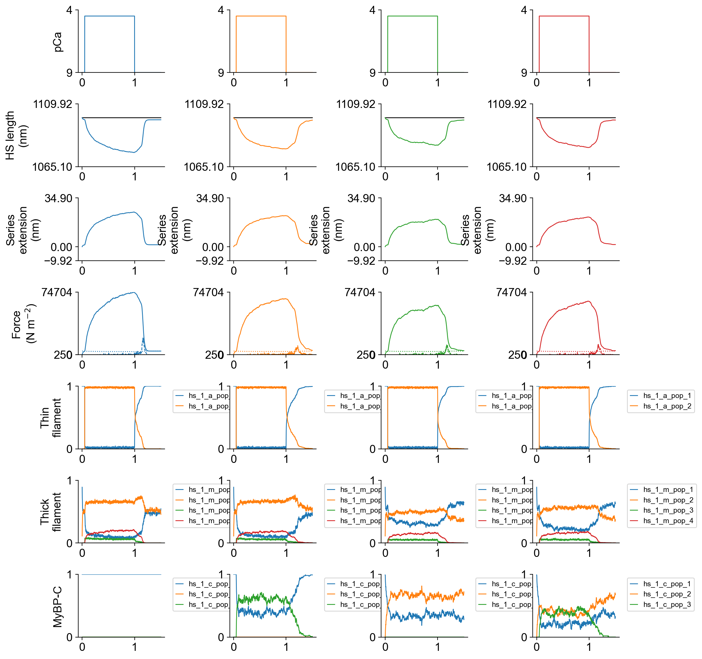
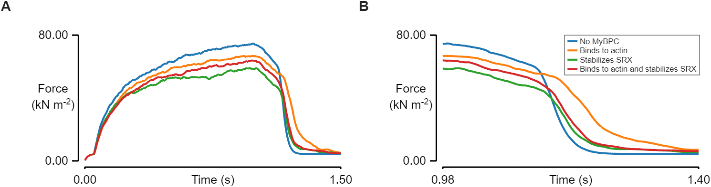

# Relaxation with different modes of MyBPC

## Overview

This demo shows how to simulate a single half-sarcomere that is connected in series with a linear spring with different modes of MyBPC

## What this demo does

This demo:

+ Builds on the [half-sarcomere with series compliance](../hs_with_sec/hs_with_sec.html) demo with 4 different MyBPC modes:
   + No MyBPC
   + MyBPC binds to actin
   + MyBPC stabilizes SRX
   + MyBPS binds to actin and stabilized SRX
+ Uses an adjustments structure to create 4 models with different parameter values
+ Plots summaries of the simulation

## Instructions

If you need help with these step, check the [installation instructions](../../../installation/installation.html).

+ Open an Anaconda prompt
+ Activate the FiberSim environment
+ Change directory to `<FiberSim_repo>/code/FiberPy/FiberPy`
+ Run the command
```
 python FiberPy.py characterize "../../../demo_files/myofibrils/mybpc/base/setup.json"
```
+ You should see text appearing in the terminal window, showing that the simulations are running. It may take a few minutes to finish.

### Viewing the results

All of the results from the simulation are written to files in `<FiberSim_repo>/demo_files/myofibrils/mybpc/sim_data/sim_output`

The file `superposed_traces.png` shows pCa, length, force per cross-sectional area (stress), MyBPC, and thick and thin filament properties plotted against time. Note the complex time-course of relaxation.



Below figure highlights changes in the relaxation profile with each MyBPC mode. 



### How this worked

The demo was similar to that shown in [half-sarcomere with series compliance](../hs_with_sec/hs_with_sec.html) except that the setup file has an adjustments structure to modify the parameters of ```c_kinetics``` and ```m_kinetics``` with non-zero MyBPC parameters.

```
  "c_kinetics": [
    {
      "state": [
        {
          "number": 1,
          "type": "D",
          "extension": 0,
          "transition": [
            {
              "new_state": 2,
              "rate_type": "constant",
              "rate_parameters": [ 20 ]
            },
            {
                "new_state": 3,
                "rate_type": "gaussian_pc",
                "rate_parameters": [ 100, 0.001]
            }
          ]
        },
        {
          "number": 2,
          "type": "D",
          "extension": 0.0,
          "transition": [
            {
              "new_state": 1,
              "rate_type": "constant",
              "rate_parameters": [ 10 ]
            }            
          ]
        },
        {
            "number": 3,
            "type": "A",
            "extension": 0.0,
            "transition": [
                {
                    "new_state": 1,
                    "rate_type": "poly",
                    "rate_parameters": [10, 1, 2]
                }
            ]
        }
      ]
    }
  ]
```

Please note that the specific modes are generated following adjustments structure. The multiplier combinations of ```c_kinetics``` determines the MyBPC mode:
   + No MyBPC
        + Both multipliers are 0
   + MyBPC binds to actin:
        + Transition 1 is set to 0
        + Transition 2 is set to 1
   + MyBPC stabilizes SRX
        + Transition 1 is set to 1
        + Transition 2 is set to 0
   + MyBPC binds to actin and stabilized SRX
        + Transition 1 is set to 1
        + Transition 2 is set to 1
    

```
    "model":
    {
      "relative_to": "this_file",
      "options_file": "sim_options.json",
      "manipulations":
      {
        "base_model": "model.json",
        "generated_folder": "../generated",
        "adjustments":
        [
            {
                "variable": "c_kinetics",
                "isotype": 1,
                "state": 1,
                "transition": 1,
                "parameter_number": 1,
                "multipliers": [0, 0, 1, 1]
            },
            {
                "variable": "c_kinetics",
                "isotype": 1,
                "state": 1,
                "transition": 2,
                "parameter_number": 1,
                "multipliers": [0, 1,0, 1]
            },
            {
                "class": "mybpc_parameters",
                "variable": "c_k_stiff",
                "multipliers": [1, 1,1,1],
                "output_type": "float"
            },
            {
                "variable": "m_kinetics",
                "isotype": 1,
                "state": 1,
                "transition": 1,
                "parameter_number": 5,
                "multipliers": [0,0,0.1,0.1]
            },
            {
                "variable": "m_kinetics",
                "isotype": 1,
                "state": 1,
                "transition": 1,
                "parameter_number": 6,
                "multipliers": [0,0,0.1,0.1]
            }
        ]
      }
    }
```
