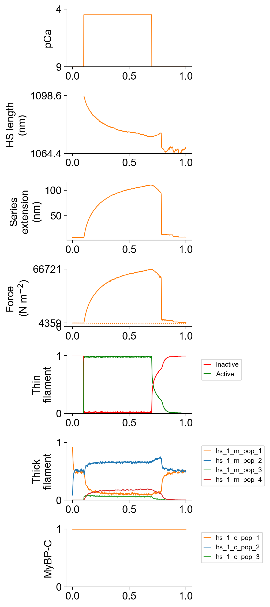
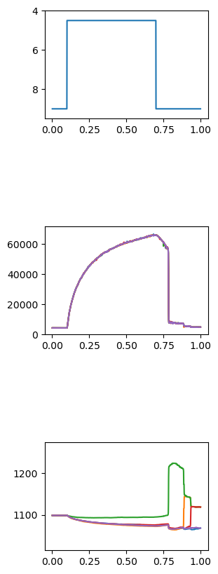

# Half-sarcomeres with variable properties

## Overview

This demo shows how to simulate multiple half-sarcomeres that have variable properties.

## What this demo does

This demo:

+ Builds on the [multiple half-sarcomeres with series compliance](../multiple_hs_with_sec/multiple_hs_with_sec.html) demo but reduces the attachment rate for myosin in a half-sarcomere in the middle of the myofibril
+ Plots summaries of the simulation

## Instructions

If you need help with these step, check the [installation instructions](../../../installation/installation.html).

+ Open an Anaconda prompt
+ Activate the FiberSim environment
+ Change directory to `<FiberSim_repo>/code/FiberPy/FiberPy`
+ Run the command
```
 python FiberPy.py characterize "../../../demo_files/myofibrils/variable_hs/base/setup.json"
```

+ You should see text appearing in the terminal window, showing that the simulations are running. It may take a few minutes to finish.

### Viewing the results

All of the results from the simulation are written to files in `<FiberSim_repo>/demo_files/myofibrils/variable_hs/sim_data/sim_output`

The file `superposed_traces.png` shows pCa, length, force per cross-sectional area (stress), and thick and thin filament properties for the first half-sarcomere in the myofibril plotted against time. Note the complex time-course of relaxation.



FiberPy also generated a customized figure for this simulation showing the force and length of each of the 5 half-sarcomeres in the myofibril. This file is named `summary.png` and is saved to the normal `sim_output` folder.



### How this worked

The demo was identical to that shown in [multiple half-sarcomeres with series compliance](../multiple_hs_with_sec/multiple_hs_with_sec.html) except that the number of half-sarcomeres was reduced to 5 and the rate of the attachment power stroke was reduced in the 3rd half-sarcomere in the myofibril.

The top of the model file (found at `<repo>/demo_files/myofibrils/variable_hs/base/model.json`) was:

```
"muscle": {
    "no_of_half_sarcomeres": 5,
    "no_of_myofibrils": 1,
    "sc_k_stiff": 3000,
    "initial_hs_length": 1100,
    "prop_fibrosis": 0.0,
    "prop_myofilaments": 0.5,
    "m_filament_density": 0.407e15
  },
  "half_sarcomere_variation":
  [
    {
      "variable": "m_kinetics_isotype_1_state_2_transition_2_parameter_1",
      "multiplier": [1, 1, 0.6, 1, 1]
    }
  ]
```

Note that `no_of_half_sarcomeres` was set to 5.

A new section titled `half_sarcomere_variation` defined an array of manipulations. In this example, the variable name points to:
+ myosin isotype 1
+ state 2
+ transition 2
+ parameter 1

The m_kinetic scheme is defined further down the model file. The keys above correspond to a parameter value of 200.

```
"m_kinetics": [
  {
    "no_of_states": 4,
    "max_no_of_transitions": 2,
    "scheme": [
      {
        "number": 1,
        "type": "S",
        "extension": 0,
        "transition": [
          {
            "new_state": 2,
            "rate_type": "force_and_mybpc_dependent",
            "rate_parameters": [ 20, 200, 1, 1, 0.01, 0.01, 1, 1]
          }
        ]
      },
      {
        "number": 2,
        "type": "D",
        "extension": 0,
        "transition": [
          {
            "new_state": 1,
            "rate_type": "constant",
            "rate_parameters": [ 100 ]
          },
          {
            "new_state": 3,
            "rate_type": "gaussian_hsl",
            "rate_parameters": [ 200 ]
          }
        ]
      },
      {
        "number": 3,
        "type": "A",
        "extension": 0.0,
        "transition": [
          {
            "new_state": 2,
            "rate_type": "poly",
            "rate_parameters": [ 500, 10, 4]
          },
          {
              "new_state": 4,
              "rate_type": "constant",
              "rate_parameters": [ 75 ]
            }
        ]
      },
      {
          "number": 4,
          "type": "A",
          "extension": 5.0,
          "transition": [
            {
              "new_state": 2,
              "rate_type": "exp_wall",
              "rate_parameters": [ 75, 1, 8, 7]
            }
          ]
        }
    ]
```


FiberCpp sets the value of this parameter in each half-sarcomere to the base value (200) multiplied by the corresponding value in the `multiplier` array. Thus:

+ half-sarcomere 1, 1 * 200
+ half-sarcomere 2, 1 * 200 = 200
+ half-sarcomere 3, 0.6 * 200 = 120
+ half-sarcomere 4, 1 * 200 = 200
+ half-sarcomere 5, 1 * 200 = 200
