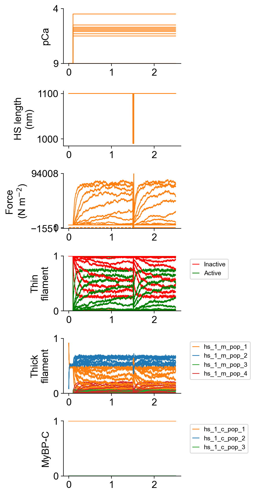

# Single curve

## Overview

This demo shows how to simulate a pCa curve with information about  k_tr.

## What this demo does

This demo:

+ Builds on the [single k_tr trial](../../single_trials/k_tr/k_tr.html) demo and runs simulations in which a half-sarcomere is subjected to a k<sub>tr</sub> maneuver at a range of pCa values
+ Plots summaries of the simulation

## Instructions

If you need help with these step, check the [installation instructions](../../../installation/installation.html).

+ Open an Anaconda prompt
+ Activate the FiberSim environment
+ Change directory to `<FiberSim_repo>/code/FiberPy/FiberPy`
+ Run the command
```
 python FiberPy.py characterize "../../../demo_files/pCa_curves/single_curve/base/setup.json"
 ```

### Viewing the results

**Important note - some of these traces, particularly at lower activation levels, are noisy. This is because the code is only simulating 9 thick filaments and there are not enough cross-bridge events at low levels of activation to obtain smooth averages. You can increase the `m_n` parameter in the set-up file to get smoother records but the simulations take longer to run and might be frustrating for a demo. Note that `m_n` must be a integer squared [4, 9, 16, 25, 36 ... with a maximum value of 196].** 

All of the results from the simulation are written to files in `<FiberSim_repo>/demo_files/pCa_curves/single_curve/sim_data/sim_output`

The file `superposed_traces.png` shows pCa, length, force per cross-sectional area (stress), and thick and thin filamnt properties plotted against time.



Since the simulations included more than 1 pCa value, FiberPy created a pCa curve `force_pCa.png`


and wrote summary data to `pCa_analysis.xlsx`


Since the code simulated a k<sub>tr</sub> maneuver, FiberPy also created a figure showing the analyis of the tension recovery.


and wrote summary data to `k_tr_analysis.xlsx`.


### How this worked

The only difference between this simulation and the [single k_tr trial](../../single_trials/k_tr/k_tr.html) is that the additional pCa values have been added between the brackets.

````
"characterization": [
        {
            "type": "pCa_length_control",
            "relative_to": "this_file",
            "sim_folder": "../sim_data",
            "m_n": 9,
            "pCa_values": [9, 6.5, 6.3, 6.1, 6.0, 5.9, 5.8, 5.7, 5.5, 4.5],
            "sim_duration_s": 2.5,
            "time_step_s": 0.001,
            "pCa_step_up_s": 0.1,
            "k_tr_start_s": 1.5,
            "k_tr_duration_s": 0.02,
            "k_tr_ramp_s": 0.001,
            "k_tr_magnitude_nm": 100,
            "k_tr_fit_time_s": [1.525, 2.45],
            "output_image_formats": [ "png" ],
            "figures_only": "False",
            "trace_figures_on": "False"
        }
    ]
````

