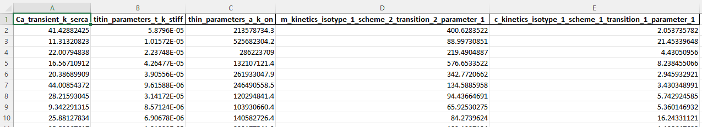
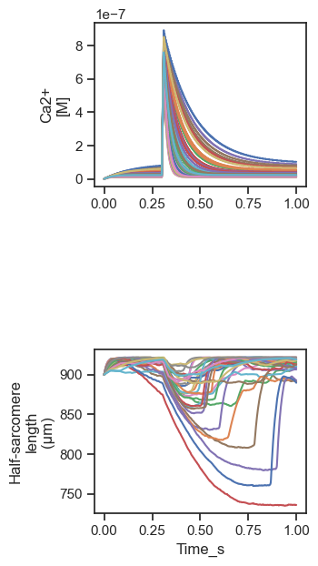
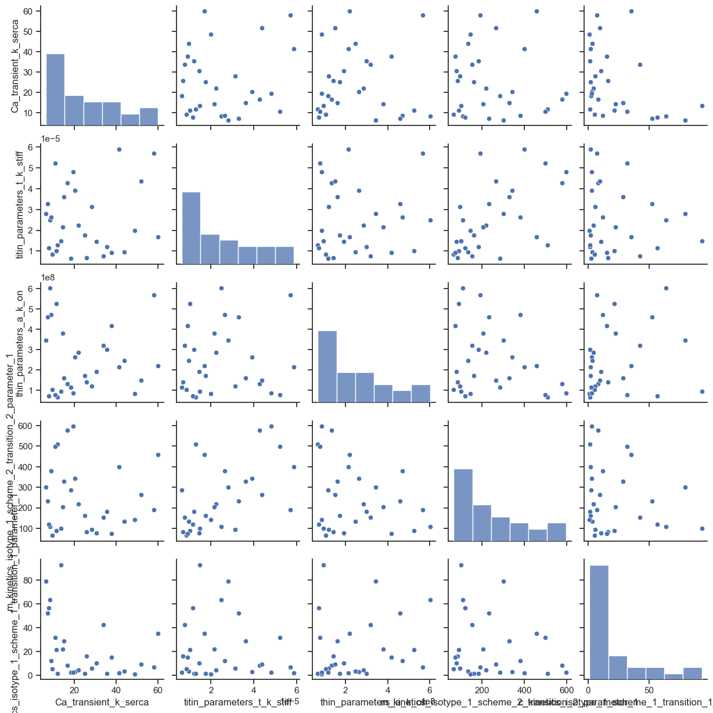
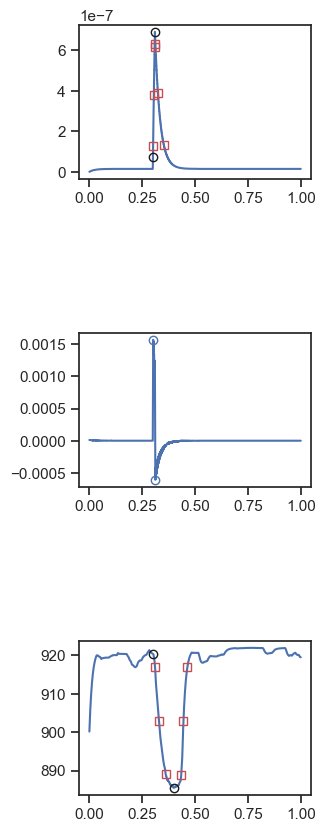
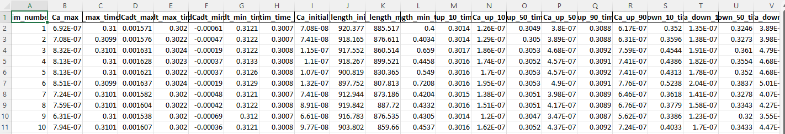

# Latin hypercube sampling of unloaded shortening

## Overview

This demo shows how to run repeated simulations where each trial uses a different combination of parameter values. The user defines which parameters to vary and over what range. Each trial simulates a half-sarcomere activated by a Ca<sup>2+</sup> transient and shortening / re-lengthenging without an external load.

## What this demo does

This demo:

+ Samples a base model by running 30 free-form simulations, each of which is based on a different model and simulates a protocol with a slightly different Ca<sup>2+</sup> transient
+ After the simulations are complete, calls a custom-written Python function that
  + Deduces summary statistics for each simulation
  + Creates figures summarizing the results

## Instructions

If you need help with these step, check the [installation instructions](../../../installation/installation.html).

+ Open an Anaconda prompt
+ Activate the FiberSim environment
+ Change directory to `<FiberSim_repo>/code/FiberPy/FiberPy`
+ Run the command
```
 python FiberPy.py sample "../../../demo_files/sampling/latin_hypercube/base/setup.json"
 ```

+ You should see text appearing in the terminal window, showing that the simulations are running. Since there are 30 simulations, it may take several minutes for the calculations to finish.

### Viewing the results

The model values that were used to run the simulations are saved to
`<FiberSim_repo>/demo_files/sampling/latin_hypercube/generated/parameter_values.xlsx`



The post-simulation Python code is at `<FiberSim_repo>/demo_files/sampling/latin_hypercube/python_code/analyze_simulations.py`

It saves analysis results in `<FiberSim_repo>/demo_files/sampling/latin_hypercube/analysis`. These include:

`summary.png` which superposes the Ca<sup>2+</sup> transients and unloaded shortening profiles for the 30 simulations



`pair_plot.png` which shows the pair-wise correlations for the parameter values. Note that the frequency distributions and the profiles of the histograms on the leading diagonal reflect plotting parameter values that are selected from a log-scale on linear axes.



`sim_x.png` where x ranges from 1 to 30 in the `images` subfolder. These show the analysis of each simulation.



`analysis.xlsx` which summarizes the simulations.




### How this worked

The hypercube sampling was defined in the model section of the setup file

```
 "model": {
      "relative_to": "this_file",
      "options_file": "sim_options.json",
      "sampling":
      {
        "no_of_samples": 30,
        "base_model": "model.json",
        "generated_folder": "../generated",
        "adjustments":
        [
          {
            "variable": "Ca_transient_k_serca",
            "factor_bounds": [-0.5, 0.5],
            "factor_mode": "log"
          },{
            "class": "titin_parameters",
            "variable": "t_k_stiff",
            "factor_bounds": [-0.5, 0.5],
            "factor_mode": "log"
          },
          <SNIP>
```

`sampling: no_of_samples = 30` told FiberPy to run 30 simulations

The parameters to vary where defined by the adjustment array. Each entry defined the parameter and the range over which to sample. As an example, the second entry varies `t_k_stiff` between 10<sup>-0.5</sup> and 10<sup>0.5</sup> of the value in `base_model`.

The post-Python analysis call was defined by:

```
"post_sim_Python_call": "../Python_code/analyze_simulations.py"
```

Finally, the unloaded shortening experiment was defined by the characterization struction

```
 "characterization": [
        {
            "type": "unloaded_shortening",
            "relative_to": "this_file",
            "sim_folder": "../sim_data",
            "m_n": 9,
            "twitch_protocol":
            {
                "time_step_s": 0.0001,
                "n_points": 10000,
                "stimulus_time_s": [0.3],
                "Ca_content": 1e-3,
                "stimulus_duration_s": 0.01,
                "k_leak": 6e-4,
                "k_act": 8.2e-2,
                "k_serca": 20
            },
            "output_image_formats": [ "png" ],
            "figures_only": "False",
            "trace_figures_on": "False"
        }
    ]
```
