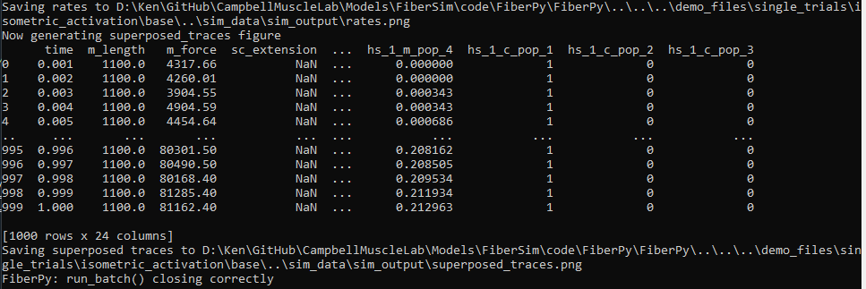
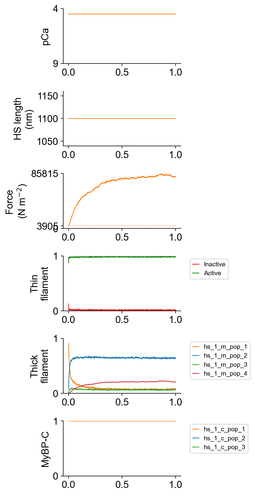
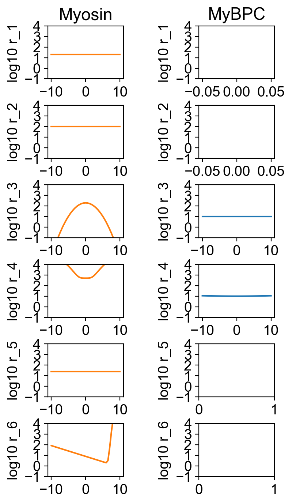
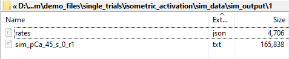

# Isometric activation

## Overview

This demo shows how to run a single isometric simulation.

## What this demo does

This demo:

+ Runs a single simulation in which a half-sarcomere is held isometric and activated in a solution with a pCa of 4.5
+ Plots a summary of the simulation

## Instructions

If you need help with these step, check the [installation instructions](../../../installation/installation.html).

+ Open an Anaconda prompt
+ Activate the FiberSim environment
+ Change directory to `<FiberSim_repo>/code/FiberPy/FiberPy`
+ Run the command
```
 python FiberPy.py characterize "../../../demo_files/single_trials/isometric_activation/base/setup.json"
 ```

+ You should see text appearing in the terminal window, showing that the simulations are running. When it finishes (this may take a few minutes), you should see something similar to the image below.



### Viewing the results

All of the results from the simulation are written to files in `<FiberSim_repo>/demo_files/single_trials/isometric_activation/sim_data/sim_output`

The file `superposed_traces.png` shows pCa, length, force per cross-sectional area (stress), and thick and thin filamnt properties plotted against time.



The myosin and myosin binding protein-C rates are shown in



The result files are in `<FiberSim_repo>/demo_files/single_trials/isometric_activation/sim_data/sim_output/1`



### How this worked

FiberPy ran a single simulation based on `setup.json`.

````
{
  "FiberSim_setup":
  {
    "FiberCpp_exe": {
      "relative_to": "this_file",
      "exe_file": "../../../../bin/FiberCpp.exe"
    },
    "model": {
      "relative_to": "this_file",
      "options_file": "sim_options.json",
      "model_files": ["model.json"]
    },
    "characterization": [
        {
            "type": "pCa_length_control",
            "relative_to": "this_file",
            "sim_folder": "../sim_data",
            "m_n": 9,
            "pCa_values": [4.5],
            "sim_duration_s": 1,
            "time_step_s": 0.001,
            "output_image_formats": [ "png" ],
            "figures_only": "False",
            "trace_figures_on": "False"
        }
    ]
  }
}
````

The first section labeled `"FiberCpp_exe"` showed FiberPy where to find the main FiberCpp software. This demo can use relative paths because the demos are part of the repository.

The next section, titled `"model"` shows where to find the base model and the simulation options.

The last section says:
+ run a `pCa_length_control` simulation
+ write the data to the relative path `../sim_data`
+ run a simulation with 9 thick filaments (this number has to be an integer squared [16, 25, etc.] with bigger numbers taking longer but producing smoother traces)
+ the pCa is 4.5
+ the simulation is 1 s long with 1 ms resolution
