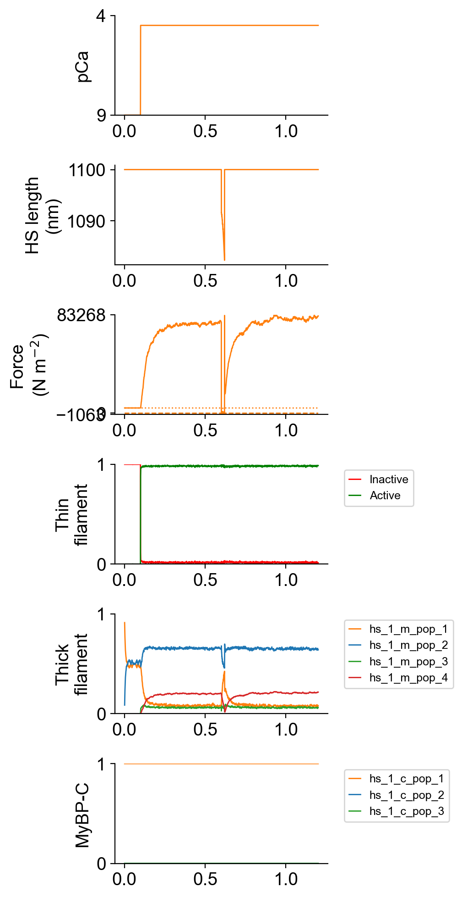
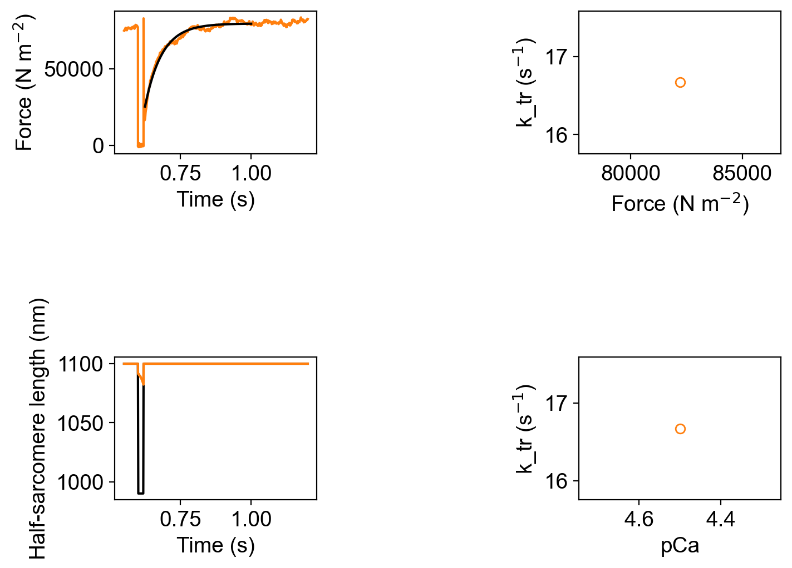
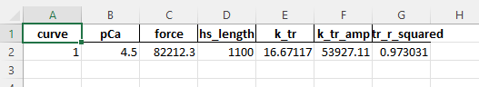

# Activation with a k_tr maneuver

## Overview

This demo shows how to simulate a single k_tr experiment.

## What this demo does

This demo:

+ Runs a single simulation in which a half-sarcomere is activated in pCa 4.5 and then subjected to a k_tr maneuver
+ Plots a summary of the simulation

## Instructions

If you need help with these step, check the [installation instructions](../../../installation/installation.html).

+ Open an Anaconda prompt
+ Activate the FiberSim environment
+ Change directory to `<FiberSim_repo>/code/FiberPy/FiberPy`
+ Run the command
```
 python FiberPy.py characterize "../../../demo_files/single_trials/k_tr/base/setup.json"
 ```

### Viewing the results

All of the results from the simulation are written to files in `<FiberSim_repo>/demo_files/single_trials/k_tr/sim_data/sim_output`

The file `superposed_traces.png` shows pCa, length, force per cross-sectional area (stress), and thick and thin filamnt properties plotted against time.



Since the code simulated a k<sub>tr</sub> maneuver, FiberPy also created a figure showing the analyis of the tension recovery.



Data quantifying the k<sub>tr</sub> are written to `<FiberSim_repo>/demo_files/single_trials/k_tr/sim_data/sim_output/k_tr_analysis.xlsx`



### How this worked

The only difference between this simulation and the [isometric activation example](../isometric_activation/isometric_activation.html) are a few extra lines in the characteriztion structure of the setup file.

````
"characterization": [
        {
            "type": "pCa_length_control",
            "relative_to": "this_file",
            "sim_folder": "../sim_data",
            "m_n": 9,
            "pCa_values": [4.5],
            "sim_duration_s": 1.2,
            "time_step_s": 0.001,
            "pCa_step_up_s": 0.1,
            "k_tr_start_s": 0.6,
            "k_tr_duration_s": 0.02,
            "k_tr_ramp_s": 0.001,
            "k_tr_magnitude_nm": 100,
            "k_tr_fit_time_s": [0.625, 1.0],
            "output_image_formats": [ "png" ],
            "figures_only": "False",
            "trace_figures_on": "False"
        }
````

Note the parameters starting with `k_tr`. These describe:

| Parameter | Sets |
| ----| ---------|
|k_tr_start_s | The start time for the k_tr maneuver |
|k_tr_duration_s | How long the k_tr lasts |
|k_tr_ramp_s | The duration of the length changes |
|k_tr_magnitude_nm | The magnitude of the length change (per half-sarcomere) |
|k_tr_fit_time_s | The portion of the record that the code will fit a single exponential to |

