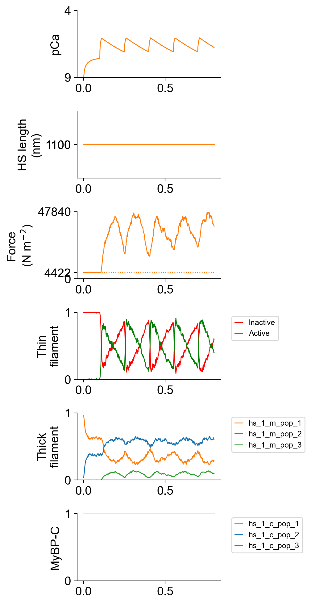

# Semi-fused tetanus

## Overview

This demo shows how to simulate a semi-fused tetanus.

## What this demo does

This demo:

+ Runs a single simulation in which a half-sarcomere is held isometric and activated by a sequenece of Ca<sup>2+</sup> transients.

## Instructions

If you need help with these step, check the [installation instructions](../../../installation/installation.html).

+ Open an Anaconda prompt
+ Activate the FiberSim environment
+ Change directory to `<FiberSim_repo>/code/FiberPy/FiberPy`
+ Run the command
```
 python FiberPy.py characterize "../../../demo_files/single_trials/semi_fused_tetanus/base/setup.json"
 ```

### Viewing the results

All of the results from the simulation are written to files in `<FiberSim_repo>/demo_files/single_trials/semi_fused_tetanus/sim_data/sim_output`

The file `superposed_traces.png` shows pCa, length, force per cross-sectional area (stress), and thick and thin filamnt properties plotted against time.



The file `rates.png` summarizes the kinetic scheme.


### How this worked

This demo is identical to the [twitch demo](../twitch/twitch.html) except that the protocol has been extended to 0.8 s (800 x 1 ms time-steps) and stimuli are applied at 150 ms intervals.

```text
"protocol":
{
    "protocol_folder": "../protocols",
    "data": [
        {
            "time_step_s": 0.001,
            "n_points": 800,
            "stimulus_times_s": [0.1, 0.25, 0.4, 0.55, 0.7],
            "Ca_content": 1e-3,
            "stimulus_duration_s": 0.01,
            "k_leak": 6e-4,
            "k_act": 8.2e-2,
            "k_serca": 20
        }
    ]
}
```
