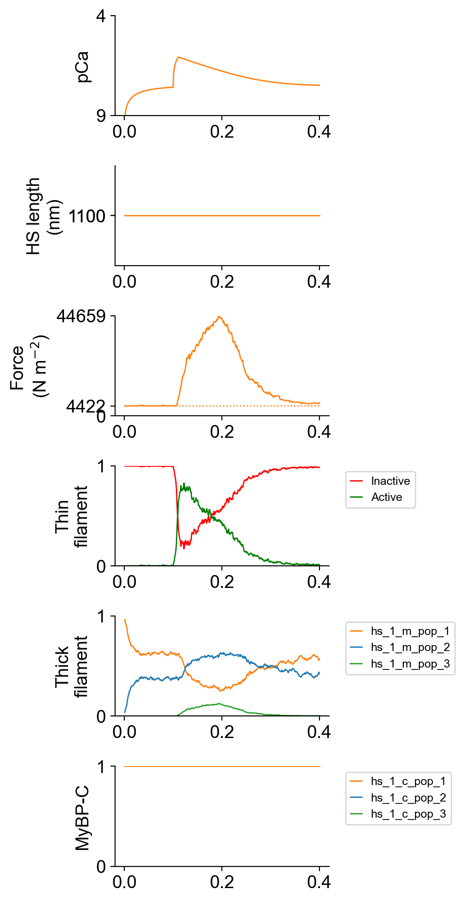

# Isometric twitch

## Overview

This demo shows how to simulate an isometric twitch.

## What this demo does

This demo:

+ Runs a single simulation in which a half-sarcomere is held isometric and activated by a Ca<sup>2+</sup> transient

## Instructions

If you need help with these step, check the [installation instructions](../../../installation/installation.html).

+ Open an Anaconda prompt
+ Activate the FiberSim environment
+ Change directory to `<FiberSim_repo>/code/FiberPy/FiberPy`
+ Run the command
```
 python FiberPy.py characterize "../../../demo_files/single_trials/twitch/base/setup.json"
 ```

### Viewing the results

All of the results from the simulation are written to files in `<FiberSim_repo>/demo_files/single_trials/twitch/sim_data/sim_output`

The file `superposed_traces.png` shows pCa, length, force per cross-sectional area (stress), and thick and thin filamnt properties plotted against time.



The file `rates.png` summarizes the kinetic scheme.


### How this worked

The setup file is very similar to that used in the prior examples.

```text
{
  "FiberSim_setup":
  {
    "FiberCpp_exe": {
      "relative_to": "this_file",
      "exe_file": "../../../../bin/FiberCpp.exe"
    },
    "model": {
      "relative_to": "this_file",
      "options_file": "sim_options.json",
      "model_files": ["model.json"]
    },
    "characterization": [
        {
            "type": "twitch",
            "relative_to": "this_file",
            "sim_folder": "../sim_data",
            "m_n": 4,
            "protocol":
            {
                "protocol_folder": "../protocols",
                "data": [
                    {
                        "time_step_s": 0.001,
                        "n_points": 400,
                        "stimulus_times_s": [0.1],
                        "Ca_content": 1e-3,
                        "stimulus_duration_s": 0.01,
                        "k_leak": 6e-4,
                        "k_act": 8.2e-2,
                        "k_serca": 20
                    }
                ]
            },
            "output_image_formats": [ "png" ],
            "figures_only": "False",
            "trace_figures_on": "False"
        }
    ]
  }
}
```

The critical difference here lies in the `characterization` element.

To simulate a twitch, FiberSim needs a protocol that incorporates a Ca<sup>transient. This is generated using a two-compartment model with parameters defined as in the table below. FiberPy uses the data defined in `protocol/data` and creates a protocol file that is saved in a new folder with the relative path `../protocols`


| Parameter | Sets |
| ----| ---------|
|time_step_s | The time-step for the simulations |
|n_points | The number of time-steps to simulate |
|stimulus_times_s | An array with start-times for stimuli |
|Ca_content | The total Ca<sup>2+</sup> (M) |
|stimulus_duration_s | How long Ca<sup>2+</sup> from the sarcoplasmic reticulum after a stimulus |
|k_leak | The rate at which Ca<sup>2+</sup> leaks from the sarcoplasmic reticulum when there is no stimulus |
|k_act | The additive rate at which Ca<sup>2+</sup> is released from the sarcoplasmic reticulum during a stimulus |
|k_serca | The rate at which Ca<sup>2+</sup> is pumped back into the sarcoplasmic reticulum |
